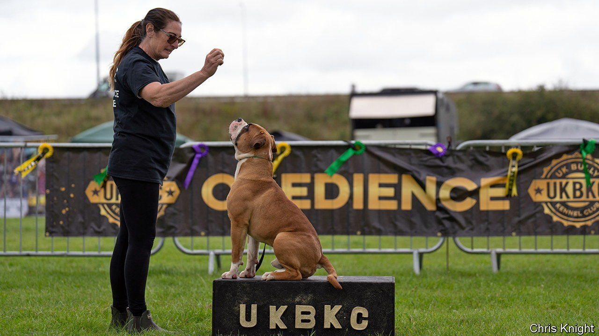

###### Bullies by nature

# Britain has a growing problem with dangerous dogs 

##### Bully XLs have killed eight people since 2021 

 

> Aug 21st 2023 

“THESE DOGS are my therapy,” says Darren Egan, a 12-year-old dog handler, as he straddles Indie, his 44-kilo American Bully pup. “I trust them.” Darren and his dad, Michael, have driven 17 hours from Ireland to compete in Champs Camp, a  run this month by the UK Bully Kennel Club. The event, in a Derbyshire field by the M1, brings together lovers of the Bully, a controversial  known for its strength and propensity to attack. Darren admits his mother worries and calls the dogs “very vicious.” 

Ms Egan is right to fret. Bullies are close descendants of pit-bull terriers, one of four breeds banned under the Dangerous Dogs Act of 1991. They were first imported from America roughly a decade ago. Bully XLs, the largest type, have killed eight people since 2021, including two this year. BullyWatch, a campaign that monitors the breed, claims the different variants of Bullies carried out 45% of all dog attacks this year. In one week in July Bullies killed seven other dogs. The  is campaigning for a ban. 

Champs Camp’s attendees say the pups are misunderstood. At the show, even toddlers compete in handling events. Owners gush about their dogs’ gentle nature. “I’d put my baby’s hand in his mouth,” says one man. Another tells how his XL is used as a therapy dog in an old people’s home. The real problem, say the attendees, is owners who cannot control their animals. Breeding is another issue. BullyWatch suggests that 97% of breeders are unlicensed. Much inbreeding takes place, with many dogs’ lineages going back to a few imported animals. Most attendees support the idea of a register for owners and breeders. 

Bully owners and others, including the Dog Control Coalition, a lobby group of animal-welfare charities, want legislation banning specific breeds to be overturned. Instead, they say, officials should target individual dogs that act dangerously. The trouble with that argument is that some breeds, including Bullies, are by nature more aggressive, no matter the owner. Both people who were killed this year were experienced in handling dogs. 

A ban on Bullies is possible. In July Chris Philp, a policing minister, said it was an option. Pressure for one mounts with news of every horrible attack. This month a Pocket Bully, a smaller variety, mauled a five-year-old girl in Stockton. At Champs Camp, there was little concern that change would come soon. Your correspondent left before a promised camp fire began, encouraged by a number of delegates who had earlier shouted at him to “beat it.” Sometimes, owners are more menacing than their dogs.■


