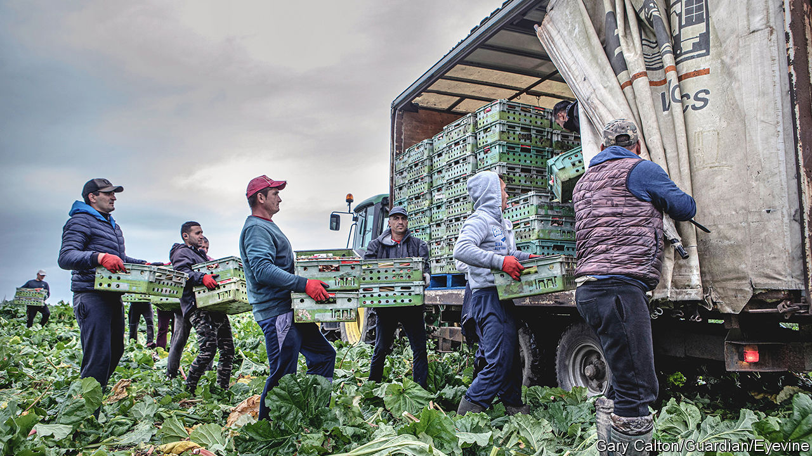
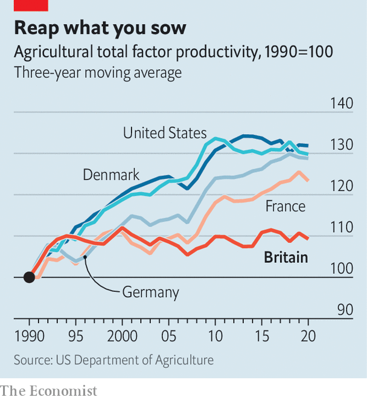

###### The low-wage economy

# Britain’s failed experiment in boosting low-wage sectors 

##### Brexiteers’ plans to choke off immigration from Europe, to boost productivity, has not worked 

 

> Aug 24th 2023 

THE BREXiTEER plan to end free movement from the European Union was not only about satisfying popular hostility to immigration. Leavers also talked of fixing Britain’s perennial productivity problems. Boris Johnson, as prime minister in 2021, described a future that was “high wage, high skill, high productivity”, and would be realised only if Britain kicked its addiction to cheap foreign labour.

Since 2010, the country has suffered a dramatic slowdown in productivity growth, including in many low-wage sectors such as food processing. By 2015, German, French and Dutch workers in low-paid roles were around 30% more productive than their British peers. In the preceding decade Britain had also experienced historically high immigration: around 1.5m eastern Europeans flocked in, many for low-wage jobs. To Brexiteers, these facts were linked. They argued, too, that the cradle of the industrial revolution had become a laggard in using technology. Britain is much less automated than other advanced economies, says the International Federation of Robotics. Some argued that Poles and Romanians could be replaced with robot carrot pickers. 

 


Most economists saw things differently, disputing the Brexiteers’ premise that low-skilled immigration reduced earnings. Increased labour supply leads to greater demand which cancels out effects on wages. Migration generally raises productivity by facilitating greater specialisation. In some cases, however, cheap labour may reduce investment. One study found that excluding Mexican farmworkers in the 1960s led to American farmers investing in mechanisation. Similar trends were seen in the Australian and Californian wine industries. Could the same happen in Britain?

Alas, the experiment has not worked. The food sector offers an example of what went wrong. Since Brexit, real output per worker in agriculture and food manufacturing has not risen; in some quarters it has fallen. Nor has there been an automation boom. Businesses show little sign of investing more or raising wages to attract more domestic workers, says Jonathan Portes, a professor of economics at King’s College London.

One problem was that politicians were not serious about going cold turkey. Free movement ended on the last day of 2020 and, by the following summer, labour shortages began to bite. Fruit rotted in the fields. Supermarkets cried out for lorry drivers. Pigs were shot for want of abattoir workers. Initially, Mr Johnson sounded bullish, but the Home Office soon opened doors and tweaked rules to help fill vacancies. Net migration reached 606,000 in 2022, higher than any previous year. 

Refugees from Hong Kong and Ukraine were part of the increase, but more students and workers were also brought in. Britons may say they want lower immigration, but they also want more migrant nurses, doctors and fruit-pickers. Businesses mostly swapped out EU workers for non-EU ones. In bars and restaurants Poles were replaced by Indians, often dependants of those on student or worker visas. In fields Romanians were replaced by Ukrainians and, last year, by a surge in new arrivals from Central Asia. 

Despite the high numbers, some firms have struggled. Brexiteers wanted fewer but higher-skilled immigrants. The opposite happened: fewer than one in seven arrivals last year were skilled workers (officially defined as those paid over £26,200 ($33,500)). The new visa system has forced firms to take some drastic measures. In 2022 Cranswick, a big food producer, paid £4m to fly in 400 Filipino butchers to avoid a Christmas shutdown.

A lack of commitment was not the only reason the Brexiteers’ experiment failed. The thinking behind it was also faulty. The real productivity problem starts at home. A significant factor is the poor quality of British managers, according to John Van Reenen and Nick Bloom, two economists who have conducted international surveys. Other research suggests that this is especially true in low-wage sectors. Weak investment is also to blame, though that is a concern throughout the economy.

Nor is automating a business as simple as switching workers for robots. Machines require skilled operatives. The Netherlands, with the most productive farms of all, pioneered vertical farming and the use of robotics in harvesting and milking. But success there grew from decades of nurturing links between farms and universities, and investing in research. For British farms and factories, workers with technical skills are hard to find. 

Running automated systems requires some labour, as when a packing machine sits at the end of a row of human fruit-pickers. Yet businesses lack certainty about their labour supply. As long as the government talks of ending some visa schemes and slashing immigration firms cannot plan. Professor Simon Pearson, who led a government review of automation in horticulture last year, says that this is a big factor deterring investment. A new field rig might pay off over several seasons, but if a farm cannot see beyond the next harvest it will not risk buying one.

Britain also timed its experiment badly. Around the world borrowing rates have soared and businesses have been hit by higher costs of labour, energy and feedstocks. Selling goods abroad also became harder with post-Brexit border checks. That made investing harder. Chicken farms have struggled, says Kerry Maxwell of the British Poultry Council. The trade body estimates the poultry sector has shrunk by 10% since 2020. 

The government could do more. The environment department has not used post-Brexit freedoms to adjust subsidies to give farms incentives to spend on technology. At the last budget Jeremy Hunt, the chancellor, did introduce a tax reform that lets businesses fully deduct investments in machinery. Unfortunately, in order to meet his fiscal rules, it is limited to just three years which negates much of the benefit. Tackling problems like weak management and low investment will be a grind, with few quick answers. But providing more certainty on immigration and tax policy would be a good place to start.■


