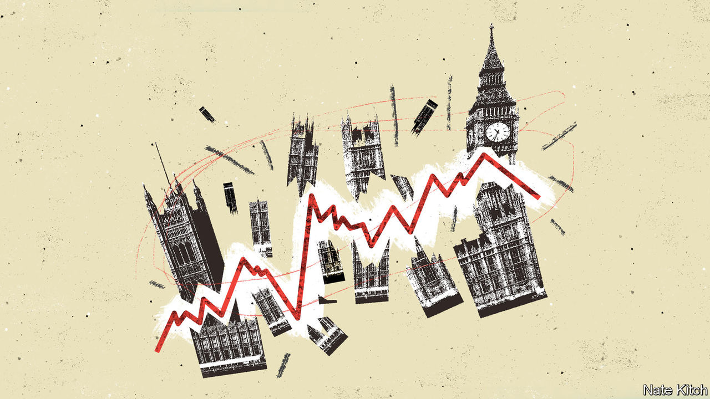

###### Bagehot

# Britons are not all in it together (whatever they might think) 

##### The power of the “cozzie livs” 

 

> Aug 23rd 2023 

Few phrases penetrate the skulls of voters. Sir Keir Starmer’s “sticking plaster politics” has not stuck. David Cameron’s “long-term economic plan” did not last. Use of Boris Johnson’s “levelling up” is well down. One phrase has gone from Westminster wonkspeak to universal refrain: “the cost-of-living crisis”. 

On television, Martin Lewis, a consumer-finance expert, is omnipresent, dishing out “cost-of-living” advice to “This Morning” viewers before rushing to 11 Downing Street to do the same to the chancellor. Across TikTok wildly popular accounts offer money-saving tips on how to survive the “cozzie livs”. Even the sentencing of Lucy Letby, a neonatal nurse serial killer, could hardly dislodge the most-read story on BBC News: a chip shop in Wales was feeding struggling families for £1 ($1.26) a go. 

The “cozzie livs” has gripped British politics to a degree few predicted when the concept emerged late in 2021. Back then, a mooted increase in National Insurance of 1.25 percentage points combined with inflation of 3.2% was enough to trigger hand-wringing among politicos, worried that the Bank of England would have to lift rates from 0.1%. By 2023, inflation has peaked at 11%, taxation’s share of GDP is on its way to the highest level since the 1940s and the bank has pushed rates to 5.25%, the highest level in 15 years. Real disposable incomes will not recover before 2028, according to the Office for Budget Responsibility.

The circumstances are worse than people could have imagined. Yet many are holding up better than anyone could have hoped. While some genuinely struggle, others merely find their “fun money” going less far. When it comes to the cost of living, Britons are not all in it together. Unfortunately for the government, they think they are.

Nightmare mortgage stories abound as the era of near-zero interest rates fades into memory. Yet unlucky homeowners are far from a majority. Rising mortgage costs affect only a minority of households, shrug government aides. (Outright-owners have outnumbered mortgagees since 2014.) Anyone who bought in the past few years in, say, London will be hammered when they refinance. But many first-time buyers in the capital are well off. Many have a big mortgage because they have a big London salary. Some of the most fiscally fortunate cosplay as the hardest hit. 

For others, rising interest rates are a boon. Almost three-quarters of pensioners own their home without a mortgage. For them, higher interest rates mean little but higher returns on cash savings. Inflation whittles away at their living standards, but the government has upped the state pension to compensate. Public-sector workers have to strike for pay rises that struggle to match inflation. Thanks to the triple lock, pensioners receive an inflation-linked bump automatically. Yet few pensioners accept that they are the lucky ones. There is a cost-of-living crisis, after all. 

Britons are tightening their belts, but in general only by a few notches. Two-thirds of voters say they have cut down on non-essentials, while almost half say they have reduced even essentials. But there is a gap between how people answer surveys and how they behave at the tills. Retail volumes, which adjust for inflation, are down by barely 3% on 2019. Likewise, living standards do not have to fall as prices rise. Some Britons can rely on savings. At 10% of gdp, Britons have more excess savings, built up in the pandemic, than any rich country bar Canada, according to a rough estimate by Deutsche Bank. 

For most people the “cozzie livs” has resulted only in a reduction of fun, rather than a descent into poverty. Thus when help arrived, much of it was spent on pleasure. The Institute for Fiscal Studies examined how poorer Britons spent some of the £70bn (3.5% of gdp) in government support dished out between 2022 and 2023. In the month after cash landed in bank accounts, spending on necessities such as groceries jumped by £20; spending on fun, whether eating out or streaming, rose by £35. 

This poses a problem for the government. People are surviving, but not thriving. For most, the cost-of-living crisis results in trade-offs, rather than going without. A zippy bmw is replaced by a Fiat 500 when it comes to renewing the car lease. For most Britons, it is not a choice between eating or heating but Marbella versus Margate. Since 2010, when the Conservatives first came to power, a plurality of voters have not had to compromise on their living standards even during the austerity years. Cheap credit plugged a gap left by lousy wage growth. Now voters have to choose.

Few things bind Britons together more than a sense of shared suffering, even if for some this means no hot tub and for others no hot food. The cost of living has a radically different effect on, say, a family with a £600,000 mortgage on a house in Battersea compared with a family on benefits in Wigan. Yet both families will use it as a reason not to vote Conservative at the next election. 

The personal (finance) is political 

Economically, things are improving. Rupert Harrison, a prospective Tory mp and a government economic adviser, notes that wage increases are already outstripping inflation and will probably do so by a big margin come 2024. The economy will be healthier as the general election nears. It was a combination of rising wages, falling energy prices and belated economic growth that helped David Cameron snatch a slim but consequential majority in 2015. 

Voters are unlikely to be grateful this time. In 2010 they backed the Conservatives knowing that times could be tough. By the election in 2019 the promise was that things would improve. Many have weathered the cost-of-living crisis better than could have been expected. But they are worse off than they thought they would be. This is a chronic problem, not an acute one. Britain was becoming relatively poorer before prices spiralled. Now, people are taking note. The worst of the “cozzie livs” may be over, but the political consequences have just begun. ■


