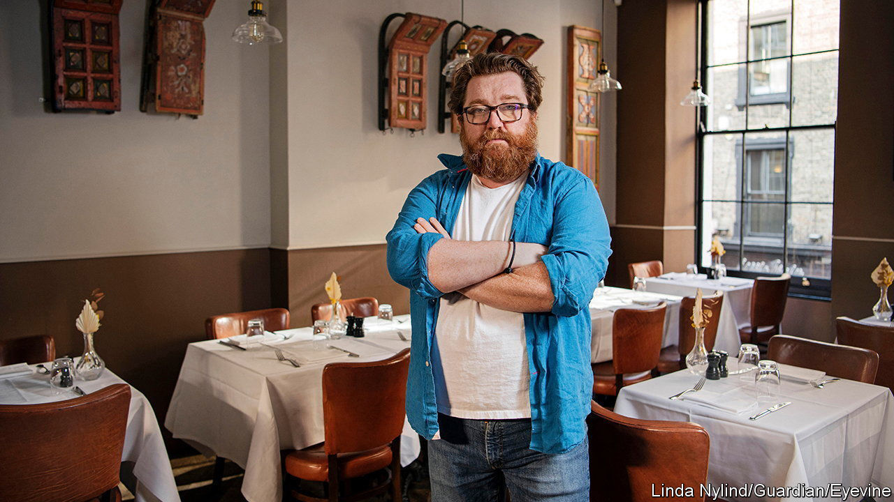

###### Russians in Britain

# How are Russians in Britain faring? 

##### Britons overwhelmingly oppose Russia’s war, but not Russia’s people 

 

> Aug 24th 2023 

ALEXEI ZIMIN is not easily fazed. Just after Russia’s invasion of Ukraine began last year, the celebrity chef posted a video of himself singing an anti-war song on Instagram. A day later the Moscow-based producers of his popular cooking programme, which was broadcast on NTV, a state-controlled Russian channel, called him to say that it had been cancelled. “That was it,” he says, sipping on sea-buckthorn tea in London. He has not returned to his homeland since. 

Mr Zimin came to Britain to attend Le Cordon Bleu, a swanky culinary school in London, and then in 2016 set up a restaurant called Zima, which means “winter”. It offers modern versions of traditional Russian dishes such as a type of dumpling, or a dressed-herring salad. The dining-room decor nods to colourful works of Kazimir Malevich, an avant-garde artist who was born in Ukraine and died in Russia. Mr Zimin, a former journalist, also runs a magazine and a social club, both for Russian-speakers in Britain. 

That’s a relatively niche audience. Two years ago the Office for National Statistics put the Russian-born population at just 81,000 (Russian-speakers are slightly more numerous, counting in those from other ex-Soviet countries). Propaganda from the Kremlin suggests Britain is a “Russophobic” hellscape. In reality, however, Russians appear to get along just fine.

In the first two months of the war the Metropolitan Police recorded five racially or religiously aggravated public-order offences against Russians, compared with ten in the full year that preceded the invasion. Mr Zimin says his restaurant staff took a few nasty phone calls early on and, as ever, abuse spreads online. But Russian émigrés say serious incidents are vanishingly rare. One who works for a consultancy notes instead how supportive their British neighbours have been. “We are not the victims,” says another, who is employed in the arts sector.

Britons overwhelmingly oppose Russia’s invasion. According to YouGov, a pollster, over 80% said they wanted Ukraine to win the war when asked in February. Britain is the largest donor in Europe of military aid to Ukraine, having pledged £4.6bn ($5.8bn) so far (only America gives more). It has also taken in some 200,000 refugees from Ukraine. That’s far fewer than Germany has taken, but notably more than have gone to either France or Italy. 

It is somewhat harder for Russians to visit Britain than before, after direct flights between the two countries ended last year. Leisure travel has become trickier, though some tourist visas are still issued. Some oligarchs who called London home before the war remain under sanctions. Still, Britain welcomes a scattering of others who are . Last year the Home Office issued 424 visas to Russians under the banner of “investment, business development and talent”—for those with a record of exceptional achievement in their field, or for the wealthy—up from 105 in 2019. Only Indians received more of those visas last year. Many of the recipients are software developers or others who work in technology, who help to meet a shortfall in domestic talent. 

As for Mr Zimin and his team, they don’t find Britain a hostile place, quite the reverse. They had an idea early in the war to make the restaurant’s name less Russian-sounding but soon dropped it. At no point did they consider closing the business. Now their ambition is even bolder: they have plans to expand. ■


