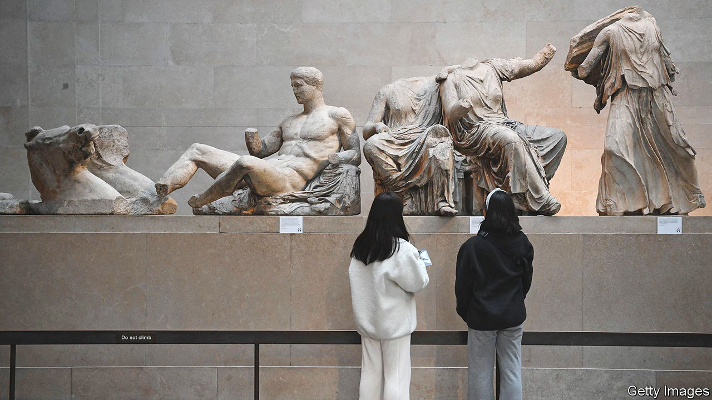

###### Now museum…Now you don’t

# Stealing from museums is easier than you might think 

##### As a series of thefts at the British Museum shows 

 

> Aug 21st 2023 

Go into the British Museum. Ignore the Rosetta Stone; don’t turn left for the Parthenon sculptures; don’t be seduced by the sumptuous naked statue of Venus. Instead, head up the stairs to Room 69. Here, it is quieter. There is the usual old stuff: Greek pots; some rude Roman decorations; and a pair of wooden double doors whose brass buzzer announces, expansively, that they lead to “GREEK AND ROMAN ANTIQUITIES”. Press it, and no one answers. They are not likely to. Because, after a series of thefts, there are fewer antiquities behind this museum’s doors than there should be. 

The British Museum is in trouble. Precisely how much is not yet clear. The museum has announced a few facts: objects dating as far back as the 15th century BC, including gold jewellery and gems, are “missing, stolen or damaged”. A staff member has been sacked. More details have, with archaeological painstakingness, been unearthed by others: it is said that the Museum first learnt of this in 2021; it is said Roman cameo gems are among the things stolen. This might sound small—the gems are tiddly. It is not. Dr Christos Tsirogiannis, who heads a UNESCO group on antiquities trafficking at Ionian University, says this is “probably the worst case so far…No one expects that to happen in a museum.” 

This is less about pottery than principles. To lose one antiquity may be regarded as a misfortune; to lose hundreds looks as if you are a museum that cannot do its job. The museum has built its reputation—and defended its collection—by arguing that it looks after things well. This would imply that it can’t. Paul Cartledge, emeritus professor of Greek culture at Cambridge University, thinks that is overstating it: the theft of some jewels does not mean the Parthenon sculptures are unsafe. But, he says, if this was going on for some time, “How the hell was it not noticed?”

Equally: how the hell would it be? Museums are icebergs of antiquity, with the vast majority of their collections unseen. In the case of the British Museum’s 8m objects, only around 1% are usually on display. As with humans, museums’ “one percent” tends to be glamorous and noticeable: the Parthenon sculptures, the Rosetta Stone. Steal that, and it would be noticed immediately. Steal a tiny Roman cameo and most would be none the wiser. Other curators may not have even known they had it in the first place.

Until, that is, the theft becomes known, for filched art is fascinating. Some of the most famous exhibits acquired their fame less from artistic merit than because they were nicked. The Mona Lisa, until it was stolen in 1911, was little known except to art enthusiasts; it took 26 hours for the Louvre to notice it had gone. The British Museum knows this better than anyone: as a former curator once pointed out, the Parthenon sculptures became “this great icon of Western art because they were removed”. 

Those sculptures are one reason why these thefts are so embarrassing. The sweet savour of  is evident in some of the comments on the thefts. The museum, says Dr Tsirogiannis, is “having a taste of their own medicine”. For centuries, it has collected objects—to the fury of other countries, which often claim such items were stolen. “Now they find themselves being…the victims of theft.” Though if the museum ever gets these gems back they could put them on display. This time, as a star appearance, not a mere cameo.■


