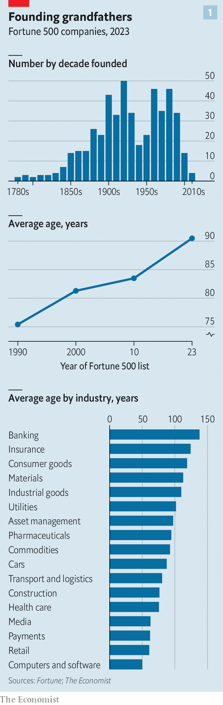
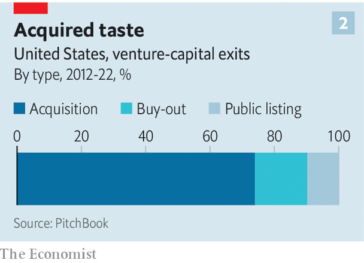
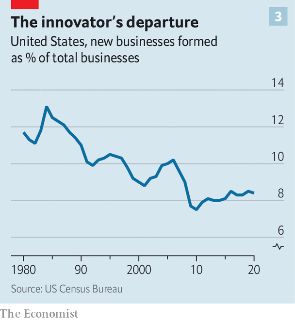

###### Goliath’s triumph

# America’s corporate giants are getting harder to topple 

##### Incumbents from Walmart to General Motors are fighting back against disrupters 

 

> Aug 21st 2023 

Attend any business conference or open any management book and an encounter with some variation of the same message is almost guaranteed: the pace of change in business is accelerating, and no one is safe from disruption. Recent breakthroughs in artificial intelligence (ai) have left many corporate Goliaths  David’s sling, and fearing the same fate as Kodak and Blockbuster, two giants felled by the digital revolution.

“The Innovator’s Dilemma”, a seminal book from 1997 by Clayton Christensen, a management guru, observed that incumbents hesitate to pursue radical innovations that would make their products or services cheaper or more convenient, for fear of denting the profitability of their existing businesses. In the midst of technological upheaval, that creates an opening for upstarts unencumbered by such considerations. Yet America Inc has experienced surprisingly little competitive disruption during the internet age. Incumbents appear to have become more secure, not less. And there is good reason to believe they will remain on their perches. 

Consider the Fortune 500, America’s largest firms by revenue, ranging from Walmart to Wells Fargo and accounting for roughly a fifth of employment, half of sales and two-thirds of profits. has examined the age of each firm, taking into account mergers and spin-offs that make the group look artificially young.

 


We found that only 52 of the 500 were born after 1990, our yardstick for the internet era. That includes Alphabet, Amazon and Meta, but misses Apple and Microsoft, the middle-aged tech titans. Only seven of the 500 were created after Apple unveiled the first iPhone in 2007, while 280 predate America’s entry into the second world war (see chart 1). In fact, the rate at which new corporate behemoths arise has been slowing. In 1990 there were 66 firms in the Fortune 500 that were 30 years old or younger. Since then the average age has crept up from 75 to 90.

One explanation for this is that the digital revolution has not been all that revolutionary in some parts of the economy, notes Julian Birkinshaw of the London Business School. Communications, entertainment and shopping have been turned on their heads. But extracting oil from the ground and sending electricity down wires look much the same. High-profile flops like WeWork, a much-hyped office-sharing firm now at risk of collapse, and Katerra, which tried and failed to redefine the construction business by using prefabricated building components and fewer middlemen, have discouraged others from trying to disrupt their respective industries.

Another reason is that inertia has slowed the pace of competitive upheaval in many industries, buying time for incumbents to adapt to digital technologies. Although 65% of Americans now bank online, nearly all the banks they use are ancient—the average age of those in the Fortune 500, including JPMorgan Chase and Bank of America, is 138. Fewer than 10% of Americans switched banks last year, according to Kearney, a consultancy. That stickiness has made it difficult for would-be disrupters to build scale before incumbents imitate their innovations. A labyrinthine regulatory system that favours big institutions with well-staffed compliance departments helps. The insurance industry, also dominated by geriatric giants like aig and MetLife, is much the same.

The pattern is not unique to financial services. Walmart, America’s mightiest retailer, almost missed the rise of e-commerce. David Glass, its boss in the 1990s, predicted that online sales would never exceed those of its single largest retail warehouse, according to a recently published book, “Winner Sells All”, by Jason Del Rey, a journalist. Nonetheless, Walmart’s financial heft and enormous customer base gave it the chance to change course later. Only Amazon now sells more online in America. The recent growth of electric vehicles from Ford and General Motors, America’s two largest carmakers, offers another example. Their bulky balance-sheets have allowed them to spend heavily on reinventing their businesses at a time when raising capital is becoming more difficult for newcomers.

A third explanation for the endurance of America’s incumbents is that their scale creates a momentum of its own around innovation. Joseph Schumpeter, the economist who coined the phrase “creative destruction”, first argued that economic progress was propelled mostly by new entrants, noting in “The Theory of Economic Development” in 1911 that “in general it is not the owner of stage coaches who builds railways”. By the time he published “Capitalism, Socialism and Democracy”, his magnum opus of 1942, he had changed his mind. It was, in fact, big firms—monopolies, even—that drove innovation, thanks to an ability to splash cash on research and development (r&amp;d) and quickly monetise breakthroughs using existing customers and operations, spurred on by a constant fear of being toppled.

America’s tech titans offer the quintessential illustration. Alphabet, Amazon, Apple, Meta and Microsoft invested a combined $200bn in r&amp;d last year, equivalent to 80% of their combined profits and 30% of all r&amp;d spending by listed American firms. Less obvious examples abound, too. John Deere, America’s largest agricultural-equipment firm, founded in 1837, leads the way in innovations like driverless tractors and clever sprayers that use machine learning to spot and target weeds. Its ambition is to make farming fully autonomous by 2030. After snatching laid-off techies from Silicon Valley it now employs more software engineers than mechanical ones.

 


Incumbents and newcomers also often play complementary roles in innovation. William Baumol, an economist, wrote in 2002 of a “David-Goliath symbiosis” in which radical breakthroughs generated by independent innovators are then enhanced by established firms. A paper in 2020 by Annette Becker of the Technical University of Munich and co-authors split r&amp;d spending by a sample of firms into more exploratory “research” and more commercially oriented “development”, and found that the relative weight of research fell with firm size. Likewise, a paper in 2018 by Ufuk Akcigit of the University of Chicago and William Kerr of Harvard Business School found that patents generated by big firms were less radical and more focused on incremental improvements to existing products and processes.

That division of labour may help explain why many startups are bought by established firms. John Deere’s acquisition in 2017 of Blue River, for example, gave it the technology behind its clever weed sprayer, which it was then able to sell through its vast network of distributors. Over the past decade 74% of venture-capital “exits” in America were via such acquisitions, according to PitchBook, a data provider (see chart 2). That is up from next to none in the 1980s, leading to warnings of a plague of “killer acquisitions”, with big firms eating their potential future rivals. 

 


Such cases do occur, but are rare. A study in 2021 by Colleen Cunningham, then at the London Business School, and co-authors found that 5-7% of acquisitions by drug companies, which rely heavily on startups to top up pipelines, looked suspect. Most of the time, folding into an established giant is simply the most efficient way for an innovative new firm to bring its breakthroughs to the world.

A final explanation for the lack of competitive disruption relates to demographics. “Young firms are generally built by young people,” notes John Van Reenen of the London School of Economics. Between 1980 and 2020 the share of America’s population aged between 20 and 35 fell from 26% to 20%. The rate of new business formation dipped from 12% to 8% in the same period (see chart 3). In a study of 2019 comparing variations in population growth and new business formation across states in America, Fatih Karahan of the Federal Reserve Bank of New York and co-authors concluded that falling population growth accounted for 60% of the decline in the business-entry rate over the past 40 years. 

Application rates to start new businesses in America surged in late 2020 after plunging in the early months of the pandemic, and have since remained well above pre-pandemic levels. That entrepreneurial burst has mostly focused on hospitality and retailing, which were hammered by covid, and over time may peak, especially as pandemic-swollen household savings dwindle. Optimists will hope that the recent flurry of investment in ai startups can sustain the momentum. Even if it does, the corporate giants of the past may well remain on top. ■


