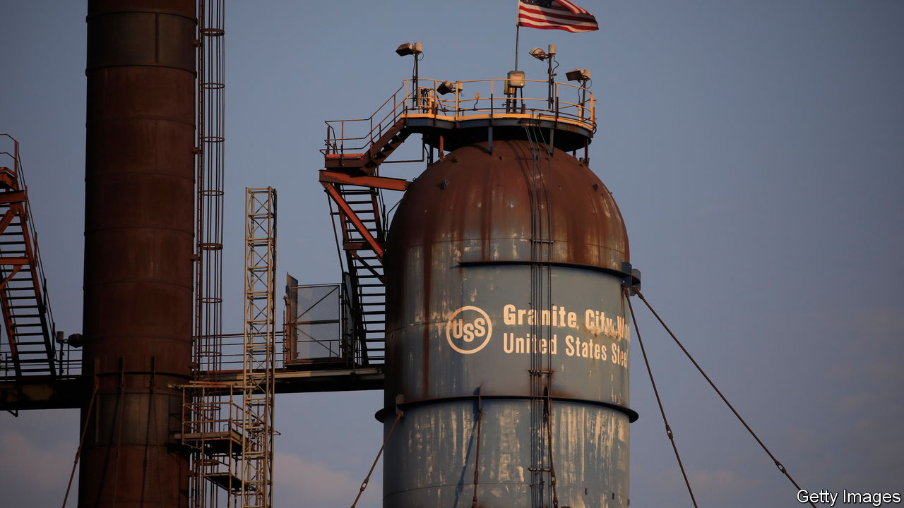

###### A question of furnace

# America’s steelmakers forge a future together 

##### Cleveland-Cliffs makes an offer for US Steel 

 

> Aug 24th 2023 

America’s steelmakers were the big-tech firms of their day, at the corporate forefront in the 19th century as industrialisation led to rocketing demand. In 1901 ten industrial firms were combined to create us Steel, one of the world’s first billion-dollar corporations, and for the next 70 years business boomed for steelmakers boosted by rearmament in two world wars. Those heady days are long gone. Many firms such as us Steel, which smelt steel in blast furnaces from iron ore using coking coal, have either been bought or gone bust. Indeed, on August 13th Cleveland-Cliffs, an American competitor, said it had offered $7.3bn for us Steel, half in cash and half using its own shares. Shortly afterwards ArcelorMittal, the world’s second-largest steelmaker, was said to be mulling a bid.

us Steel, once a juggernaut of the American stockmarket, now languishes in the s&amp;p 400, a mid-cap index, as does Cleveland-Cliffs. Meanwhile, companies using electric-arc furnaces (eafs), which process scrap metal using electricity in mini-mills, now account for 75% of American production compared with 10% in 1960. Mini-mills are greener and cheaper to build and run, so generally remain profitable even during downturns. That translates into nifty margins. Mini-mill operators such as Nucor and Steel Dynamics posted operating margins of around 22% in the latest quarter, compared with 12.5% for us Steel and 8% for Cleveland-Cliffs. 

The legacy steelmakers could fall even further behind. eafs have the flexibility to make the flat-rolled steel used by railways and carmakers as well as long-steel products mainly used in construction. Blast furnaces are limited to just the former. That leaves the incumbents with few options. One is to embrace the new. In 2021 us Steel purchased Big River Steel, a mini-mill, for around $1.5bn and is building another, taking its steel capacity from eafs to around 6.6m tonnes in 2024, 28% of its total. A more audacious move would be to buy another big steelmaker to consolidate blast furnaces further. The industry has already heavily consolidated; 14 steelmakers made up around 80% of the market in 2000 compared with just four today.

Cleveland-Cliffs, the only confirmed bidder for us Steel so far, has been particularly active: in 2020 the firm snapped up ak Steel and ArcelorMittal’s blast furnaces when it left America. Merging with us Steel is a bigger gamble. It would create a steelmaking juggernaut, giving it half of flat-rolled steel, 60% of the car market and total control over electrical steel. Antitrust authorities may deem it a consolidation too far. Politicians may be more amenable, especially as an election approaches. 

United Steelworkers, the union that represents us Steel’s employees, is batting for Cleveland-Cliffs. The union wants to keep blast furnaces, as they are heavily unionised, and claims to have veto power over prospective bidders. us Steel’s boss, David Burritt, disputes this and has so far turned down his rival’s offer, calling it unreasonable. He may soon have no choice but to accept if he wants to restore us Steel to anything its like former glory.■


