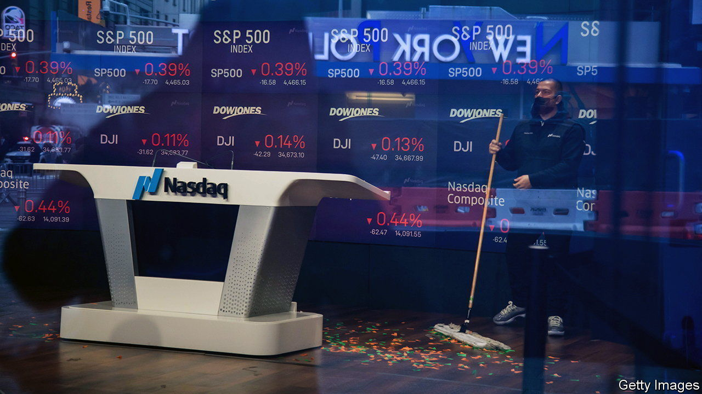

###### Strike up the band

# Arm’s flotation could revive the market for IPOs 

##### Despite a resilient economy and buoyant stocks, listings are still thin on the ground 

 

> Aug 24th 2023 

No matter how wild the party, it is a rare hangover that lingers into its second year. Yet after a record-smashing rave in 2021, investors in initial public offerings (ipos) are still nursing sore heads. Over the course of a year-long binge, they ploughed some $600bn into stockmarket listings around the world in 2021, according to Dealogic, a data firm. That is more than double the figure for 2007, in the mad gallop preceding the financial crisis, and nearly triple that for 2000, as the dotcom bubble swelled. But then soaring inflation, the end of cheap money and cratering markets put paid to the celebrations. In some places flotations all but disappeared: proceeds from American ipos in 2022 fell by more than 90% compared with the previous year. So far in 2023, the sombre mood has continued (see chart).

The music may soon start up again. On August 21st Arm, a British chip designer, at last filed a preliminary prospectus for a hotly awaited listing on the Nasdaq exchange, expected to take place in the first half of September. A likely valuation of between $60bn and $70bn would mark the biggest American float in nearly two years.

 


It is not just Arm. Notwithstanding an August wobble, stockmarkets have been rising for almost a year: the s&amp;p 500 index of large American firms is up by 24% from a trough in October. msci’s broadest index of global stocks has also risen by 24%. Such a bull run offers inevitable temptations to the bosses of private firms. With prices having risen so much, perhaps now is the time to sell a chunk of the company’s shares to public investors and get a healthy slug of capital in return.

Importantly, says James Palmer of Bank of America, volatility has also been subdued for months. That lowers the likelihood of would-be floaters kicking off a weeks-long listing process only to see the market plunge and the value of their soon-to-be minted shares fall with it. Aloke Gupte of JPMorgan Chase, another bank, is more bullish still. The pace of work at firms using his team’s help to go public, he says, has “gone from second gear to fifth” in recent weeks.

Meanwhile, the listings that have already taken place suggest a market that is hungry for more. Oddity Tech, a beauty outfit that perhaps inevitably uses artificial intelligence (ai) to develop its products, listed on the Nasdaq on July 19th. It saw demand for its offering vastly outstrip supply. The firm sold $424m-worth of its shares, while investors placed orders for over $10bn. After Arm’s ipo, Instacart, a grocery-delivery group, Databricks, a software firm, and Socure, an identity-verification company, are all likely to follow up with their own flotations.

If this steady drip is to become a rush, it will require three developments in its favour. The first is a clearer picture of where interest rates are heading. One senior banker cites confusion over this as the main reason that listings, as well as other deals such as mergers and acquisitions, were so slow to return in the first half of 2023. With the Federal Reserve’s fastest tightening cycle in decades still under way and a clutch of American regional banks teetering close to collapse, guessing where long-term rates would end up felt like taking a shot in the dark, she argues. As well as determining firms’ funding costs, this is the ultimate benchmark against which ipo investors measure their potential returns. And so without much idea of where the “risk-free rate” will settle, pricing a new tranche of shares with any confidence becomes impossible.

There is now a growing sense, both in markets and among economists, that the Fed’s rate rises are at or near an end. Yet uncertainty over how long rates will stay high persists, largely due to the surprising . Mostly as a result of this, the yield on ten-year Treasuries—possibly the most important benchmark for investors—has risen by 0.8 percentage points since early May, to 4.2%. Until this measure begins to settle, ipos will remain hard to price and, as a result, sparse.

A second factor required for listings to resume in earnest is for firms themselves to grow in confidence. “I’ve thought for some time that market readiness would come before company readiness,” says Bank of America’s Mr Palmer. A successful flotation, he says, involves the businesses making a series of reassurances: to regulators, investors and research analysts. The firm will offer guidance on its financial performance not just over the next quarter, but probably over the coming year.

For as long as geopolitical tensions, especially between America and China, are running high, companies that rely heavily on cross-border trade will find such reassurances fiendishly hard to offer. Virtually all, meanwhile, are hampered by uncertainty over where inflation will settle and whether the world’s big economies have avoided, rather than merely delayed, recessions. Some firms, such as those owned by private-equity funds with limited lifespans, may have few options but to make the jump and list despite the fog of uncertainty. But those with the freedom to choose are more likely to wait until it lifts.

A final, if obvious, requirement for a new ipo boom is that the firms now preparing to float manage to do so successfully. Crucially, says Rachel Gerring of ey, a consultancy, that means their shares end up being sold at around the price investors have been led to expect and then rise from there. That the opposite happened for many of 2021’s floaters was the death knell of the previous boom: few ipo investors want to open their chequebooks without benefiting from the share-price “pop” associated with new listings. In this sense, Arm’s flotation has acquired totemic importance. Should its share price leap, others will be quick to follow; should it flop, they may not.

Whenever it materialises, the next cohort of ipos is likely to look substantially different from the class of 2021. With the heady days of rock-bottom interest rates firmly in the past, investors will prize “safer” prospects. This means big firms over small, profits over revenue growth, seasoned executives over newbies, and easy-to-model business plans over more speculative ventures. JPMorgan’s Mr Gupte sees these preferences reflected in a much more diverse group of companies now preparing to go public than did in 2021. Whereas the last wave was dominated by tech firms, he says, the next will involve many more industrial, energy-transition, consumer-focused and health-care outfits. 

All agree that a return to the breakneck pace of dealmaking that preceded the current drought is unlikely. Central banks are no longer flooding markets with liquidity, the rate rises of the past 18 months could yet tip many economies into recession, and an American stockmarket that is at its most expensive in decades could yet crash. But “if nothing upsets the apple cart”, says Mr Gupte, then a reasonable number of firms should be looking to go public in 2024. All eyes on Arm, then, to see if the apple cart can stay on the road. ■


