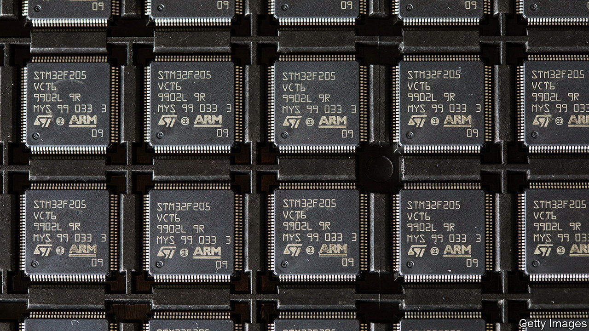
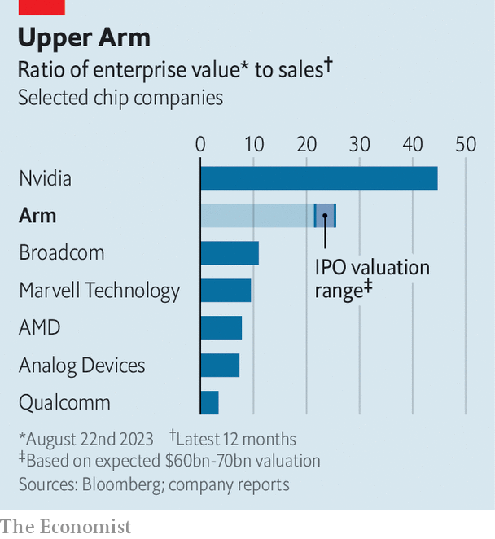

###### Arm-twisting

# Arm’s public listing is set to break records 

##### The company hopes that investors look to its AI future, not its smartphone past 

 

> Aug 23rd 2023 

On August 21st Arm, a chipmaker whose designs power most of the world’s smartphones, filed for an initial public offering (ipo) that could turn out to be the largest of the year. The route taken by the , which is owned by SoftBank Group, a Japanese technology conglomerate, has not been straightforward. In 2016 SoftBank acquired Arm, then listed on the London Stock Exchange, for $31bn. Four years later a proposed $40bn sale to , another chipmaker, was squashed by competition authorities. Now a blockbuster listing is in prospect that would also signal a  that has been largely dormant since 2022 .

 


Arm will now be listed on America’s tech-heavy Nasdaq as soon as early September. SoftBank will retain majority control and pocket all the proceeds. The ipo filing does not specify how much Arm intends to raise or the chipmaker’s worth, though in August SoftBank paid $16bn for a 25% stake which was held by the group’s Vision Fund, a tech-investment vehicle, putting Arm’s value at around $64bn. It will probably seek around $60bn-70bn, or around 21-25 times annual sales. That would place it close to the lofty multiples of Nvidia (see chart), which on August 23rd confirmed its position as the leader of the artificial-intelligence gold rush by reporting a 101% increase in quarterly revenue compared with a year earlier, beating analysts’ already lofty expectations. Projections for the next quarter are even rosier. 

The ubiquity of Arm’s chip designs may seem to justify a juicy valuation. Unlike its competitors, which design, manufacture and sell chips, Arm deals only in intellectual property. It makes money by licensing its designs, which customers can modify if required, and takes a small cut from every chip built. Using Arm’s off-the-shelf designs allows firms to build a processor at a fraction of the cost of designing it themselves. As a result, its chips are everywhere.

Its technology sits within 99% of the world’s smartphones. In devices from industrial sensors to smart toasters or anything else that now connects to the internet, its designs feature in 65% of their processors. In the automotive sector Arm has a 41% market share and even in the lucrative cloud-computing market, long dominated by Intel, Arm-based processors account for 10% of the chips sold. 

The ai boom brightens Arm’s prospects. Earlier in August Nvidia unveiled Grace Hopper, a new chip that combines an Arm-based central processing unit (cpu) with its graphics-processing unit (gpu). The chip promises to run bigger and faster versions of the language models that are trained on text from the internet to produce human-like output. And as Sara Russo of Bernstein, a broker, points out, as ai moves from data centres to consumer apps, devices able to run ai functions using less energy will be needed. Arm’s expertise in low-power, high-performance chips should help it meet the demand. 

Other tech trends look less encouraging. Begin with sluggish demand. Most of Arm’s sales come from processors for smartphones, cars and other connected devices. Sales of these chips have lately been weaker than expected. Qualcomm, an American chipmaker that specialises in smartphone processors, recently reported a 23% drop in sales in the latest quarter compared with a year earlier. It expects the downturn to drag on until at least the end of the year. The forecast for automotive chips is similarly gloomy. Expanding demand from ai will not be enough to offset a drop-off in Arm’s core products.

Arm’s position as the only supplier of easy-to-use chip designs is also in peril from risc-v, an open-source alternative developed at the University of California, Berkeley. risc-v designs are available to anyone without a licence or fee. Alan Priestley of Gartner, a market-research firm, believes it is a “growing threat” to Arm. For now risc-v serves the lower end of the market—sensors, connected devices and automotive chips. But as the technology improves, the promise of licence- and royalty-free designs for expensive smartphone and data-centre processors could prove a problem for Arm. In the year to March 2023 all its revenues came from licensing ($1bn) and royalties ($1.6bn).

A reliance on Arm China—a separate entity—for a quarter of its revenues is another cause for concern for investors. In its filings Arm admits that it is “particularly susceptible” to tensions between China and America. In December Arm chose not to license its designs for a high-end cpu to Alibaba, a Chinese e-commerce giant, for fear that it would fall foul of a ban imposed by America last year on selling certain cutting-edge chips in China. 

The question is whether the hype around ai means that investors pay less attention to such worries. When the deal to sell Arm to Nvidia fell through in 2022, Son Masayoshi, the founder of SoftBank, vowed to take Arm public in the “the largest ipo in semiconductor history”. ai exuberance in a market starved of blockbuster ipos may make his wish come true. ■


