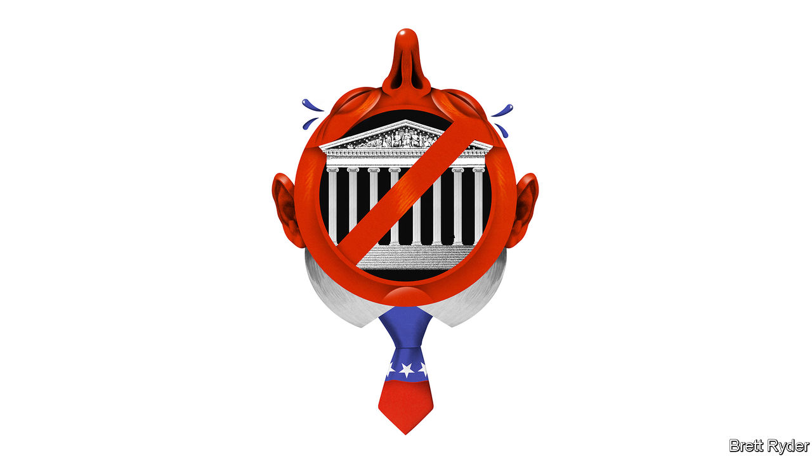

###### Schumpeter

# Corporate America risks losing the Supreme Court 

##### It has already lost the Republican right. What’s next? 

 

> Aug 24th 2023 

If America inc were ever to raise a glass to the Supreme Court, the ideal time to have done so was in June, when the nine justices ruled unanimously in favour of Jack Daniel’s in a jolly judgment that included discussion of parody, bad puns and, of all things, dog poo. The trademark-infringement case centred on a canine toy shaped like a bottle of Jack Daniel’s called “Bad Spaniels”. Beneath, in the whiskey maker’s black-and-white filigree, the words “Old No. 7 Brand Tennessee Sour Mash Whiskey” were replaced by “The Old No. 2 on your Tennessee Carpet”. Jack Daniel’s was not amused, nor was the US Chamber of Commerce, an influential lobby group that called the case “no laughing matter”. Elena Kagan, a liberal justice who wrote the opinion, could barely contain her mirth, remarking that the case was about “dog toys and whiskey, two items seldom appearing in the same sentence”. Her conclusion, though, was dead serious and pro-big business: parody is not a blanket excuse for trademark violation. 

To some, the decision fitted a pattern. Last year Lee Epstein of the University of Southern California and Mitu Gulati of the University of Virginia School of Law used data on wins and losses by corporations in 1920-2020 to describe the Supreme Court led for 17 years by Chief Justice John Roberts as possibly “the most pro-business court in a century”. This was not only because of the Republican majority, they argued. Those appointed by Democrats voted remarkably often in favour of business, too, as they did in the Jack Daniel’s ruling. 

This business-friendly characterisation may be an oversimplification. As the academics admit, there are more nuanced ways of evaluating America’s highest court, such as looking at the legal doctrines the cases set out. Since former President Donald Trump stuffed the court with ultraconservatives, its 6-3 rightward swerve may even have weakened its support for business. In fact, the court’s most recent decisions, some swayed by originalist readings of a constitution blind to the way business would operate 235 years later, have confounded corporate America, ruling against its interests on issues ranging from interstate commerce to affirmative action. As it has become less pragmatic, the court has become less predictable. And business recoils at uncertainty.

History shows how the court’s ideological texture has influenced American commerce. For most of the 20th century, data from Ms Epstein and Mr Gulati show that the most business-friendly court was under William Howard Taft in 1921-30, a laissez-faire age when cases against unions predominated. The nadir of corporate success was during the 1950s and 1960s. After that, with the re-emergence of free-market thinking, the corporate win rate improved. Emblematic of the pro-business environment that defined the Roberts court in its early years was , a decision finding that corporations have a constitutional right to spend what they like on political campaigns.

Recent rulings have darkened the mood, though. Two that directly went against the interests of corporations have big potential spillover effects. In upholding a California law that bans the sale of pork from overly confined pigs, the court in May rejected an attempt by out-of-state farmers (who produce almost all of the nation’s pork) to claim the law, called Proposition 12, violated the constitution by harming interstate commerce. In support of the farmers, the Chamber of Commerce unsuccessfully sought to show that the California precedent could allow other powerful states to impose regulations on businesses beyond their borders, thereby Balkanising state-by-state trade. 

Another case, , dealt with the question of where companies may be sued. It has long been settled that companies can face legal challenges where an injury occurred or where they are based. But the court’s ruling in June upheld a unique Pennsylvania law enabling prosecution of companies in its courts even if injuries occurred elsewhere. That raises the possibility of “forum shopping” if other states pass similar laws. 

Equally worrying from a corporate point of view are the repercussions from seismic judgments that are not related to business. Companies are bracing for the fallout from a decision in June to end race-based affirmative action in higher education. Before the judgment, more than 80 firms, from Apple to Uber, joined in filing a friend-of-the-court brief expressing the workplace benefits of promoting diversity at universities. Since the ruling, some fear that a similar challenge to Title VII of the Civil Rights Act, which prevents discrimination in the workplace, could jeopardise their diversity efforts.

The court may yet mollify parts of the business community. Free-market diehards have applauded its efforts to push back against President Joe Biden’s regulatory onslaught. Two forthcoming cases will explore the contours of the administrative state. One concerns the future of the Consumer Financial Protection Bureau, a watchdog. The other will examine a nearly 40-year-old precedent known as Chevron that instructs judges to defer to government-agency interpretations of ambiguous laws as long as their readings are reasonable. 

Don’t get court out 

Yet there is an uneasy tension. While parts of the private sector welcome curbs on administrative power, last year’s landmark  curbed the EPA’s ability to regulate greenhouse-gas emissions from coal-burning power plants, setting back the move to cleaner forms of fuel that many firms support. Critics saw it as the conservative supermajority making policy from the bench. Just as corporate America rues the loss of common sense in parts of the Republican Party, so it may come to lament a more interventionist Supreme Court. Time for a Jack Daniel’s stiffener, surely.■


