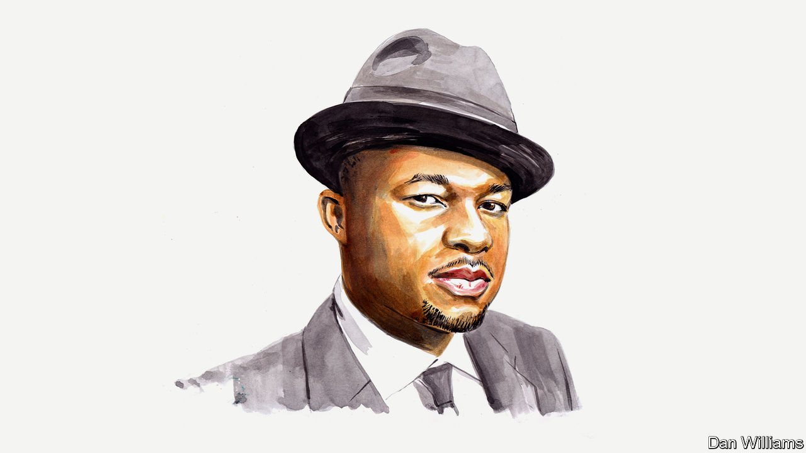

###### Zimbabwe

# Miles Tendi on the depressingly business-as-usual feel to Zimbabwe’s election 

##### The Oxford professor bemoans continued authoritarianism and a lack of female participation 

 

> Aug 21st 2023 

AS ZIMBABWE heads for national elections on August 23rd, the standard criticisms about the country’s polls have arisen once more. Opposition parties and civil-society groups accuse the Zimbabwe Electoral Commission, which runs elections, of being biased towards President Emmerson Mnangagwa and the ruling Zimbabwe African National Union Patriotic Front (ZANU PF) party. Opposition groups complain that they are not receiving fair coverage in state-controlled media outlets.

There is a partial boycott. Douglas Mwonzora, the presidential candidate of the opposition Movement for Democratic Change (MDC), has withdrawn from the race because he believes that a fair election is impossible under conditions that greatly favour the incumbent. Ahead of the poll, opposition politicians such as Job Sikhala languish in prison without having received a fair trial. 

There have been several instances of pre-election political violence. Opposition parties accuse ZANU PF of intimidating their supporters in the countryside and they maintain that Zimbabwe’s security services are supportive of Mr Mnangagwa and ZANU PF.

Complaints that the system is rigged are hardly new. The partiality of election-management bodies has been a bone of contention in every Zimbabwean vote since 1985. Opposition parties boycotted past elections in protest at the uneven playing field—for instance in 1995. They complained before the election of 2018, and numerous earlier elections, about the pro-government stance of the security forces. They have long bemoaned their lack of coverage in state media. Opposition figures were locked up, exiled or assassinated ahead of past votes; dozens suffered one of those fates in 1985 alone. Political violence worse than today’s occurred in the run-up to the 1985, 2002 and 2008 elections. 

Things were supposed to be different by now, or so some hoped. The removal from power of Zimbabwe’s long-time ruler, Robert Mugabe, in 2017 was seen by “the international community”—as Western democracies style themselves—and some domestic opposition as a potential harbinger of democratic change. 

But if this election has a business-as-usual feel to it, it is because Mugabe was removed in a coup by military generals. Coups staged by generals tend to be conservative because they have a stake in and benefit from the existing regime. They have little incentive to drive change, which might upend their access to power and privileges.

Western governments and local opposition did not formally acknowledge that Mugabe’s removal from power was a coup. As I show in my forthcoming book on the coup in 2017, “Coups, Gender and Diplomats”, there is a widely held belief in Zimbabwe that Britain had a hand in Mugabe’s fall and that many Western diplomats and domestic opposition figures deliberately suppressed use of the word “coup” to describe it, partly because they were bent on seeing an end to the much reviled Mugabe’s 37-year-long rule, which many believed presented an opportunity for democratic reforms. 

The record shows they were mistaken. The coup-born government was immediately repressive after the election in July 2018, as seen in the shooting of unarmed civilians by the military in August 2018 and the ruthless crushing of the popular protests against rising fuel prices in January 2019. That the conditions of the current election are just as uneven as in the past is a result of the conservative nature of the coup in 2017. Conservative coups rarely usher in democracy.

Western countries’ and the domestic opposition’s eschewal of the C-word in 2017 undermines their moral authority as external promoters of democracy and local democrats, respectively. This might seem an unforgiving judgment. Yet the reality is that they failed to call by its name, condemn or attempt to undo a coup that guaranteed there would be more continuity than change after Mugabe.

One of the main casualties under coup-born governments is women’s participation in politics. Such administrations seldom encourage women’s involvement in politics in Africa (a rare exception being Thomas Sankara’s leadership of Burkina Faso in the 1980s). Often, when women’s participation is “promoted” it comes with tight controls that constrain their political agency, or women’s “participation” is cynically used to deflect criticisms of illegitimate government and repression.

In Zimbabwe, women’s participation in politics has declined since the coup. Only 11% of candidates running for seats in the national assembly in 2023 are female, down from 14% in the last election in 2018. Eleven men and one woman are running for the presidency; the female candidate was only able to run after successfully challenging being ruled ineligible in the courts. The coup, cast as thwarting the influence and rise to power of Grace Mugabe, the former First Lady, was an assertion of a particular kind of masculine authority in Zimbabwean politics. “Manly” men who participated in Zimbabwe’s independence war govern. Women and “unmanly” men with no experience of the war are governed.

Given the unequal election-campaign field, the result of this poll is likely to be contested. Mr Mnangagwa and ZANU PF deserve to be impugned for not fighting fair. But foreign powers and most opposition groups need to take a long, hard look at themselves regarding their controversial stances on the coup that brought the current president to power, helping to guarantee the continuation of electoral authoritarianism in Zimbabwe. ■


