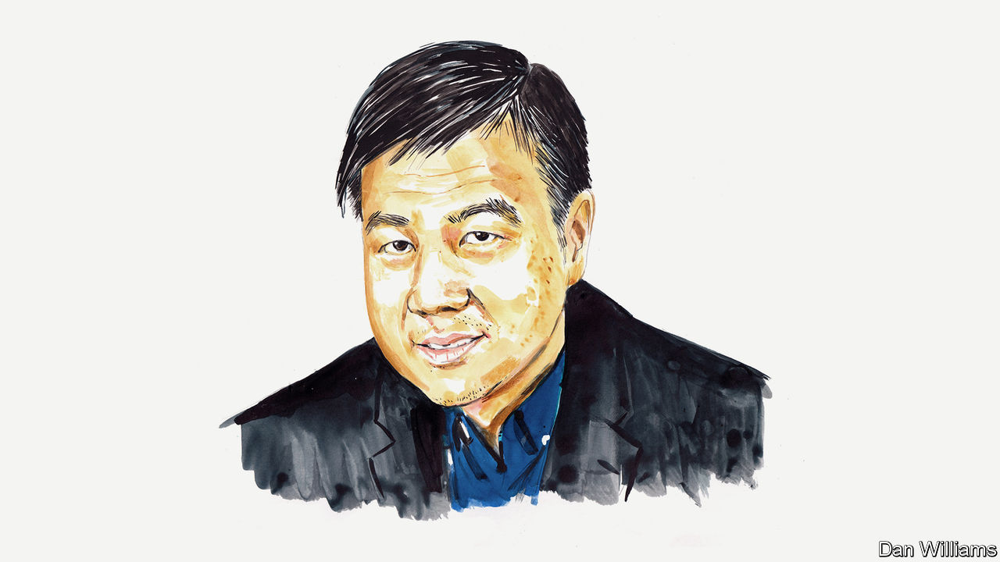

###### China’s economy

# Wei Xiong on how China can overcome its economic challenges 

##### Its hybrid model needs a partial refit, argues the Princeton academic 

 

> Aug 24th 2023 

CHINA’S ECONOMY has struggled to rebound quickly after emerging from its zero-covid policy in late 2022. Despite GDP growth of 5.5% year-on-year in the first half of 2023, indicators point to a much weaker recovery than expected. Youth unemployment hit a record 21.3% in June, consumer and producer prices fell in July, and exports and imports contracted that month. The onshore yuan hit a 16-year low against the dollar in August. Additionally, two large property firms, Country Garden and Sino-Ocean, failed to stump up debt payments, highlighting the turmoil in the sector.

These challenges have put China’s distinct economic model under scrutiny. Over the past four decades China has transitioned from a centrally planned economy to a hybrid one. While still using economic planning to set priorities, ensure social stability and manage market-induced externalities such as pollution and systemic financial risk, the government also embraces market forces. This spurs innovation while ensuring that resources are allocated productively. Market signals help to refine state planning and provide performance measures to enhance economic efficiency. This blend of free market and state planning is a unique experiment, and China’s ascent to its current status as the world’s second-largest economy attests to its viability.

However, this hybrid approach must also grapple with the inherent tensions between state intervention and market dynamics. With an expansive, hierarchical government system, China employs potent career incentives—through promotions and demotions of local officials—to align local and regional governments with the central government’s agenda. These incentives, however, may also foster short-termism at the local and regional level, amplifying internal inefficiencies, such as excessive debt, and crowding out financing from private sources. 

Conversely, while market forces encourage innovation and increase economic efficiency, they may also exploit these government inefficiencies, resulting in negative externalities and price distortions. For instance, property firms fuelled local governments’ drives to sell more land to finance local projects, while shadow banking evolved to support off-the-books borrowing by local governments and real-estate firms, avoiding central-government scrutiny and amplifying China’s property and borrowing booms. 

The present challenges in the Chinese economy can largely be attributed to the impact of state interventions on market confidence. The government has been pushing ambitious social agendas, from the stringent zero-covid policy to antitrust crackdowns on large tech firms and the pursuit of “common prosperity”. Many market participants read these as a signal that the state is prioritising social objectives over the interests of private businesses. 

This has dampened entrepreneurial vigour, making business owners reluctant to embark on new ventures, even in an economy with substantial savings and liquidity. Heightened uncertainty, coupled with weak prices for real estate—the largest asset held by Chinese households—has hurt consumer confidence. Geopolitical tensions have hit Chinese exports and made foreign firms queasier about investing in China.

Bolstering market confidence and averting a downward spiral are essential to mitigate further risks in the property and export sectors. Financial distress is currently concentrated in the property market. Although the balance-sheets of banks, non-property firms and households are stable, falling confidence could, over time, substantially weaken the finances of these sectors, too. Were that to happen, the cost of avoiding prolonged economic stagnation would rise steeply. 

The government’s reluctance to backstop the market during the current turmoil may be justifiable on the grounds of not exacerbating moral hazard in the property sector or undermining financial discipline among local governments, but it may also be interpreted as demonstrating a lack of commitment by the state to the market. The government has consistently emphasised that it regards the market economy as essential, and in July it reiterated its support for private enterprises by issuing a significant policy paper, “Opinions on Further Promoting and Developing the Private Economy”. Nevertheless, these endorsements have been overshadowed by the continuing economic uncertainty. 

This presents policymakers with a thorny dilemma. They need to respond firmly with both short-term and long-term measures. 

Start with the short term. As a potent signal of its commitment to the market economy, the government should implement more robust measures to avert a cascade of property-sector defaults. This could be achieved by encouraging banks and local governments to work together to manage the debt of property developers. The government should also ease restrictions on housing investment, thereby boosting housing demand. 

Moreover, with local governments’ balance-sheets battered after three years of enforcing the zero-covid policy and their land-sale revenues depleted by the property slump, the central government needs to be fiscally bold. It should focus on supporting local-government budgets and encouraging spending, for instance by distributing one-time consumption vouchers to households.

In the longer term, structural reforms are needed to address moral hazards and promote fiscal responsibility. At the top of the list should be reforms that promote affordable housing, reduce local governments’ reliance on land sales for fiscal revenue and make their debt transparent. 

The government must also commit to deeper market reforms that bolster protections for private businesses, private property and foreign investors. Private companies should be placed on an equal footing with state-owned enterprises (SOEs), not just in words but, more importantly, in industrial regulation (which tends to impose added restrictions on private firms) and bank financing (which tends to favour SOEs in both quantity and terms). Another helpful step would be to place more emphasis on economic development when reviewing the performance of local governments, which have played a vital role in fostering the market economy. 

However, instead of solely emphasising GDP growth as the yardstick of economic development, it is vital to shift the focus to household welfare, which encompasses both household-income growth and improvements in public services, from education and health care to support for the elderly. 

China needs to act quickly and forcefully to restore market confidence by averting a full-blown property meltdown, by using aggressive fiscal policies to stimulate demand and by renewing its long-term commitment to market economics.■


