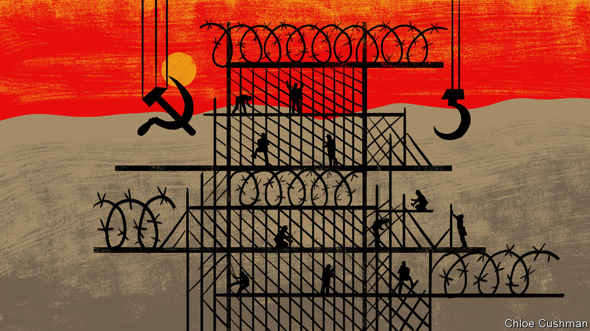

###### Chaguan

# The world should study China’s crushing of Hong Kong’s freedoms 

##### Repression in Hong Kong is a work in progress, and a revealing window on the party’s worldview 

 

> Aug 24th 2023 

“HONG KONG is becoming less and less relevant,” says a Western diplomat in the city. On the face of it, that is an odd claim. Lots of foreign governments take Hong Kong seriously, noting each step of the financial centre’s journey towards autocracy.

Only last month the governments of America, Australia and Britain formally protested when the authorities in Hong Kong announced bounties of HK$1m ($128,000) on eight democracy activists living as exiles in their respective countries. The territory’s chief executive, John Lee, a former police officer, pledged that the eight will be “pursued for life” and “spend their days in fear”. This was not mere bluster. In recent times police have swooped on Hong Kong-based family members of those exiles, questioning them for hours about contacts with their relatives.

The European Union’s latest annual report on Hong Kong, published on August 18th, is both grim and thorough. It describes the arrests of hundreds of opposition politicians, journalists and democracy activists, among them a retired Roman Catholic cardinal in his 90s, under a national-security law imposed on the city by the central government in Beijing. The report catalogues new pressures and controls on schools and universities, environmental groups, trade unions and professional associations. More broadly, diplomats posted to Hong Kong by dozens of countries have spent long hours observing national-security trials, held without juries before panels of hand-picked judges. Dutifully, foreign envoys write reports on stage-managed “elections”. Some of those contests involve a single, pre-screened candidate—the only one to meet the requirement, imposed from Beijing after anti-government protests in 2019, that “patriots administer Hong Kong”.

For all those signs of external scrutiny, there are signs of policymakers in foreign capitals losing interest, or at least hope. The Western diplomat laments that, back home, the city’s smothering is considered a done deal. “When I talk to colleagues at headquarters, they already consider Hong Kong to be part of China.” 

Actually, such fatalism is a mistake, for both principled and practical reasons. Start with the former. Democratic governments cannot change the Communist Party. But they can make China’s rulers pay a price when they break their word. To shrug and turn away from China’s actions in Hong Kong would break faith with the territory’s 7.5m people, who were promised a high degree of autonomy and the preservation of many fundamental freedoms for 50 years after British colonial rule ended in 1997, under China’s formulation of “one country, two systems”. 

Then there is the impact on the stand-off over Taiwan, the democratic, self-ruled island that China calls its own. China’s preferred Taiwan scenario involves the island’s peaceful submission, in return for limited autonomy under a version of “one country, two systems”. If foreign governments allow China to trample commitments to Hong Kong with impunity, they risk encouraging rulers in Beijing to imagine they can do the same to Taiwan. It is hard to see how that could be a consensual, bloodless process. Understandably, China’s crushing of freedoms in Hong Kong has left the people of Taiwan warier than ever of a mainland takeover. 

There is a practical reason to keep tracking repression in Hong Kong, too. A good way to understand any edifice is to watch it being built. In the same way, the stifling of Hong Kong’s pluralism is a work in progress, and as such is unusually revealing about the ambitions and terrors that drive China’s secretive rulers, and about the controls they think are needed in an orderly society. 

For now, the territory enjoys freedoms unknown in mainland China. The internet is not sealed behind China’s “great firewall”. One of the biggest threats to debate is arguably self-censorship, induced by fear and by deliberately vague calls by Hong Kong’s officials to eradicate “soft resistance”—their sinister description of dissent that does not explicitly challenge the law.

The trends are ominous, though. When Xi Jinping, China’s supreme leader, visited Hong Kong last year he called on officials to heed central authorities in Beijing, to guard against foreign interference and to tackle what he called locals’ primary concerns, namely larger homes, more economic opportunities, better schools and quality care for the elderly. Hong Kong’s leaders have made progress on Mr Xi’s first two priorities, at least. 

Their new political model has no time for the notion of loyal opposition. Officials praise the “efficiency” of the territory’s Legislative Council since dissenting politicians were thrown out. School curriculums have shed classes that encourage critical thinking and added lessons about national security. The new model questions the legitimacy of even constructive criticism. When campaigners raise doubts about planned transport or housing schemes, state-backed news outlets denounce them for inciting “citizens’ negative emotions against the government”.

A world city no more 

Hong Kong is being domesticated, in every sense of the word. To bring the city to heel, its leaders want to weaken the West’s perceived influence. One of the exiles with a bounty on his head calls extraterritorial harassment a warning to Hong Kongers. “It is not as if they are going to extradite us,” he says. “The audience is domestic.” China is working to bind Hong Kong economically to nearby mainland cities. Reportedly, lucrative opportunities are increasingly steered to mainland firms in Hong Kong, or to “patriotic” locals. There is talk of admitting more mainland immigrants. Diplomats draw parallels with settler-colonialism practised elsewhere in China’s restive periphery, from Tibet to Xinjiang. 

Once, foreign governments and businesses predicted that Hong Kong’s value as a global city would protect it from heavy-handed Chinese rule. Instead, party bosses prize control over openness: that is the ongoing lesson of Hong Kong. As a window on the party’s bleak worldview, the city’s fate is all too relevant. ■


