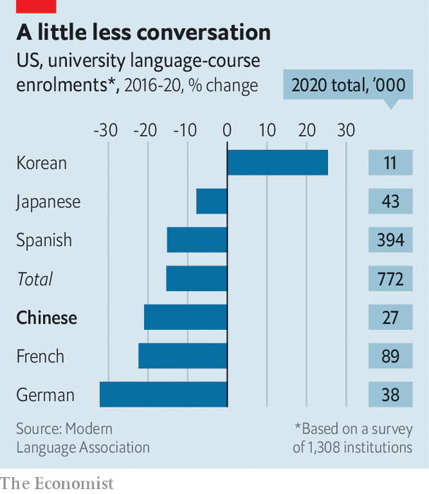

###### How do you say “not interested”?

# Why fewer university students are studying Mandarin 

##### Learning the difficult language does not seem as worthwhile as it once did 

 

> Aug 24th 2023 

Ten years ago Mandarin, the mother tongue of most Chinese, was being hyped as the language of the future. In 2015 the administration of Barack Obama called for 1m primary- and secondary-school students in America to learn it by 2020. In 2016 Britain followed suit, encouraging kids to study “one of the most important languages for the UK’s future prosperity”. Elsewhere, too, there seemed to be a growing interest in Mandarin, as China’s influence and economic heft increased. So why, a decade later, does Mandarin-learning appear to have declined in many places?

Good numbers are tough to come by in some countries, but the trend is clear among university students in the English-speaking world. In America, for example, the number taking Mandarin courses peaked around 2013. From 2016 to 2020 enrolment in such courses fell by 21%, according to the Modern Language Association, which promotes language study. In Britain the number of students admitted to Chinese-studies programmes dropped by 31% between 2012 and 2021, according to the Higher Education Statistics Association, which counts such things (though it does not count those who take Mandarin as part of other degrees). 

China may be the top trade partner of Australia and New Zealand, but in those countries, too, local enthusiasm for learning Mandarin is flagging. Enrolment in university courses fell by a whopping 48% in New Zealand between 2013 and 2022. The dynamic looks similar in Germany, where the data show a decreasing appetite for Chinese studies among first-year university students. Scholars in Nordic countries report similar trends.

 


To be sure, the study of modern languages is falling across the board in many rich countries. In general, students are drifting away from the humanities. Mandarin seemed like it would buck this trend. However, the study of it in American universities has fallen faster than enrolments in all foreign languages combined. 

According to an international survey taken in 2016 of education agents—consultants who help students to choose institutions—the most common reason people studied Mandarin back then was to improve their employment prospects. At the time, even a little Mandarin went a long way. From 2010 to 2015 the number of job postings in America that required skills in the language increased by 230%, according to the Language Connects Foundation, a lobby group. It reckons that American firms continue to desire Mandarin over any other foreign language, save Spanish. But that no longer seems to motivate students. Jennifer Liu, who runs Harvard University’s Mandarin programme, says engagement by business students has fallen over the past decade, compared with those studying international affairs and security.

It could be that the market has changed. Tools like Google Translate and ChatGPT work so well that low-level Mandarin skills aren’t really needed any more. The market may have also got more competitive. Bilingual Chinese graduates now fill many of the jobs that require Mandarin. In terms of language skills, they are often more qualified than their Western counterparts. All Chinese children start learning English by age eight, some even earlier. University-entrance exams in China require a high level of proficiency. 

Students in the West may have also soured on the idea of doing business with China. Mandarin teachers point to the Beijing Olympics in 2008 as a seminal moment, when excitement for learning the language took off. Since then, though, China has grown more oppressive under Xi Jinping. Its human-rights abuses in Xinjiang and Hong Kong have been widely reported. In most rich countries negative views of China are at or near all-time highs.

At the same time, tensions between China and the West have risen. American and European leaders now talk of “de-risking” their economic ties with China. Analysts fear that a broader decoupling is taking place. The shift in narratives about China, from a place to make money to America’s main rival, has affected student choices, reckons James Gethyn Evans of Harvard. Many now see no point in studying Mandarin, says Chen Dongdong of Seton Hall University (in New Jersey), where the number of students taking Mandarin classes has nearly halved in ten years.

There are also fewer American university students studying in China. The number peaked in 2011, even as the total studying abroad continued to grow. One reason may be pollution. Around that time, Western media regularly reported on Beijing’s “airpocalypse”. The capital’s heavy smog made it difficult for foreign firms and embassies in China to recruit people, with or without Mandarin skills.

In need of a BTS

In many ways, the linguistic reach of a country is an expression of its soft power. Take South Korea, which can point to such cultural exports as BTS, a wildly popular boy band, “Parasite”, an Oscar-winning film, and “Squid Game”, a hit television show. Enrolment in Korean courses at American universities rose by 25% between 2016 and 2020. On Duolingo, a language-learning app, Korean is more popular than Mandarin.

China’s soft power is weak by comparison, in part because its  must please the Communist Party. Few of its cultural offerings have caught on in the West. China has more influence in poor countries, where its Belt and Road Initiative, a spree of global infrastructure building, is most active. In these places, Mandarin-learning appears to be ticking up. More than 81,000 students from Africa were studying in China in 2018, the last year for which data are available. (Many were on Chinese-government scholarships.) China’s deployment of Confucius Institutes has also helped. These offer instruction in Mandarin, as well as other Chinese cultural pursuits.

Confucius Institutes were once prevalent on Western university campuses, too, providing them with cheap Mandarin teachers. But the outposts were accused of pushing a political agenda. Since 2017 more than 100 American universities have closed them. Universities elsewhere in the West have taken similar steps.

Western governments, though, say they need more people with advanced Mandarin skills. The CIA, for example, is looking to double the number of Mandarin-speakers that it employs. America’s State Department deems it a “critical language”. Britain is underpowered when it comes to expertise on China and the ability to speak its main language, according to a recent official report. The German government has said much the same thing.

As China and the West, especially America, struggle to get along, those who learn Mandarin seem more likely to be future spies and diplomats than businesspeople. Whether that will help ease a sense of mutual mistrust is an open question. For now, China and its rivals are doing a good job of misunderstanding each other. ■


