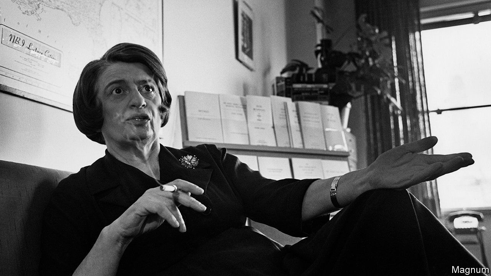

###### Philosophy

# A new book explains the intellectual legacy of four women 

##### “The Visionaries” takes on the ideas of Hannah Arendt, Simone de Beauvoir, Ayn Rand and Simone Weil 

 

> Aug 24th 2023 

By Wolfram Eilenberger. Translated by Shaun Whiteside. 

In February 1933 the Reichstag, home of Germany’s parliament, caught fire. The country’s new chancellor, Adolf Hitler, claimed arson and used it as an excuse to revoke civil liberties. For 26-year-old Hannah Arendt, toiling in an archive to collect “everyday anti-Semitic expressions”, Hitler’s reaction demonstrated the ruthlessness of totalitarianism. Soon she was interrogated by the secret police—an experience that catalysed a long career as a scholarly observer of persecution and mob rule.

Arendt is one of four women whose lives and thoughts Wolfram Eilenberger, a philosopher, recounts in this lively book, which spans the turbulent years from 1933 to 1943 (when Hitler was staring down defeat). The others are , a pioneering feminist; Simone Weil, a trade-union activist who combined mysticism with a yen for social justice; and Ayn Rand, a Russia-born critic of communism who immigrated to America and later shaped the doctrine of libertarianism (although she did not identify with it).

The book is translated from German, and its original title, “Feuer der Freiheit” (“Fire of Freedom”), suggests what links the quartet. They barely met, but the imminence and then eruption of European conflict stirred each to explore alternatives to political violence. 

Mr Eilenberger applauds Arendt’s integrity and toughness. But, after an exciting start, she is not a vivid presence on the page. Weil is more sharply drawn—squabbling with her parents’ tenant, Leon Trotsky, and, as a volunteer in the , scalding her feet in a pot of boiling oil. Between stints working in a factory and flights of religious ecstasy, she wrote tirelessly, hardly eating or sleeping as she crafted essays on the empty rhetoric of extremism and man’s “need for roots”.

Rand, based in New York and distanced from Europe’s turmoil, could surround herself with “intellectual aristocrats” and keep a journal expounding her elitism and hatred of religion. After a decade of literary obscurity—her efforts included a courtroom drama play called “Penthouse Legend”, in which members of the audience were chosen as the jury—she broke through in 1943 with her novel “The Fountainhead”. Marketed by her publisher as a love story set among architects, it was actually a manifesto. Readers, undeterred by terrible reviews, lapped up her paean to individualism and rationality, which became a word-of-mouth hit. Given Rand’s reputation for egotism, one of the book’s most memorable details is how she addresses her husband in a letter (“Cubby Sweet”) and signs off (“Your Fluff”). 

Unlike the other three, de Beauvoir was not from a Jewish family. Nazism impinged on her less directly, and during this period she channelled much of her energy into a liaison with a fellow philosopher, . The couple had many lovers, who formed a “network of asymmetrical relationships and dependencies that eluded any kind of benevolent description”, writes Mr Eilenberger. These entanglements exhausted her. But, in illustrating the ways society thwarted women’s independence, they provided rich material for her masterpiece of 1949, “The Second Sex”, which argues that women are sidelined by men. Her theories were so controversial that the Vatican put “The Second Sex” on its list of prohibited books, but it became a seminal text of feminism, inspiring campaigners for women’s rights.

In his previous book,  (published in English in 2020), Mr Eilenberger wove together the lives of four male intellectuals of the 1920s, and “The Visionaries” reproduces its historical sweep, snappy chapter headings and inevitable affection for the adverb “meanwhile”. Sometimes he insists too firmly on the parallels between the four women’s lives, whether claiming that, for each of them in 1937, “the chief source of joy…was a gramophone” or that a letter of Rand’s “could have been committed to paper with equal aptness” by any of the others.

Attempts to capture the immediacy of his characters’ thoughts can sometimes result in portentousness. Weil, for example, leaps “out from the ivory tower of theory, into the everyday suffering of the workers” and concludes that “to truly liberate humanity from this planetary nightmare, a comprehensive cultural U-turn would be necessary”. But Mr Eilenberger’s most valuable achievement is his focus on Weil, who died at the age of 34 in a sanatorium in Kent. In the 1950s Albert Camus declared her “the only great mind of our time”, responsible for “a body of work whose full impact we can as yet only guess”. 

This is still broadly true. Sickly and lonely yet courageous, she championed the oppressed, extolled the dignity of work and teased out the similarities between the politics of the far left and the far right. Most strikingly, as she foresaw a future riddled with narcissism and constant distraction, she preached the virtues of contemplating not the self, but the world’s beauty and fragility. “Attention”, she declared, “is the rarest and purest form of generosity.” ■


