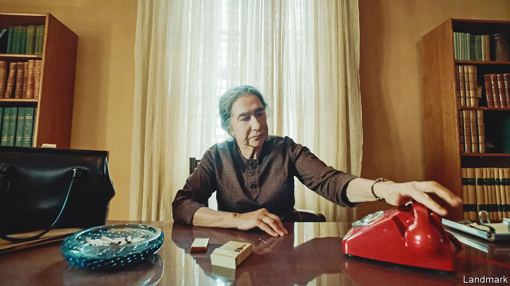

###### Back Story

# Calls for actors’ identities to match their roles have gone too far 

##### How to weigh “authenticity” in casting versus the privileges of art 

 

> Aug 18th 2023 

Posterity holds much crueller fates for politicians than to be reincarnated as Helen Mirren. Such is Golda Meir’s lot in “Golda”, which dramatises the trials of ’s only female prime minister during the Yom Kippur war of 1973 (ignited by a surprise attack from Egypt and Syria). Ms Mirren (pictured) movingly portrays a lone woman in a coterie of military men, a chain-smoking lymphoma sufferer whose country is threatened with extinction.

The film is out in America on August 25th. Before its release, though, it has been criticised by some for casting a gentile as a Jewish luminary—as have  and “Maestro”, an upcoming biopic of Leonard Bernstein starring Bradley Cooper (in a controversial prosthetic nose). Those concerns are part of a wider ruckus over “authenticity” in casting, or who can play whom. As with many cultural rows, a reasonable course is discernible amid the shouting.

These days hardly anyone thinks every actor is eligible for absolutely any part. The practice of white actors donning make-up for black roles is now unconscionable, not least because of its roots in the ignoble tradition of blackface minstrelsy. Originating in the 1830s and popular for much of the 20th century, minstrelsy demeaned black people and mocked their aspirations. Its link to oppression is captured in the name of an early blackface persona: Jim Crow. 

Similar forms of racial mimicry are no-nos, too. Today’s strife tends to involve other strictures, which are proliferating. Some in showbiz and beyond think depictions of many marginalised groups should be reserved for members of them. Straight performers should not take gay parts; only trans actors should play trans roles, and only deaf actors deaf ones. Artists with dwarfism have decried Hugh Grant’s appearance as an Oompa-Loompa in a forthcoming Willy Wonka film. Brendan Fraser’s recent turn as the obese protagonist of “The Whale”, for which he wore a “fat suit” (and won an Oscar), irked some plus-size observers.

Part of the grievance is that deaf actors, say, or those with dwarfism, are routinely overlooked by casting directors and resent missing out on the rare work that mirrors their experience. But the objections involve justice as well as jobs. As with blackface, runs the argument, casting non-disabled actors as disabled characters or gentiles as Jews can lead to caricature and distortion. And those can cause misconceptions and prejudice, which seep from stage and screen into the real world.

This argument is winning. If it seems an age since Laurence Olivier wore dark make-up to play Othello in 1965, even ’s trans role in “The Danish Girl” in 2015 now seems antiquated. Mr Redmayne has since said taking that part was a mistake, one of several stars and directors to express regret for bygone violations of the new orthodoxy.

Orthodoxies, however, can calcify into dogma, and pendulums swing too far. Dissenting voices worry—rightly—that the promise and privileges of art are being wilfully renounced.

Always and only viewing roles in terms of groups and categories is impractical. In the case of a gay Irish part, for instance, which is more essential, a gay actor or an Irish one? It is simplistic, as “Golda” shows: the crux of Ms Mirren’s character is that she must make decisions over soldiers’ lives and deaths, a burden few people of any race or nation have carried, none of them actors. Above all, rigid identity-matching is soulless. Rounded characters, like people, are more than the sum of their labels. Acting can illuminate prejudices and difference, yet at its finest it surmounts them in leaps of imagination and empathy.

Film-makers have the right to cast whomever they like. Still, a fair and politic approach is for roles to go to the best-qualified performers—on criteria that include background alongside other factors. Those from underrepresented groups should be considered and get a better shot than in the past; but if there are sound artistic reasons, such as talent or screen chemistry, someone else may be cast. The lame king in “Richard III” need not always be played by a disabled actor. But disabled actors should get a crack at him (as Arthur Hughes did last year at the Royal Shakespeare Theatre).

In other words, judge the output not the inputs—and judge it, first, as art. This bargain over casting has a final condition for actors and directors: do your research on unfamiliar lives, do your best, then be prepared for criticism. Activists should not have an audition-room veto. But, like everyone, they are entitled to an opinion.■


