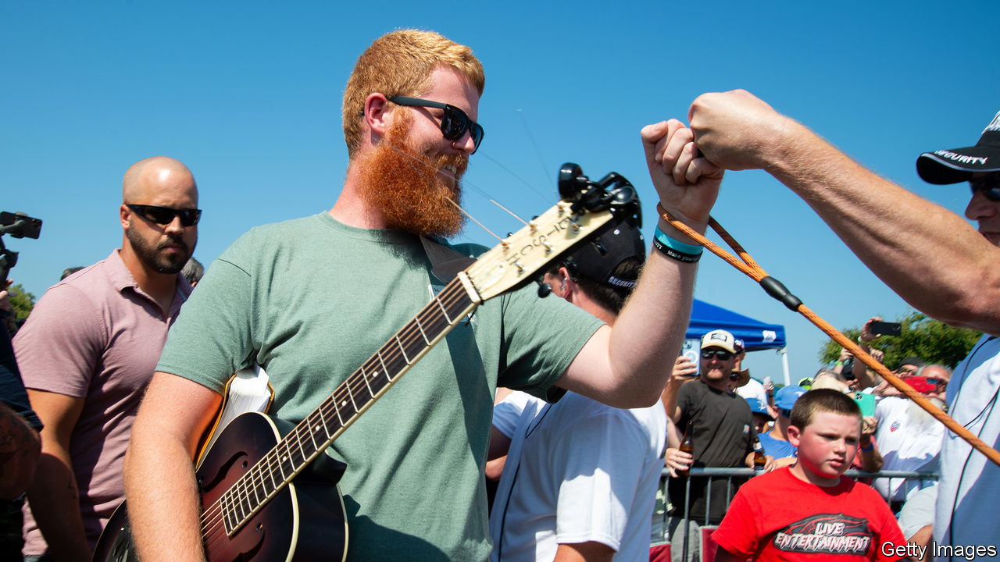

###### Hillbilly elegy

# How America’s right turned “Rich Men North of Richmond” into a hit 

##### Oliver Anthony’s song blames urban elites for the woes of working-class Americans 

 

> Aug 23rd 2023 

He sports a red beard fit for a Viking, prays before he performs and strums his guitar with his three hounds slumped by his boots. Oliver Anthony is an unlikely star. And yet his song, “Rich Men North of Richmond”, released on August 11th, is crowning the charts, having racked up more than 34m streams on YouTube. He is the first musician to debut in the number-one slot on the Hot 100 without having had another song in the charts before. How did an unsigned, unknown artist become the minstrel of the moment? 

The song’s substance helps explain its success. With the nostalgic twang of Appalachian folk, the bearded bard is singing of Americans’ struggles. When Mr Anthony laments “your dollar ain’t shit/And it’s taxed to no end” and repeats the chorus (“It’s a damn shame/What the world’s gotten to/For people like me/And people like you”), he is speaking directly to the anger millions of listeners feel, as they struggle with inflation,  and disillusionment with Washington. 

Mr Anthony is also parroting frequent complaints heard from populists on the American right, crooning that obese people use welfare funds to buy fudge and that northern elites travel to private islands to abuse minors (a reference to Jeffrey Epstein and his ties to Democratic politicians). Conservative pundits including , a podcast host, and Kari Lake, an ally of Donald Trump who ran unsuccessfully for office in Arizona, praised Mr Anthony’s authenticity online to their social-media followers. These endorsements helped “Rich Men” go viral, says Jada Watson, who studies country music.

For years America’s political divisions have played out on cable news. Now they are shifting to the music charts. In May Jason Aldean, a country singer, released “Try That in a Small Town”, a warning to urban protesters. Critics deemed the music video racist; , a Republican presidential hopeful, added it to her campaign playlist; and the row drove the song to number one in early August. 

Mr Anthony maintains that he is centrist. He claims to have rejected a proposed $8m record deal, saying that he does not want to buy a private jet and tour buses, play shows at stadiums or be in the spotlight. But that will not stop conservative voters and right-wing politicians using his music as their theme song. ■


