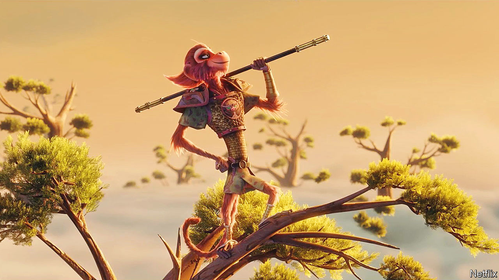

###### A Chinese superhero

# The Monkey King is one of China’s most successful cultural exports 

##### As a new film shows, it is a rare example of a Chinese work spreading to the West 

 

> Aug 18th 2023 

THE MONKEY King, like many iconic fictional heroes—, , Little Orphan Annie—had an unhappy childhood. Sprung from a rock on a mythical mountain, he overcame early hardship to hone his fighting skills, learning to somersault clouds and to turn each hair on his body into a miniature version of his warrior self. With his mix of mischief and might, he resembles the Hollywood pantheon’s many superheroes. But the Monkey King is different: he is more than 400 years old and comes from China.

Released on Netflix on August 18th, a new animated version of “The Monkey King” is full of bust-ups and slapstick, as Monkey faces down 100 demons and tries to achieve immortality. The film is the latest in a long line of adaptations of “Journey to the West”, the most famous novel in Chinese literature, published in 1592. Chinese children still study the book in school, and , China’s leader, was charmed by the Monkey King as a boy. He has used the character as an ice-breaker when he speaks to crowds, including most recently with a group of children in .

The novel is a fantastical retelling of a journey undertaken by a monk in the seventh century to find sacred Buddhist scriptures; the “West” in its title refers to India, where he travelled. But the ancient story has since conquered the world. It is a rare example of successful Chinese soft power, enduring the many ups and downs in relations between China and America. 

In the past century the book has been adapted into more than 60 films, countless TV shows, children’s books, video games, a theme park and  toys. In May an award-winning graphic novel, “American Born Chinese” by Gene Luen Yang, which incorporates the myth into a tale of teen angst at an American high school, was turned into a TV series by Disney. Japan has been behind several successful adaptations, including “Dragon Ball”, a manga version of the story that has sold millions of copies and was spun out into a gaming franchise, and “Monkey”, a badly dubbed television show that became popular in Britain and Australia in the 1980s. 

The original novel is irreverent—at one point Monkey King urinates on the Buddha’s hand. It tells the story of a monk upstaged by his mischievous companions, including a pig whose ears became wings, a sulky sand monster and the famous talking monkey, also known as Sun Wukong. But with fiction considered a disreputable pastime during the Ming dynasty, the novel was published anonymously and only later ascribed—with scant evidence—to Wu Cheng’en, a clerk’s son who repeatedly failed the exam to get a government job.

As in all good storytelling, from  to Star Wars, the ultimate fight in this story is for the protagonist’s soul. Monkey King’s physical journey is overlaid with a mental one. (Spoiler alert: the rebellious hero finally finds peace.) 

Each Monkey King retelling has served as a mirror on its times, reflecting the anxieties of its creators. Some interpretations have concentrated on the need for discipline to quell the inner voice. Others stress the democratising theme of a lowly being rising to great heights. 

Flexible interpretation of the novel’s message has allowed the story to thrive in Communist China, even when other aspects of traditional culture were crushed.  admired Monkey King, who repeatedly challenged the hierarchies of Heaven, as a “wrecking ball who battles the forces of tradition”, says Julia Lovell, who translated the novel into English in 2021. A stage adaptation in 1955 praised Monkey’s “working-class wisdom” in defeating his oppressive rulers, the court of the mythical Jade Emperor. During the  some of Mao’s Red Guards likened themselves to Monkey Kings, rebelling against the Party as Monkey did against the immortals.

Netflix’s film offers a pseudo-Freudian version, with Monkey’s self-doubt stemming from a desperate need to be loved and to belong. It will resonate with navel-gazing viewers in the West. As most versions have done, it situates the legend in a stereotyped ancient China, with wispy-bearded men, curved rooftops, pagodas and red lanterns. On-screen adaptations often feel reductionist as a result, particularly since most retell the book’s first seven chapters—Monkey’s bid for eternal life—and ignore the 93 chapters that describe the monk’s journey to find the scriptures. 

At first glance, Netflix’s “Monkey King” seems like an example of a successful Chinese cultural export. The real picture is more complex. Developed as an idea by a Shanghai-based studio in collaboration with Stephen Chow, a film director in Hong Kong, and then sold to Netflix, the film was ultimately made by an American studio. (So was the recent adaptation of the graphic novel.) Though the story of a mischievous monkey has crossed borders, genres and generations, Communist China has produced few international box-office hits or stories that endure elsewhere. It took Disney to popularise the ancient Chinese folk legend of “Mulan”, first in 1998 and then again in 2020.

China’s state media regularly boast about the success of new Chinese films and TV series abroad, yet in truth most are flops. “The Great Wall” starring Matt Damon—the most expensive film ever made in China when it came out in 2016— With improvements in Chinese film-making technique, special effects and scriptwriting, many films now become blockbusters at home, but few gain traction beyond China’s borders. “Crouching Tiger, Hidden Dragon” and “Hero”, two Chinese-made martial arts films, performed well in the West, but that was more than 20 years ago.

Much of this has to do with creative constraints. Mr Xi has made clear that the primary job of film-makers is a political one: to “tell China’s story well”. In the past five years even slightly edgy social issues have become taboo, says Chris Berry, a professor of film studies at King’s College London. Propaganda, even with whizzy special effects, rarely makes great art.

An animated version of the Monkey King should be the perfect vehicle to transcend national boundaries, with no need for awkward dubbing or distractingly strange facial hair on human actors. But this “Monkey King” again reflects its times. Netflix is not available in China, and the streaming service has no plans to release the film on a Chinese platform. 

With geopolitical tensions between China and America rising, even this beloved cultural icon is raising hackles. Netizens in China who watched the trailer complained that the cartoon creature looked too “Western” and criticised the film as yet another attempt to stereotype the “mysterious power of the East”. As a seventh-century monk must once have observed, there are always obstacles on a journey to the West. ■


