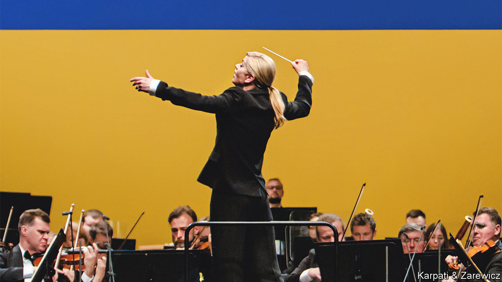

###### A different tour of duty

# The Ukrainian Freedom Orchestra is on tour 

##### It is part of a broader campaign to raise support for the Ukrainian cause 

 

> Aug 24th 2023 

On August 20th the Ukrainian Freedom Orchestra—composed of 75 musicians based in their homeland or abroad, some of them refugees—began their second international tour with ’s Ninth Symphony in Warsaw. In collaboration with the New York Metropolitan Opera and Polish National Opera, the tour will hold eight performances in Germany, Switzerland, the Netherlands and Britain. Keri-Lynn Wilson (pictured), a Canadian conductor of Ukrainian descent, has translated into Ukrainian the words of “Ode to Joy”, which has been used as a protest song before, including by students in Tiananmen Square. “I have never conducted before as I have with this orchestra,” she says, praising the group’s “extraordinary intensity and intimacy”.

Russia’s invasion of Ukraine in 2022 was not only a military contest. It was a cultural siege. Yet far from being obliterated, Ukrainian culture has survived, and interest in it has surged. Condemnation of Russia’s aggression has been accompanied by “a newfound global acknowledgment of and respect for Ukrainian culture”, says Boris Dralyuk, a Ukrainian-American author. 

The sale of foreign rights for Ukrainian books nearly doubled in 2022. Data for 2023 are not yet available, but , a leading Ukrainian writer, says that “over the past year and a half, more Ukrainian books have been translated into foreign languages than in the previous 20 years.” Recently Simon &amp; Schuster, a large publishing house, bought the English rights to one of Ukraine’s most celebrated novels, Sofia Andrukovych’s “Amadoka”, an epic tale of a protagonist who suffers from amnesia after fighting Russians. 

After the war began last year, galleries in Europe and North America rushed to put on . Germany currently boasts major surveys in Dresden and Cologne. In October the fifth edition of the Kyiv Biennial art exhibition will open in Ukraine before travelling to Vienna, Warsaw and Berlin.

This new visibility has led to fresh encounters and reframed histories. The Ukrainian Freedom Orchestra has introduced works by the composers Valentyn Silvestrov and Yevhen Stankovych, whom many outside of Ukraine have never heard of. Their music unites local and global influences, with wistful echoes of Ukraine’s traditional melodies and harmonies.

More contentiously, museums have re-labelled painters such as Sonia Delaunay and Kazimir Malevich as Ukrainian rather than Russian. Peter Doroshenko, director of the Ukrainian Museum in Manhattan, notes a passion among artists for “ Ukrainian art history from 200 years of Russia’s long shadow of repression, lies and propaganda”.

Some worry that if military support for Ukraine’s defence erodes in the West, the groundswell of interest in Ukrainian culture may diminish. Others point out that cultural charm offensives do not always alter political outcomes. During the Spanish civil war in the 1930s, stars such as  and the cellist Pablo Casals inspired recruits abroad and at home to the Republican cause. But they still lost to the Nationalists in 1939. In his poem, “Spain 1937”, W.H. Auden lamented, “History to the defeated/May say Alas but cannot help or pardon”. However, as the Ukrainian Freedom Orchestra performs, “alas” is hard to contemplate, as the music’s majesty mixes with the righteousness of the cause. ■


