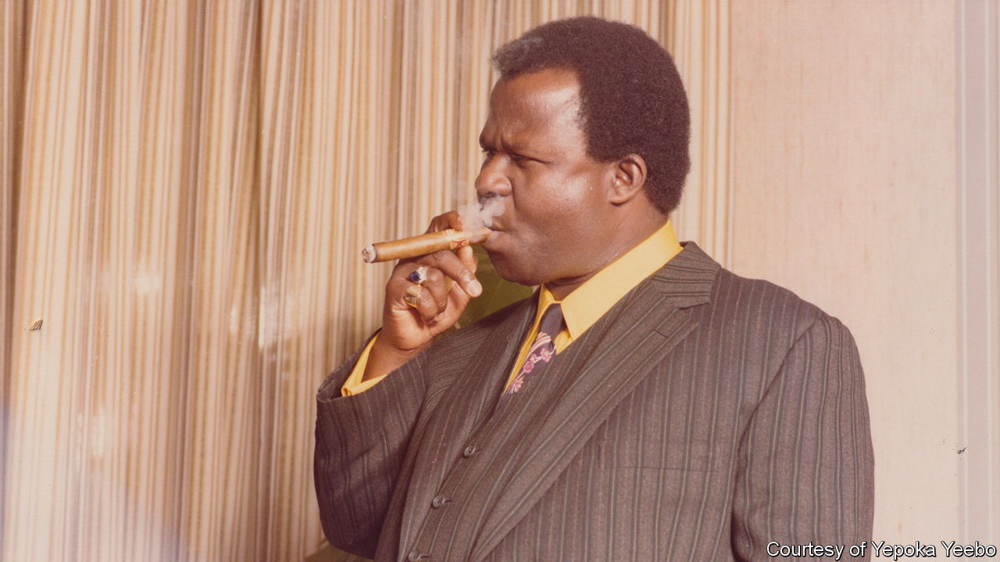

###### Going for gold

# “Anansi’s Gold” examines one of the world’s biggest con artists 

##### A riveting new book pieces together how a swindler with a low profile duped so many high-flyers 

 

> Aug 23rd 2023 

 By Yepoka Yeebo.

From  to Jordan “Wolf of Wall Street” Belfort and , swindlers bring colour to the often-monochrome world of money. John Ackah Blay-Miezah is no such household name, at least outside his native Ghana. But Yepoka Yeebo, a British-Ghanaian journalist, makes a strong case for why he should be. 

For two decades, from the 1970s to the 1990s, he peddled lies and rode his luck, spinning a remarkable story that helped him bilk hundreds (and perhaps thousands) of investors on several continents. Blay-Miezah is a contender for world’s greatest con artist. He is certainly Africa’s. 

His story unfolds after the ousting of Kwame Nkrumah, Ghana’s first post-independence leader, by a military coup in 1966. Rumours swirled that Nkrumah had stashed the nation’s gold overseas. No one was quite sure how much the gold was worth: perhaps hundreds of millions, billions or even tens of billions of dollars. The stories were probably nonsense, but many Ghanaians believed them.

Blay-Miezah was born poor but made his way as a young man to America. There he got a taste for enterprise and sensed a golden opportunity. He buzzed around America, Europe and Asia—always staying in swanky hotels, always on someone else’s dime—peddling the story that he had been made custodian of Nkrumah’s trust fund for the gold. He promised that those who funded his efforts to retrieve the bounty would share handsomely in it. The gold, of course, never appeared. 

The question, as so often with big frauds, is how Blay-Miezah kept it going for so long. One answer is his aptitude for deceit. He had a gift for financial sleight-of-hand, from cheque-deposit fraud to document forgery. A portly, sharp-dressed, cigar-chomping charmer, he had almost superhuman powers of persuasion. Ms Yeebo likens him to Anansi, the trickster god, part-man part-spider, from west African mythology. He understood the importance of assembling a cast of credible backers: among those he persuaded to promote his story were several top Ghanaian officials, Swiss bankers and Richard Nixon’s former attorney-general, John Mitchell. He understood, too, that a good story needs a convincing set: offices in London and Zurich, glossy brochures, and so on. 

But none of it would have been possible without greed: his own and others’. So many investors—whom he preferred to call “supporters”, so as not to fall foul of securities regulators—should have known better but swallowed the fiction. Among those willing not only to invest but to keep ploughing in more were financiers, business owners and lawyers from New York, London and Seoul. 

“Some of them had heard dozens, maybe hundreds of ‘soons’,” Ms Yeebo writes. “Something always came up. Someone had died. There had been some unrest.” Shirley Temple Black, the former child star, was one of the few sceptics to raise questions about Blay-Miezah while she served as ambassador to Ghana, at one point even cabling , then the secretary of state, with her concerns.

Many of the investors simply could not admit to themselves that they had been scammed. It was less painful to keep giving Anansi one last chance. In this sense the fraud, for all its audacity, was like so many others before and since. The high life Blay-Miezah enjoyed for so long owed much to the sunk-cost fallacy. After American law-enforcement finally twigged on to the scam, it took years to unravel. Blay-Miezah returned to Ghana but was never fully held to account, dying at his home in 1992 after a few years of house arrest. 

The backdrop to Blay-Miezah’s shenanigans is a nation blessed with resources (gold,  and, increasingly, oil) but perennially exploited by slave-traders, colonists and corrupt politicians. Nkrumah’s offshore gold may have been illusory, but Ghana’s natural wealth is real. Its decades-long betrayal by rapacious colonisers, leaders and sharks like Blay-Miezah is the book’s central tragedy.

With many of the relevant documents destroyed in coups or by those hoping to cover up their involvement, Ms Yeebo had to dig tenaciously to reveal the full story of Blay-Miezah’s exploits. In addition to interviewing dozens of people who crossed paths with or were scammed by him, she drew on unpublished memoirs and family archives, tracked down missing official records and sifted through files compiled by the FBI and American prosecutors. “Anansi’s Gold” is a welcome, if belated, addition to the canon on great swindlers. ■


