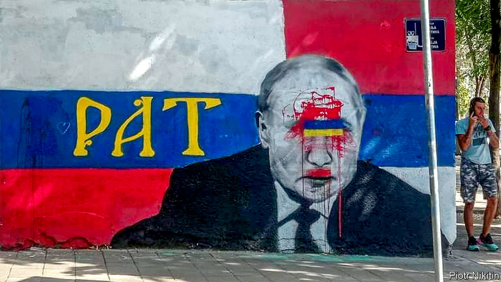

###### The art of war

# In Belgrade, backers of Ukraine and Russia fight with graffiti 

##### In a propaganda war, spray-paint cans are the weapons 

 

> Aug 24th 2023 


AS GLEB PUSHEV, an artist who fled Russia to dodge the draft, was finishing a pro-Ukraine mural in Belgrade, Serbia’s capital, three toughs hurled away his paints. The mural, which took four days to paint and featured a Ukrainian poetess, was later defaced. With friends standing guard, Mr Pushev repainted it. The restored mural was soon covered in pro-Russia imagery. He painted it again under police protection and covered it with plexiglass. The sheet was then shattered and the wall painted over. Mr Pushev now prints stickers instead: “If someone rips them off, it’s less emotionally painful.”

A “graffiti war” is on, says Piotr Nikitin, a Russian anti-Kremlin activist in Belgrade. Opposite a school where a shooting on May 3rd killed ten people, a mural of Vladimir Putin has been repainted repeatedly to support Ukraine (sometimes by changing the red in Russia’s flag to “bloodless” blue). One honouring Ratko Mladic, a Serbian war criminal, is frequently defaced and restored.

Passions are high. After Mr Nikitin asked local media to report on repaintings of the Putin mural in which he participated, Serbia’s president disparaged Mr Nikitin on TV. The artist was detained for 44 hours on landing in Belgrade on July 13th. Another anti-war Russian, Ilya Zernov, fled to Germany after being beaten for painting over graffiti that read “Death to Ukraine”. Aida Corovic, an activist who was roughed up by cops after throwing eggs at the Mladic mural, thinks the state finds far-right graffiti useful. It placates extremists and suggests to America and the EU that the centre-right government is needed to tamp them down.

As Russian losses in Ukraine mount, nationalist street artists have shifted to other messages: homophobia (“I don’t want Dad and Dad”), militarism (“Serbia Sparta”) and irredentism (“When the army returns to Kosovo”). Krokodil, a liberal cultural centre in Belgrade, has changed tack too. When it painted over a mural calling for the reconquest of Kosovo, nationalists restored the mural and defaced its headquarters with nationalist slogans. Now its founder, Vladimir Arsenijevic, is taking a subtler, less political anti-war approach. Krokodil is paying artists to involve youngsters in the painting of a permitted mural series which he says will radiate “gentle stuff, like nice, peaceful feminine images”.■

