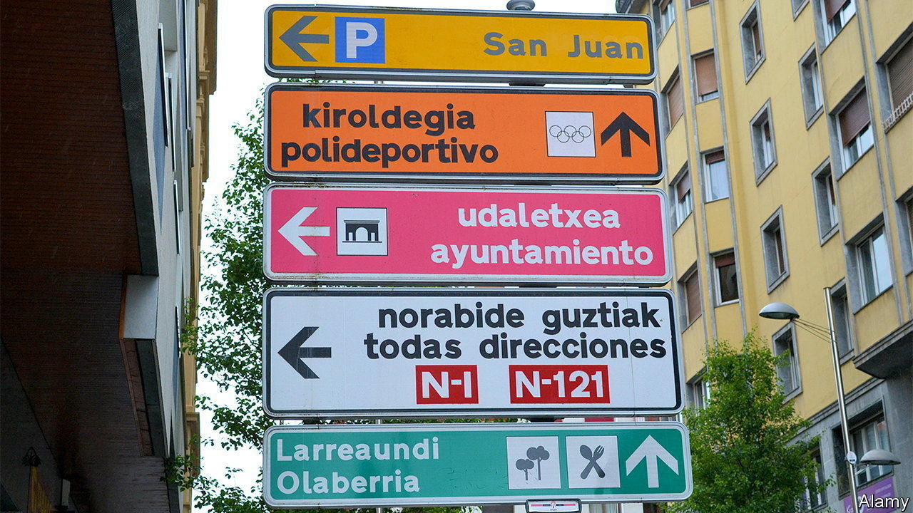

###### Sí, se puede

# In Spain’s parliament, you can now speak Basque (or Catalan or Galician) 

##### Minority languages are part of the left’s effort to stay in power 

 

> Aug 21st 2023 

“ALWAYS REMEMBER this, Sepharad/Keep safe the bridges of dialogue/and take care to understand and keep/the different reasons and languages of your children.” Thus in 1960 Salvador Espriu, a Catalan poet, reminded Spain of its historical diversity (using the country’s Hebrew name to evoke the days before it expelled Jews in 1492). Espriu’s stance was bold at the time. Francisco Franco’s dictatorship forbade official use of any language but Castilian Spanish. But on August 17th Francina Amengol, the new president of the lower house of Spain’s parliament, known as the Congress of Deputies, read the verse in Catalan in her maiden speech. Sprinkling in Basque and Galician too, she announced that the chamber would thenceforth allow use of those three languages. 

Spain’s election in July left neither its right- nor left-wing alliances with a majority. On August 23rd the country’s king gave Alberto Núñez Feijóo of the conservative People’s Party the first shot at forming a new government, but he is expected to fail. Pedro Sánchez, head of the Socialist party, remains as caretaker prime minister, and still hopes to stay in power by cobbling together the support of five regional separatist parties. It was those parties that helped elect Ms Armengol (also a Socialist) to her post, and changing the language policy was part of the deal. 

Ms Armengol, a former president of the Balearic Islands, where varieties of Catalan are spoken, is a proponent of federalism for Spain, where language fights stoke intense passions: they are a proxy for  over the power of the Castilian-speaking centre versus the rest. Some find the bargain “grotesque”, as a leader of the hard-right nationalist Vox party put it. They see it as rewarding separatists and supporting languages used to divide Spain.

Néstor Rego, the lone MP for the Galician Nationalist Bloc, scoffs at such views. “They can’t understand that if you speak Spanish because it’s your language, I speak Galician because it’s mine. They think we do it…to piss them off.” He sees the change as powerfully symbolic. Over 90% of Galicians can speak the language, but only about half do so regularly—a failure of “self-esteem”, he says. Perhaps hearing their language spoken in lawmaking could change that.

As part of the deal with the nationalists, Mr Sánchez has also requested official status for Basque, Catalan and Galician in the European Union. This is trickier. The rules let each country make one language official for EU purposes. Many states might balk at the cost, and the precedent. Other countries have minority languages too. There are already 24 official ones, and the bloc’s translation services employ over 2,000 people at an annual cost of €350m ($380m), or 0.2% of its budget.

Back in Madrid it is not yet clear how the policy will work. The Senate, which represents the regions, already allows other languages, but only in certain proceedings. Ms Armengol says she will consult all the parties. The People’s Party, in contrast to Vox’s hard opposition, says it will await details. 

Javier Cercas, a novelist who lives in Barcelona, says he is “in favour of Catalan in the Congress, and everywhere.” He is a fierce opponent of Catalan separatism, but a proud adoptive Catalan himself (hailing from Extremadura, in the south-west). In his column in , a daily, he argues against the logic that if you speak a language you are a nationalist, and therefore a separatist. The way to fight that idea is for Spanish patriots to celebrate all of the country’s languages: “it is a tremendous error to leave the promotion and defence of Catalan in the hands of the secessionists…there is no better way to refute separatism than in Catalan.” ■

