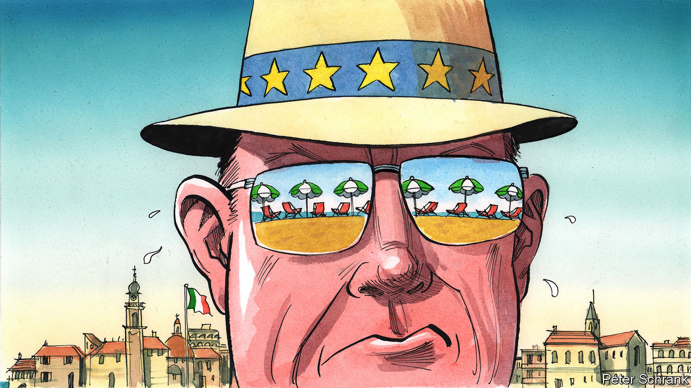

###### Charlemagne

# Italy’s beaches are an unexpected battleground of the European economy 

##### The politics of beach concessions boils over 

 

> Aug 24th 2023 

To venture outdoors in heat-struck southern Europe these days is an act of sweaty defiance. Perhaps the only sensible place to head for is the seaside. In most countries, little more is needed for a successful beach outing than a few spades, a parasol and sunscreen (trashy romance novel optional). Those heading for the shore in Italy, however, should also bring their wallets. From Bari to Venice to Palermo, much of the Italian coast is in effect the private property of a lucky few. Families holding concessions to run beach-side establishments monopolise the shoreline with row after row of reclining chairs and brightly-coloured parasols. Forking out the price of a couple of cinema tickets for a day’s shade is a staple of Italian summers, on a par with  and the national football team underperforming in the World Cup. 

As economic actors go, there may be worse than these amiable , dedicated to offering sweltering customers a respite from the sun and an occasional lemonade. And yet, the manner in which Italian beaches are run has left European authorities redder in the face than a toddler unattended in the sun. For over a decade the European Commission in distant, drizzly Brussels has tried to make the sector comply with rules ensuring the EU economy is open and competitive. In its view the  arrangements amount to the capture of a lucrative business sector by protected incumbents—the very thing crimping European growth. Is that so? To grasp the nature of this vital issue better, Charlemagne grabbed his sunglasses and flip-flops for a visit to the Italian coast. 

The fight comes down to who can be  Most concessions dotting Italy’s 8,000km of coast are family affairs, some tracing back to old fishing huts or handed out as a sop to war veterans decades ago. They have become a big business: the 12,000 or so establishments probably rake in over €10bn ($10.9bn) a year. Since they operate on public land, a hefty slice of that ought to end up in the coffers of local authorities. But rents charged amount to little more than €100m, a tiny amount. Even with the expense of a few brollies, the margins to be made should be attractive to newcomers. They might have new ideas about how to run a beach shack, offer keener prices, or perhaps be willing to pay the state higher fees. But since the 1990s the Italian authorities have allowed existing concessions to be renewed all but automatically. This has created a closed shop, like taxis protected from competition. 

The European Commission wants Italian authorities to get their heads out of the sand. Under EU rules enacted in 2006 that extended the bloc’s single market from goods to services, anyone should be able to compete to bid to run such businesses. That includes any Italian who might fancy having a go at renting out beach chairs, or indeed any European. To this end the EU has demanded changes to  concessions. These should be tendered out openly—perhaps through auctions, though not necessarily—for limited periods of time and according to objective criteria. Such criteria cannot include arguments such as “My used to run this concession, and his before him”. Only then will competition flourish and consumers win.

 is the collective Italian response. Complying with EU diktats would upend decades of tradition. What if big hotel groups decided to muscle in on the beach trade—worse, what if  hotel groups started winning concessions? Given that Italy’s shoreline is also its border, would national security be assured without authentic policing the coast? 

Luckily for incumbents, Italian authorities have run rings around fuming Eurocrats. Official rebukes started coming from Brussels in 2008, backed by rulings from EU courts. Politicians in Rome periodically promise change to bring the sector into line. This prompts Brussels to drop its complaint—at which point the concessions are extended again. In 2022 the technocratic government of Mario Draghi became the latest to promise new tenders for , by the end of this year. Giorgia Meloni, the populist who took over as prime minister, soon reversed course; an ally of hers denounces the forced tendering the EU wants as “expropriation”. Icons of summer fun, the  have considerable lobbying power—a recent ministerial meeting featured 11 trade associations speaking for the beach-bum industry. Their latest wheeze to kick the can down the road is to demand a time-consuming mapping of Italy’s coastline, which they think will show there are enough spots left to issue fresh concessions to newcomers. 

Talk to the sand

The situation is hardly ideal for . “For many years we have been trying to figure out what to do,” says Alessandro Rizzo, who runs a concession on the Lido, a short ferry ride from Venice. Investing to improve facilities is hard to justify, given the uncertainty. His family has run the joint’s 260 cabins—most of which are rented out by local families for the summer, at a cost of up to €6,000—since the 1970s. Yes, he acknowledges he is the recipient of a handy distortion. But the undue privilege comes with obligations not fully grasped by Brussels types: the  take care of the beach, keep teenagers out of trouble, ensure that everyone tans peacefully. Why must everything be run according to the kind of rules that give big business an edge over the average man?

Plenty of Italians think the concessions should not be transferred to new , but cancelled: there are parts of the country where private-parasol joints are so rife it is impossible to visit a beach without paying. Viewed from Brussels, the tussle is part of an enduring struggle for the soul of the European economy, notably that of its poorer south. In too many sectors, incumbents are mollycoddled: think of workers clinging onto comfy jobs-for-life even as the unemployed struggle for opportunity. The privileges given to a lucky few end up amounting to huge costs for the many. The economy loses dynamism as outsiders ache to break in. Something to ponder while waiting for that .■


