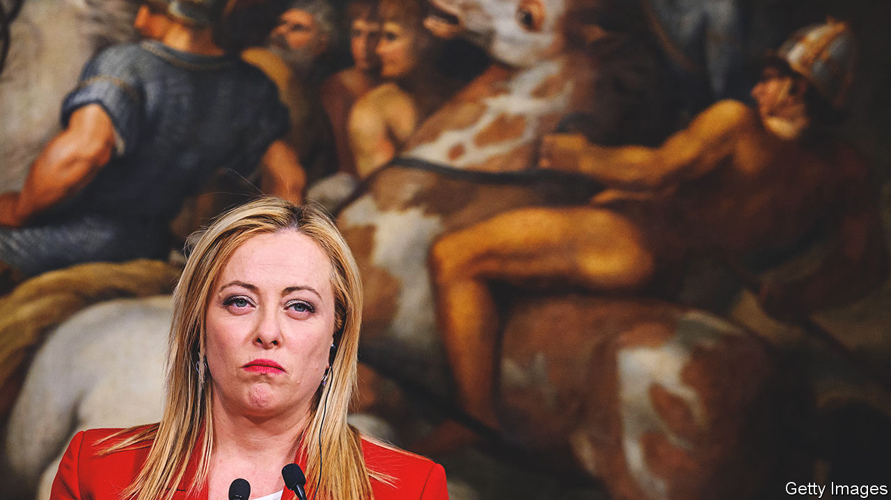
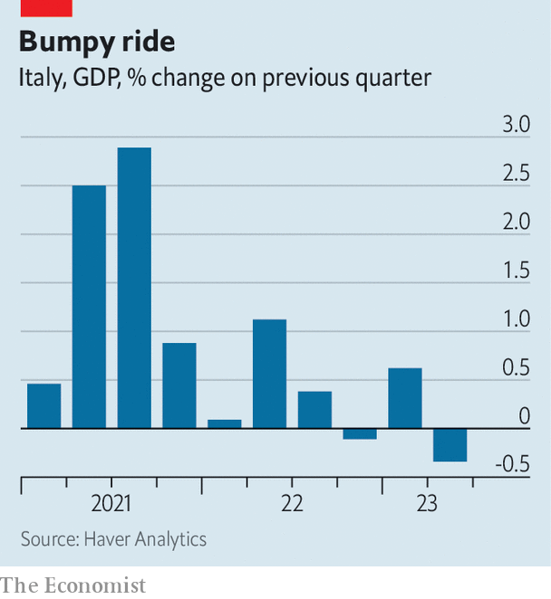

###### True colours

# Italy’s hard-right government is starting to look more radical 

##### Georgia Meloni indulges in cultural and economic populism 

 

> Aug 24th 2023 

ADMIRers of Giorgia Meloni and her Brothers of Italy (FdI) party like to describe them as “Latin conservatives”—no more radical than, say, Britain’s Tories. For the most part, the Italian prime minister has indeed been reassuringly pragmatic since coming into office last year. But the comparison ignores two significant differences: a widespread hostility among the Brothers to social diversity, be it ethnic or sexual; and a deep distrust of free markets and enthusiasm for vigorous state intervention. Both differences have burst to the surface in recent weeks, prompting open splits in the governing coalition, which also includes the populist Northern League and the more liberal Forza Italia party.

The latest row erupted after Roberto Vannacci, a serving army general and a former commander of Italy’s elite parachute brigade, self-published a polemical book inveighing against “the dictatorship of the minorities”. In the general’s view this includes feminists, environmentalists and even animal-rights groups. His book is offensively homophobic (he laments no longer being able to use terms such as the Italian equivalents of “faggot” and “poofter”) and profoundly racist (he writes of Paola Egonu, an Italian-born black volleyball star, that “her physical features do not represent Italian-ness”). Some of the general’s warmest words are reserved for Vladimir Putin’s Russia, where he served in the Italian embassy.

 


The army swiftly and publicly dissociated itself from the general’s opinions. So did the defence minister, Guido Crosetto, who described them as “ravings”. Major General Vannacci was suspended from his job as head of the military geographical institute and Mr Crosetto said an inquiry would be held. Though a founder of the FdI, Mr Crosetto, unlike most party members of his generation, never belonged to its forerunner, the defunct neo-fascist Italian Social Movement (MSI). Nor was he ever a member of the MSI’s youth movement, as Ms Meloni was. “We are different—and very much so,” he remarked of his party colleagues amidst the tumult over Mr Vannacci.

His colleagues made that difference abundantly clear. Not a single party or cabinet member expressed support for Mr Crosetto’s stance; he was publicly criticised by leading members of the Brothers, and furiously denounced in online party chat rooms. The silence from the prime minister was deafening. As one of Mr Crosetto’s critics remarked, General Vannacci’s book reflects the thinking of many who voted for the FdI and its allies—especially supporters of the League. On August 21st Matteo Salvini, the League’s leader and one of two deputy prime ministers, declared that the general had a right to his opinions and compared his treatment to that of Giordano Bruno, a 16th-century philosopher who asserted that the earth revolves around the sun and was burnt at the stake.

In addition to such tacit support for racism and homophobia, the government’s economic attitudes have begun to trouble investors. On August 7th Mr Salvini, standing in for the prime minister, announced that the state would levy an unexpected windfall tax of 40% on the profits accruing to Italian banks because of higher interest rates. After Italian bank shares dived the following day, losing some €10bn of value, the government hurriedly modified the measure, capping the tax at 0.1% of a lender’s total assets. 

Meanwhile, another clash with the corporate world is looming. Ms Meloni plans to set limits on surge-pricing of flights between the mainland and Italy’s biggest islands, Sicily and Sardinia. Ryanair, Europe’s largest airline, claims this is illegal under EU law. 

Neither airline executives nor bankers should have been too surprised. The Brothers’ electoral manifesto in 2022 was relatively anodyne towards the financial sector. But its official programme in previous years had been openly hostile. It called for a parliamentary commission of inquiry into unspecified banking scandals; the separation of retail from investment banking; and a cap on dividends and salaries at banks that received public funding. Foreign airlines might also have expected a rough ride from a party that has made state control of strategic infrastructure a central plank of its programme.

The government’s economic populism looks like a ploy to bolster the FdI’s popularity after the economy unexpectedly shrunk by 0.3% in the second quarter compared to the first. And the banking tax will replenish the state’s coffers ahead of what promises to be an austere 2024 budget. Both moves are wholly consistent with the beliefs of the senior partner in the coalition. The Brothers do not, like Britain’s Conservatives, hark back to laissez-faire conservatives such as Edmund Burke; their ideological roots lie in the statist nationalism that characterised fascism. Ms Meloni publicly endorsed the bank tax and said it had been her idea from the beginning.

Of course, her party is not the only one in government. The bank tax may have pleased the League, but it appalled Mr Salvini’s fellow deputy prime minister, Antonio Tajani of Forza Italia. He complained he had not even been informed of it in advance. Before the election that brought Ms Meloni to power last year, the late Silvio Berlusconi, the founder of Forza Italia, strove to quell the misgivings of foreign governments and investors by claiming that his party would temper the populist instincts of its coalition partners. One lesson of Italy’s summer surprises is that Forza Italia, polling below 8% (compared with 9% for the League and 29% for the Brothers), is in no position to do anything of the sort. Another is that if Ms Meloni starts to look too moderate, Mr Salvini will be happy to outflank her on the right. ■

