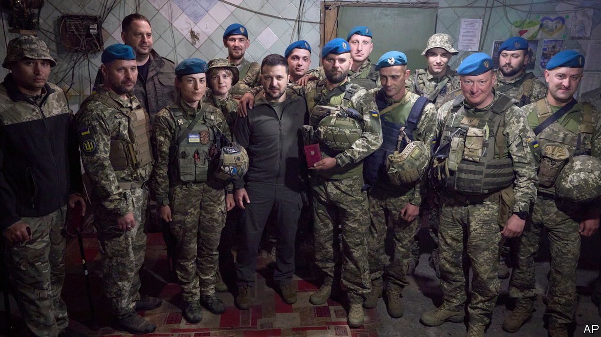
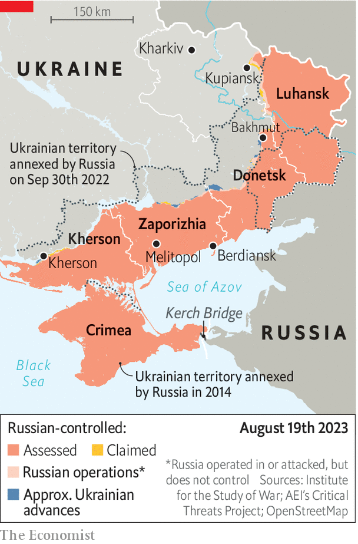

###### Frustrated expectations

# Ukraine’s sluggish counter-offensive is souring the public mood 

##### The government is worried 

 

> Aug 20th 2023 


THE DISAPPOINTING pace of  has been the focus of international headlines for weeks. For Anastasia Zamula the consequences have been more tangible. Ms Zamula is a co-founder of Cvit (Blossom), an all-women volunteer organisation that supports Ukrainian units on the front line. Her crowdfunding appeals have struggled as hopes of a quick breakthrough have dwindled. Now she says her attention is devoted to counselling  whenever she sees them. “The idea of a counter-offensive is bliss when you talk about it from an armchair,” she says. “It’s much harder when you understand that it means darkness, death and despair.”

The public mood is sombre. Criticism of Volodymyr Zelensky, the president, has increased, and the reasons for the dissatisfaction are clear. Having once promised a march to Crimea, occupied and annexed by Russia since 2014, the political leadership in Kyiv now emphasises more realistic expectations. “We have no right to criticise the military sitting here in Kyiv,” says Serhiy Leshchenko, a spokesman in the presidential office. He likened frustration with the speed of the counter-offensive to impatient customers waiting for their iced lattes in the capital’s many hipster cafes. “This isn’t a horse you can whip to go faster. Every metre forward has its price in blood.” 

 


Ukraine’s leadership is particularly frustrated that Western equipment has not yet arrived in its promised numbers. It is “upsetting…and demotivating,” Mr Leshchenko says. Equivocation among allies about the supply of newer weapons, and the prospect of America re-electing Donald Trump next year, have added to Ukrainian anxieties. A source in the general staff says that Ukraine has received just 60 , despite the promise of hundreds. Demining vehicles are particularly scarce. “We simply don’t have the resources to do the frontal attacks that the West is imploring us to do,” says the source. 

Lack of air cover is another difficulty. The source adds that Ukraine’s army was never blind to the challenges of breaching Russian minefields and defence lines without air superiority. (On August 20th the Dutch and Danish prime ministers said they would donate up to 61 of the jets, starting in the new year.) For that reason the military leadership delayed the counter-offensive as long as it could. After a disastrous start in early June, when two Western-trained brigades lost an uncomfortable number of men and equipment in minefields, the initial plans were adjusted. Ukraine has since prioritised preserving its army. “We no longer plan operations that presuppose large losses,” says the source. “The emphasis is now on degrading the enemy: artillery, drones, electronic warfare and so on.”

In recent days Ukraine’s armed forces have made important advances in the crucial southern theatre, and may have breached enough minefields to reach the first of three lines of Russian fortifications in several locations. They have also degraded Russia’s operational reserve and logistics. Still, two-and-a-half months in, Ukraine remains a long way off its strategic goal of nearing the Azov sea—and thus cutting Russia’s seized land corridor to Crimea—before the rains of late October, when mud will make for much harder going.

The grim mood is spilling over into Ukraine’s politics, which have been on hold for much of the war. Rumours have circulated all summer that Mr Zelensky’s office may call early parliamentary and presidential elections. The logic is that it is better for him to seek re-election while still a national hero, rather than after being forced into peace talks that might require an unpopular ceasefire or major territorial concessions. “Any election, if it happens, would be a referendum on Zelensky,” says Volodymyr Fesenko, a political analyst. “Apart from [commander-in-chief Valery] , who is busy running the war, he currently has no obvious competitor. Zelensky’s team understands that could change.” 

Conducting an election during a war, with up to 6m Ukrainian citizens living outside the country and hundreds of thousands fighting away from home, would be complex. And martial law precludes elections, meaning parliament would have to approve a change in electoral rules. The talk was initially of holding both elections this autumn, but it is now almost certainly too late for that—indeed, sources close to the presidential office insist the idea has been ruled out. In any case, polling suggests that Mr Zelensky’s team would have trouble persuading citizens of the need for an early vote. “There just isn’t a demand for it,” says Lubomyr Mysyv of Rating, a Kyiv-based sociological group. “The population is confused by the very idea.” 

In the absence of a military breakthrough, peace negotiations with Russia would be an even harder sell. True, there have been some signs of a shift in mood, in unexpected quarters. In early August a Ukrainian sniper fighting north-west of Bakhmut made waves by dismissing the prospect of Ukraine ever regaining its full territory. He suggested that many soldiers would now welcome a ceasefire—a notion that would once have been unthinkable. But for now, few would agree. Too much blood has been spilt. “Any peace now is delayed war,” says the general-staff source. “Why hand the problem to the next generation?” 

Many of Ukraine’s young are, of course, already bearing the burden of a war that has no end in sight. For young men, in constant danger of being served conscription papers and sent to the front, the pressure is particularly intense. Those keen to fight volunteered long ago; Ukraine is now recruiting mostly among the unwilling. “It makes the air so thick that you can actually feel it,” says Ms Zamula. Everyone knows that the cost of regained territory is dead soldiers. “Even hoping for success in the counter-offensive has become an act of self-destruction.”■


