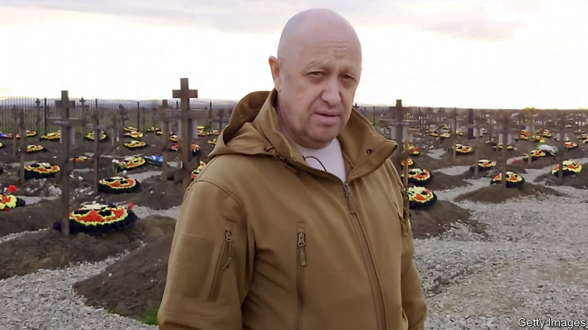
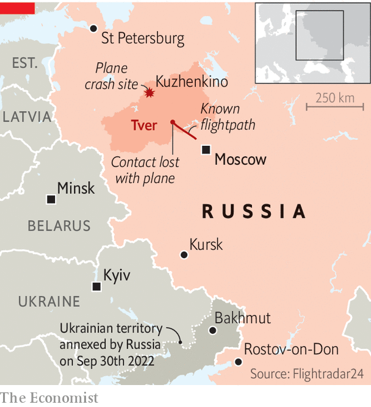

###### A plane crash outside Moscow

# Yevgeny Prigozhin’s reported death may consolidate Putin’s power 

##### But it undermines the notion that Russia functions like a normal state 

 

> Aug 23rd 2023 


BILL BURNS, the director of the CIA, recently mused on what fate might await , the mercenary leader who mounted a short-lived mutiny in Russia in June. Vladimir Putin, Russia’s president, “is generally someone who thinks that revenge is a dish best served cold,” he said. “In my experience Putin is the ultimate apostle of payback so I would be surprised if Prigozhin escapes further retribution.” On August 23rd, precisely two months after that mutiny, Mr Prigozhin’s jet plunged to the ground.

Mr Prigozhin’s Embraer business jet climbed to nearly 30,000 feet before suddenly falling in the Tver region near Moscow after less than 30 minutes in flight, according to public tracking data. All ten people on board were killed, and Mr Prigozhin was on the passenger list, according to Russia’s aviation agency and state media. Dmitry Utkin, a senior figure in Mr Prigozhin’s Wagner Group, and the commander of the column which marched on Moscow in June, was also listed as a passenger.

 


The cause of the crash is not yet known. Eyewitnesses reported hearing explosions prior to the incident, giving rise to speculation that it may have been shot down by air defences. One possibility, though few online commenters seemed inclined to believe it, is that it was an accident. Ukraine has conducted 15 drone attacks against Moscow and the surrounding area since May 3rd, including strikes on seven successive nights to August 23rd. Local air-defences may thus have been jumpy; in 2020 Iran shot down one of its own civilian airliners in Tehran during a period of high alert. It is unlikely, though, that Russian radar operators would confuse a jet for a drone: the latter are slower, smaller and lower. 

A senior source in Ukrainian intelligence said several figures in Russia were enraged enough to want Mr Prigozhin dead, including Sergei Shoigu, Russia’s defence minister, a frequent target of Mr Prigozhin’s irate video messages over the summer. Nonetheless, an operation of this sort could not have gone ahead without authorisation from Vladimir Putin himself. “I don’t know for a fact what happened but I’m not surprised,” said Joe Biden, America’s president. “There’s not much that happens in Russia that Putin’s not behind.” Mr Burns was not the only spymaster to have seen trouble coming Mr Prigozhin’s way. In an interview in June, Kyrylo Budanov, the chief of HUR (Ukraine’s military spy agency), claimed the FSB, Russia’s security service, had been tasked to assassinate the mutineer. 

Notably, the crash came on a day of wider retribution. Earlier on August 23rd General Sergei Surovikin, who had served as commander of Russian forces in Ukraine until demotion in January, was relieved as commander of Russia’s air and space forces. General Surovikin was closely associated with Mr Prigozhin and had come under suspicion of aiding the mutiny or having foreknowledge of it. The general was reported to have been under house arrest.

Mr Prigozhin’s death is likely to have a negligible effect on the front lines in Ukraine. General Valery Gerasimov, Russia’s chief of general staff, whom Mr Prigozhin routinely attacked, has “brought some order to the military chaos of last year”, says John Foreman, Britain’s defence attaché in Moscow until last year. Wagner forces had been shoved aside after they led the conquest of Bakhmut in May. Its shock troops were not as important once Ukraine went on the offensive, says Mr Foreman, and politically suspect soldiers were less welcome in the trenches. 

The impact on African countries, where Wagner was and remained active, is more uncertain. Mr Prigozhin had reportedly been in Africa, attempting to prevent the GRU, Russia’s military intelligence agency, from pushing his forces out of the continent. Wagner is not the only mercenary firm on the continent, and African leaders in need of muscle will not much care whether Russian troops answer to Mr Prigozhin or another Kremlin functionary.

The biggest ripples will be those inside Russia. If Mr Prigozhin was killed on Mr Putin’s orders, it would reinforce the president’s image as a vengeful strongman willing to dispense with procedure and law. He first caught the imagination of the Russian public as Russia’s president with a memorable pledge to “catch [Chechen rebels] on the toilet” and “wipe them out in the outhouse”. Over the following years, his enemies suffered a range of increasingly exotic methods of attack and assassination—from a radioactive isotope slipped in tea to nerve agent smeared on door handles and underpants—designed to cow would-be opponents. 

Yet these methods have also undermined the notion that Russia is a regular state, exposing Mr Putin’s regime as a mafia-like enterprise driven by personal whim and blood feuds. The very existence of Wagner—a private army that is formally banned by Russian criminal code—was a sign of Mr Putin’s mistrust in regular institutions of the state and his reliance on informal connections. 

Mr Prigozhin’s death could help consolidate Mr Putin’s power. But it could also reinforce the myth of the Wagner leader as a truth-telling patriot, and destabilise the pro-war constituency by alienating his followers and champions. “The assassination…will have catastrophic consequences,” warned Grey Zone, a Wagner-affiliated group on Telegram, a social-media site. “The people who gave the order do not understand the mood in the army and morale at all.” 

As the drama unfolded, Mr Putin was addressing a gathering in Kursk, hailing the victory of Soviet troops over German invaders 80 years ago. Russian prosecutors, who promptly shut down an investigation into Mr Prigozhin’s mutiny after he accepted a deal to go into exile in Belarus, were quick to open an investigation into a violation of “air traffic and safety rules”. The Russian public may learn that it was a pilot’s mistake or a fault in the plane that brought Mr Prigozhin to his end. In Russia, nobody expects to be told the truth.■

