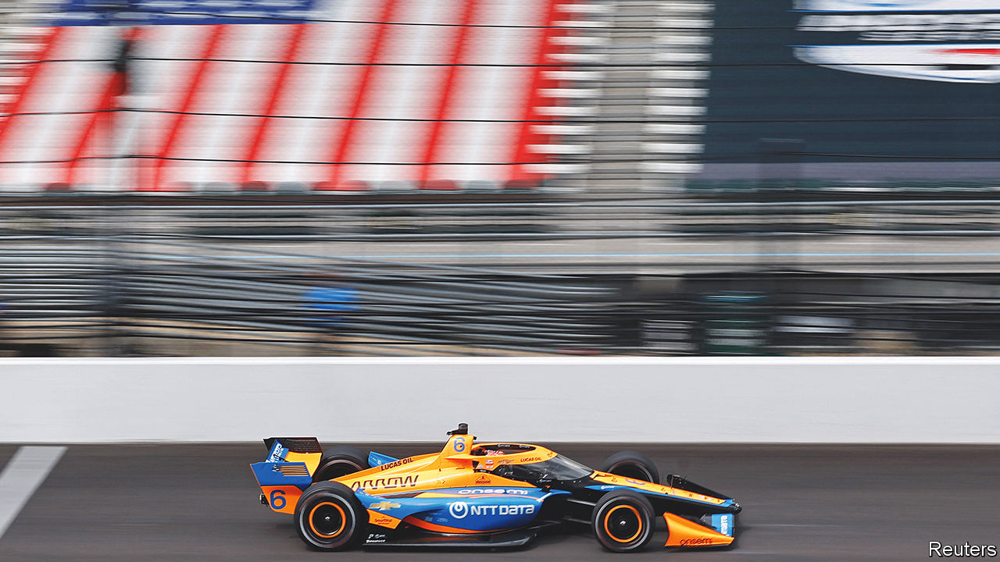

###### Energised

# America’s astonishing economic growth goes up another gear 

##### Will high bond yields be what finally takes it down? 

 

> Aug 23rd 2023 

The energizer bunny, a pink mechanical hare that keeps banging its drum owing to long-lasting batteries, will celebrate its 35th anniversary this October. As if to mark the momentous occasion, the American economy is doing its best imitation of the advertising icon. Despite umpteen predictions of a slowdown, it keeps going and going. Recent data suggest it may even be on track for annualised growth of nearly 6% in the third quarter, a pace it has hit only a few times since 2000. 

As has been the case repeatedly over the past year, a steady stream of better-than-expected data has left analysts scrambling to lift their forecasts. New orders for manufacturing firms reached their highest in nine months in July. Retail sales were perky last month, too, with consumers splurging on everything from restaurant meals to online shopping and clothing to sporting goods. The construction industry has also been buoyant, supported by a rebound in homebuilding. Underpinning all this is the labour market, which has remained hot, making it relatively easy for people to find work at decent wages. The total number of jobs in America has been growing faster than the working-age population, helping to keep the unemployment rate at 3.5%, just shy of a five-decade low.

The worry is that such strong growth, veering into overheating, will also beget a long-lasting inflation problem. Added up, America is on track for a gdp figure this quarter that may look more like a “no landing” than the “soft landing” expected a short while ago. The Federal Reserve’s branch in Atlanta uses a range of data points to estimate gdp growth in real time: a technique known as nowcasting, rather than forecasting, because it assigns weights to already observed variables without factoring in expectations for future figures. On August 16th, its latest update, the model showed the economy may expand by 5.8% in the third quarter. That would be a shocker after more than a year of aggressive interest rate hikes by the Fed.

 


Could growth really be that strong? The nowcast almost certainly exaggerates the economy’s vigour. It is normally off by about two percentage points at this point in the quarterly cycle (see chart). One factor this time is likely to be inventories. When firms make sales from their stocks rather than by producing new goods, this drawdown counts as a subtraction from gdp. A recent gap between rising retail sales and declining wholesale transactions suggests that such a drawdown is now taking place and will weigh on growth, according to Andrew Hunter of Capital Economics, a consultancy. Still, even if somewhat exaggerated, the Atlanta Fed’s nowcast is almost always directionally correct. The inference is clear: America’s economy is not just holding up but steaming ahead.

Recent months have offered some respite on the inflation front. Core prices, which strip out volatile food and energy costs, have risen at their slowest pace in more than two years. But if the economy continues to heat up, inflation may well stage a rebound. Andrew Hollenhorst of Citigroup, a bank, warns that shortages of both workers and housing risk a significant reacceleration of prices next year. Where once optimists thought that inflation might be transitory, now pessimists fear that disinflation will be fleeting. That would scupper hopes for a pivot to monetary loosening by the Fed.

The strength of the American economy may also add to financial strains. It is the principal factor explaining why investors have sold off government bonds since May. Yields, which move inversely to prices, have risen by about one percentage point during that time, with long-term Treasury yields climbing to 16-year highs. This has prompted a debate about whether America’s neutral short-term interest rate—where the Fed would set rates to neither stifle nor stimulate growth—has drifted up. Bill Dudley, a former Fed official, has argued that in the long run America may require higher rates to balance the need for more borrowing (implied by higher government deficits) and a smaller funding pool (as retirees spend their savings). A gathering of central bankers in Jackson Hole, Wyoming, taking place after we go to press, was expected to discuss such issues.

Wall Street is now convinced that in the short run the Fed will need to keep rates higher than expected, too. A few months ago most were pricing in rapid rate cuts starting in September; now most think the Fed will wait until May and will move tepidly. Given the economy’s continuous outperformance, pricing in higher rates further into the future seems prudent.

Higher yields are contributing to an increase in funding costs for financial institutions, which are a headache for smaller lenders in particular. Moody’s and s&amp;p, two credit-rating agencies, downgraded a spate of banks this month, a reminder of the continued fragility of the financial sector. Higher borrowing costs are also starting to bite for consumers. Delinquencies on credit cards and car loans have started to increase sharply. Finally, higher rates are clouding the outlook for housing. Like the wider economy, the market has been most notable for its resilience to date. But mortgage rates have jumped over the past couple of months and hit 7.5% this week, their highest since 2001. This is already having a dampening effect on existing home sales, which could spread to homebuilding and construction more generally.

The lesson of recent history is that the American economy inevitably blows through such problems. Nothing lasts for ever, though. The higher yields rise, the greater the challenge. In the advertisements the Energizer Bunny’s batteries never fade. In real life even the strongest batteries are drained eventually—or unceremoniously yanked out. ■


