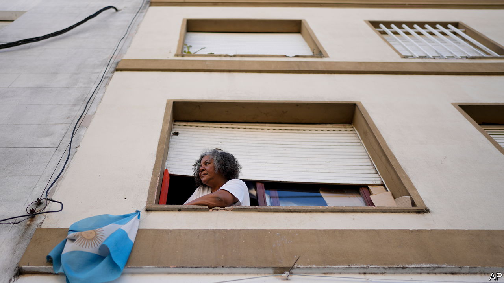
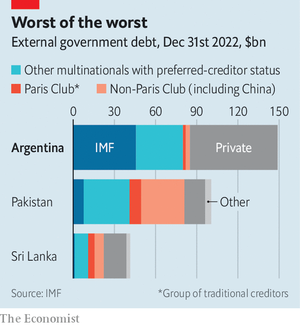

###### Argy-bargy

# Argentina is pushing international lending to its breaking point 

##### The IMF has no good options—but it may have just selected the worst 

 

> Aug 24th 2023 

The Argentine economy hangs by a thread. So far this year, the peso’s black-market value has fallen by half against the dollar and annual inflation has hit 113%. The only foreign-currency reserves left are lent by China. Policymakers are torn between printing pesos to cover the government’s bills and the need to avoid hyperinflation. Ahead of presidential elections in October, much is riding on the candidates’ proposed fixes. Javier Milei, a libertarian economist who once smashed a model of the central bank on live tv, and who unexpectedly prevailed in recent electoral primaries, would scrap the peso and make the American dollar Argentina’s legal tender.

Yet the economy may implode before any candidate gets to fix it. On August 23rd the government persuaded the imf to release a $7.5bn tranche of its bail-out programme, its only hope of meeting dollar-debt repayments and staving off default. The imf’s reluctance stemmed not from the fact Argentina is broke—lending to such countries is the fund’s purpose—but from the fact that most of the cash Argentina must repay this year is promised to the fund itself. Argentina is a rare country with the imf as its biggest creditor, owing the fund a cool $40bn, roughly a third of its external debt. By providing support, the imf has delayed disaster. It has also prolonged an increasingly absurd situation.

 


The imf lends to the world’s unstable economies as a “preferred creditor”. If a country only has a little cash, it is the first to be repaid. It never takes a loss during debt restructuring. This lets it and other multilateral institutions, including the World Bank, hand out cheaper rescue packages. The approach has worked when packages are small enough that even troubled countries are able to repay them.

Yet Argentina is pushing the model to its breaking point. In 2018 the imf took a gamble and offered the country a bail-out worth $57bn, the fund’s biggest ever. At the time, many observers thought it was too much for a country with Argentina’s patchy track record. It turned out also to be far too little to fix the country’s economy. 

Argentina cannot afford its bills; the imf cannot cut the debt it is owed without forfeiting its status as preferred creditor. The result is a stalemate. For now, an instrument approved by the imf last year provides a workaround. Every time the fund collects Argentine debts it deposits a roughly equal amount with Argentina’s government. This programme has an elongated repayment schedule, but also eye-watering interest bills of 8%. Argentina has just as much borrowing—and just as few ways to pay—as it did before. 

One escape for Argentina would be to find the cash to repay the imf. During 60 years of borrowing from the fund, however, the country’s politicians have shown little interest in taking its advice. Few reforms stipulated as part of the agreement in 2018 have been enacted. Even if the next president is disciplined, it will take years to get the economy on track. imf officials point to the country’s recent bad luck, including a drought that cost an estimated $20bn. But that would have barely covered repayments to the fund for the year.

Another option is for the imf to admit that Argentina has too much debt and things will have to change. Although the fund reckons that Argentina is just about solvent, with a bit of luck, many outside economists think the country is already unable to repay its debts without restructuring. It is unlikely other creditors, mostly American financial institutions, will agree to take losses while the fund shelters behind its elevated status, since the more obligations Argentina racks up to multilateral institutions, the less its bondholders matter. Soon private-sector lenders could hold so little of the country’s external debt that they are irrelevant for its solvency.

The imf’s preferred-creditor status ultimately rests on the expectation that borrowers will turn their fortunes around and on other creditors’ goodwill. Neither condition holds in Argentina. By doling out another wodge of cash, the fund will reassure markets, stopping sudden fluxes in the peso or bond prices. But the disbursement brings a tough question. When does the imf stop handing out money? Through their desperation to avoid default, the fund’s officials are putting up with naked disobedience from Argentina, which may set a bad example for other countries.

Meanwhile, Argentina desperately needs a lasting fix. Each month without one deepens the country’s economic woes. Inflation worsens as imports become more expensive and monetary policy flirts with fiscal dominance, where the government borrows so much the central bank has no choice but to bail it out. The longer Argentina limps on without restructuring, the more damaging the process will be when it happens. In the past three months, Argentina has racked up short-term debts of $1.7bn from China, $1.3bn from caf, a regional lender, and $775m from Qatar. 

These are steep costs to protect the imf’s preferred-creditor status. The alternative would be for the fund to stop lending to Argentina, which would force the country to restructure its debts. In doing so, the fund would risk default and perhaps even a loss. Those in favour of such a move argue that the damage to the imf’s preferred-creditor status would not affect its dealings with other countries, so long as it did not make a habit of big bail-outs. 

With the next disbursement due in November, imf officials might even be able to use the threat of this action to squeeze real reforms from the outgoing government. If the move fails, the next government would at least receive a clean slate, rather than being dogged by negotiations during its first year in office. The cost of letting Argentina carrying on is high. In the coming months, the imf will have to figure out if the cost of cutting it off is higher. ■


