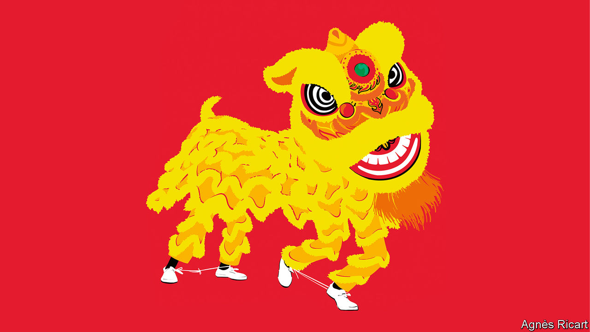
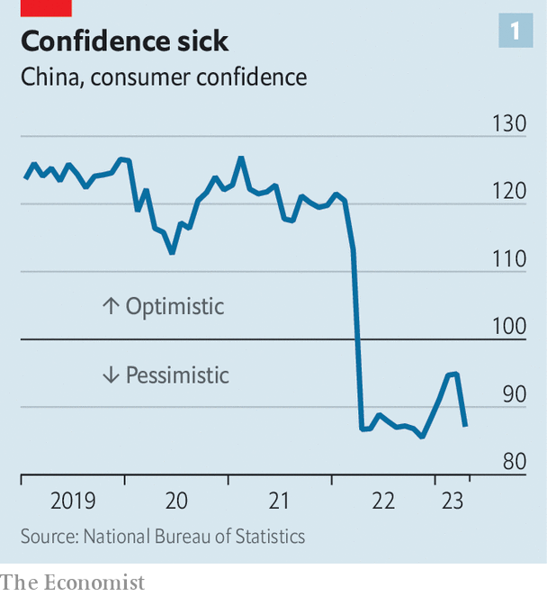
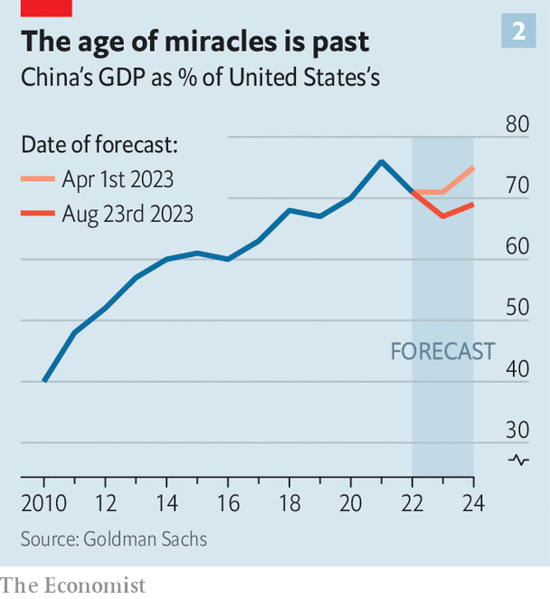
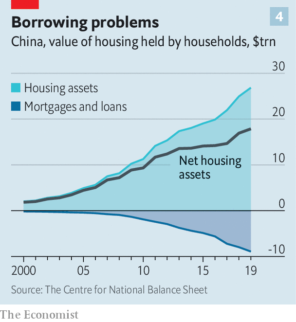

###### Power trip

# China’s economy is in desperate need of rescue 

##### Yet available options appear politically unpalatable 

 

> Aug 24th 2023 

The headlines keep getting worse for China. Consumer prices are falling. America is shunning exports from the country and restricting investment in it. China’s trade with its best customer and biggest rival shrank by a fifth in July compared with a year earlier. The country’s property sector, which has driven more than 20% of its gdp in recent years, is teetering. Developers, which carry debts worth about 16% of gdp, are struggling to meet their obligations. Two of them, Country Garden and Sino-Ocean, have missed bond payments. Investment products sold by Zhongrong Trust, which are probably exposed to property, have failed to pay out.

These reports have been accompanied by even scarier metaphors. China’s economy is a “ticking time-bomb”, according to America’s President Joe Biden, because of its ageing workers and unemployed young. Others think it is suffering from “long covid” because of the private sector’s “immune response” to Xi Jinping’s meddlesome rule. Many worry that China faces “Japanification”—a combination of debt, deflation and demographic decline—in the long term and a “Lehman moment” in the more immediate future, as defaults cascade through the shadow-banking system. 

Even level-headed observers are shaken. The mood is the worst it has been for years, if not decades. The cause of this despondency is disputed—is it politics or property?—but the consequences are clear. It is inhibiting spending, which is depressing prices, profits and hiring, all of which only adds to the gloom. To break this cycle, the country’s confidence must be revived. 

Morale used to respond to a strong signal from China’s leaders, such as Deng Xiaoping’s “southern tour” of entrepreneurial cities in 1992, or Zhu Rongji’s vow to keep growth at 8% during the Asian financial crisis in 1998. But China today lacks a ruler with the requisite economic credibility. Officials will have to put their money where their mouth is, spending on infrastructure, pensions and the like. These tools should work—if they are used. The problem is that they entail a generosity that some in China’s leadership find distasteful. And they require a commitment to growth that seems to be lacking. 

It is a disorientating state of affairs. For 40 years Chinese officialdom’s commitment to growth was never much in doubt. When China began its reform era in 1978, gdp per person was only $2,000 at purchasing-power parity, which adjusts for differences in the cost of living. More than 70% of the country’s workforce toiled on farms. Almost 90% suffered in abject poverty. Only 12 firms were permitted to trade across borders. The millions who worked in state-owned factories were saddled with “obsolete and dysfunctional products”, according to Thomas Rawski of the University of Pittsburgh and his co-authors, such as “transformers that failed to keep out rainwater” and “sewing machines that leaked oil onto the fabric”.

Market reforms meant managers “switched from politics to business”, as one of them put it. China’s gdp per person now exceeds $20,000, above the global average. The most wretched poverty has been eliminated. Those 12 trading firms have been succeeded by tens of millions of others, turning China into the world’s biggest exporter of goods by 2009, and perhaps its biggest exporter of cars this year. The country’s manufacturing gdp exceeds America’s and the European Union’s combined, churning out chips, ships and industrial sewing machines (60m leakless ones in the past ten years). In its combination of scale and speed, this economic revolution has no precedent. 

The transformation included a remaking of China’s urban landscape. From 2010 to 2020, the country added more than 140m units of housing to its cities, according to Morgan Stanley, a bank. In just three years, it produced enough cement to turn the whole of Britain into a car park. The amount of living space per person increased from a cramped 27 square metres (like the eastern half of Europe) to a more comfortable 35 (like the western half), according to calculations by Rosealea Yao of Gavekal Dragonomics, a research firm. Chinese residential property became one of the world’s largest asset classes, worth over $30trn by the end of 2019.

China’s miracle is long over. Its economy has matured. Its workforce is shrinking. Fundamental demand for new property in China’s cities, driven by people’s aspirations for a first home or better digs, has passed its peak. For China’s leadership, the pursuit of prosperity must now compete with other goals. Mr Xi wants to break the West’s chokehold on vital technological inputs. He wants to keep finance tethered to the needs of the “real” economy, like a kite tied to a tree, according to an official think-tank. He frowns on the “disorderly expansion of capital” into social realms like education and child rearing. And he despises the mix of gumption and corruption that motivates many local cadres. 

 


The question now is whether the next phase is moderate or malign. China’s strict “zero-covid” policy played havoc with its economy last year. Thus hopes for this year were high. China’s reopening released pent-up demand for the goods and services it was hard to enjoy when a single infection could imprison an entire city block. It also cleared a backlog of export orders and allowed a flurry of home purchases in China’s more expensive cities. Some private-sector economists raised their growth forecasts for the year to a jaunty 6%. 

This bout of spending was, however, considerably briefer than hoped. And, crucially, it did not lift morale sufficiently to sustain a broader recovery of spending. In April consumer confidence fell back to last year’s lows, according to the National Bureau of Statistics, which promptly stopped releasing the figure (see chart 1). Foreign direct investment all but vanished in the second quarter, falling by 87% year-on-year to $4.9bn, as multinationals repatriated their earnings rather than reinvesting them. The Shanghai Composite, a benchmark stock index, is down by about 5% compared with a year ago, when the memory of Shanghai’s torturous lockdown was still fresh. Prices for existing properties in China’s 100 biggest cities have dropped by 14% compared with their 2021 peaks, according to Beike, a broker. In the smaller cities, where price information remains patchy, things are probably worse. 

An old trick

Many economists now expect growth to meet the government’s target of “around 5%” only because the word “around” gives it some wriggle room. Slowing growth has also been accompanied by declining prices and a weaker currency. The combined effect could wipe trillions off the dollar value of China’s gdp. In the past four months, for example, Goldman Sachs, a bank, has slashed its forecast for this year and next by a combined $3trn (see chart 2). 

 


For some observers, there is little hope of improvement. Adam Posen of the Peterson Institute for International Economics, a think-tank, has suggested that China’s economy is suffering from something akin to “long covid”. Draconian and arbitrary lockdowns in 2020-22 ruptured people’s faith in Mr Xi’s meddlesome party. Households and entrepreneurs can no longer assume that the party will not bother them if they do not bother it, he argues. Therefore private investment is tentative, purchases of consumer durables are weak and bank deposits are unusually high, as people self-insure against an uncertain future.

Confidence has also suffered as a result of the “regulatory storm” that struck after 2020, humbling China’s online platform companies, such as Alibaba and Meituan, and all but killing the ed-tech industry. The succession of crackdowns and lockdowns left the impression that the government was newly willing to sacrifice economic growth for other ends. Whereas Mr Zhu urged China to keep growth at 8%, Mr Xi insists that it must be “high-quality”, by his own evolving definition. For entrepreneurs, that requires an uncomfortable switch from business to politics. 

If Mr Posen is right, China is stuck. If spending is weak because households and entrepreneurs fear the party’s intrusive policymaking, their spirits will not revive until Mr Xi commits to self-restraint—a commitment that he cannot credibly make. Even if the setbacks of the past two years have chastened him, he cannot prove he will not change his mind again. The party lacks the power to limit its own power. 

Yet low confidence may have more mundane explanations. Households may be despondent because employment is insecure, wages are stagnant and assets, especially houses, are losing value. If so, morale should pick up if the job and housing markets improve. The animal spirits of private entrepreneurs should also revive if their sales regain momentum.

It may, in fact, be property that is at the heart of the problem. In manufacturing, by contrast, private investment has been respectable, growing by 8% in June compared with a year earlier. Weak spending on consumer durables may also reflect property-market woes, which have depressed furniture and white-goods sales. Purchases of other consumer durables have shown more signs of life. Sales of cars surged in the first half of this year, helped by the exemption of electric vehicles from a 10% sales tax. China’s households are not so worried by their government that they will miss out on a bargain.

 


The renewed weakness in China’s property market has certainly contributed to fears of deflation and default (see chart 3 ). The price of building materials fell by 5.6% in July compared with a year earlier, and the price of household appliances fell by 1.8%. The “deterioration in sales” was one reason Country Garden gave for failing to pay its bondholders on its deadline of August 6th. Property distress may also help explain why products sold by Zhongrong, an asset-management firm, have failed to pay investors as expected. 

If property is a bigger mood-killer than official interference, this raises a question. Are China’s property problems any easier to solve than those produced by an overbearing state? The market got ahead of itself in 2020 and 2021, buoyed by people looking for a place to park their wealth, rather than a place to live. Although the non-speculative, fundamental demand for new construction will remain on a gently declining path from its historical peak, demand is now so low it has probably fallen below this fundamental pace. Sales are running at about 54% of their 2019 level. A sustainable pace would be closer to 75%, reckons Ms Yao of Gavekal Dragonomics. 

Lifting sales back to such a level would require bolder macroeconomic manoeuvres from China’s policymakers. Lower interest rates would make new mortgages more affordable, although they would be of little immediate assistance to existing borrowers, since mortgage refinancing is difficult in China. The People’s Bank of China, the country’s central bank, this week surprised observers by deciding not to reduce the five-year loan-prime rate, which serves as a benchmark for mortgages. Given the drop in inflation in recent months, real interest rates are rising. 

The central bank’s response partly reflects uncertainty about the impact of interest-rate cuts. Officials worry, for example, about the profit margins of banks, which may feel obliged to pass on rate cuts in full to borrowers but not to depositors. The authorities also fret about the yuan. China’s capital controls give it a degree of monetary independence. But about $26bn of foreign exchange still left the country in July, according to Goldman Sachs—the fastest pace of outflows since September 2022. China’s currency has weakened more quickly than the central bank would like in recent weeks. There are signs that state-owned banks are helping to prop it up. 

Such constraints on monetary policy necessitate a more forceful fiscal push. During past slowdowns, local governments and affiliates have led the way, allowing the central government to keep its balance-sheet relatively uncluttered. But local stimulus efforts have included poorly conceived projects, which Mr Xi views with distaste. Some cadres “over-borrow for construction and blindly expand businesses”, he complained last year. 

Other provinces have been a little more imaginative. Three years ago, for example, cities in Zhejiang distributed perishable coupons to consumers through e-wallets on their mobile phones. These coupons offered discounts on things such as restaurant meals if shoppers spent above a certain threshold. A study by economists at the Ant Group Research Institute found that these vouchers had a high multiplier, delivering a lot of wallop for the yuan.

 


The problem is that many of China’s local governments are in no position to stimulate the economy this year, imaginatively or otherwise. Indeed, they will need more help merely to prevent damaging spending cutbacks. According to , a business magazine, China’s central government will allow local governments to sell an extra 1.5trn yuan-worth ($210bn) of bonds, which carry an implicit central-government guarantee, to help repay the riskier, costlier debt owed by their financing vehicles (investment firms, backed by state assets, that can borrow in their own right). Proceeds from these bonds should help prevent an explicit default. Yet even 1.5trn yuan looks meagre compared with the total risky debt of these platforms, which one estimate suggests amounts to 12trn yuan.

Although avoiding a default by a local-government financing vehicle will prevent the economic downturn getting worse, it will not reverse it. That would require the central government to make greater use of its own balance-sheet, through increased investment in green infrastructure, consumer giveaways of the kind pioneered in Zhejiang or increased spending on things such as pensions and anti-poverty programmes. Some economists have argued that the government should also establish a fund to buy up some of the unsold inventories of China’s struggling property developers in order to create affordable rental housing for the poor.

Flaming out

The aim would be to prevent a fire-sale of properties by distressed developers, add to household incomes and replenish company order books. If used, stimulus should be enough to ward off deflation, cap unemployment and ensure China’s economy fulfils its potential over the next few years. Low inflation, after all, is both a threat and an invitation. It implies that the economy has plenty of “slack” or room to expand over the medium run, even if its growth potential is constrained in the longer term.

 


But this comes with two mighty caveats. The first is that fiscal heroics will not erase the long-term problems that cloud China’s economic future. The country will still have to contend with demographic decline and diplomatic dangers. Its workforce will begin to shrink more rapidly in the 2030s (see chart 5). And America’s restrictions on semiconductor exports will bite more keenly as technology advances. 

The second concerns the political dynamics at play. If China’s government acts with urgency, it has the tools it requires in order to engineer a recovery in the latter part of this year. But will it use them? Mr Xi lacks the credibility or focus of previous leaders. He now prizes greatness over growth, security over efficiency and resilience over comfort. He wants to fortify the economy, not gratify consumers. These competing priorities may prevent China’s rulers from doing whatever it takes to revive demand. Mr Xi no longer wants growth at all costs. And so the country has not had it. At growing cost. ■


