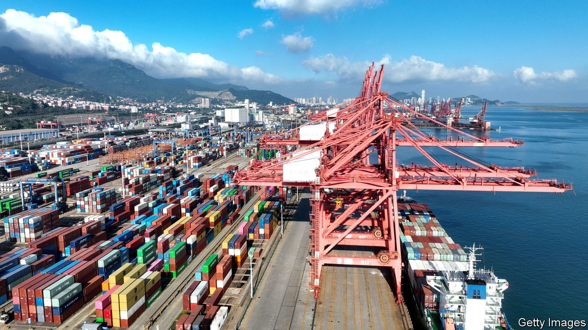

###### Aftershocks

# What China’s economic troubles mean for the world 

##### Pain for Elon Musk; relief for Jerome Powell 

 

> Aug 22nd 2023 

Only eight months ago China’s economy was expected to roar back to life. Zero-covid had been abandoned; the country’s shoppers and tourists allowed to roam free. Yet the rebound has fizzled out, with weak growth and deflation the result. This will not only affect its people. What happens in the world’s second-largest economy matters beyond its borders, too.

 


Because China is so big, its changing economic fortunes can drive overall global growth figures. But a slowing China also directly affects other countries’ prospects. Its households and companies will buy fewer goods and services than they would have otherwise, with consequences for both the producers of these goods and other consumers of them. In some places, China’s difficulties will be a source of pain. In others, though, they will bring relief. 

Commodity exporters are especially exposed to China’s slowdown. The country guzzles almost a fifth of the world’s oil, half of its refined copper, nickel and zinc, and more than three-fifths of its iron ore. China’s property woes will mean it requires less of such supplies. That will be a knock for countries such as Zambia, where exports of copper and other metals to China amount to 20% of gdp, and Australia, a big supplier of coal and iron. On August 22nd the boss of bhp, the world’s biggest miner, reported the lowest annual profit for the Australian firm in three years, and warned that China’s stimulus efforts were not producing changes on the ground. 

Weak spots in the West include Germany. Faltering demand from China is one reason why the country’s economy has either contracted or stagnated over the past three quarters. And some Western companies are exposed through their reliance on China for revenues. In 2021 the 200 biggest multinationals in America, Europe and Japan made 13% of their sales in the country, earning $700bn. Tesla is more exposed still, making around a fifth of its sales in China; Qualcomm, a chipmaker, makes a staggering two-thirds. 

Provided the slowdown does not escalate into a full-blown crisis, the pain will remain relatively concentrated. Sales to China account for only 4-8% of business for all listed companies in America, Europe and Japan. Exports from America, Britain, France and Spain come to 1-2% of their respective outputs. Even in Germany, with an export share of nearly 4%, China would have to collapse in order to generate a sizeable hit to its economy. 

Moreover, China’s struggles come at a time when the rest of the world is doing better than expected. In July the imf revised up its forecast for global growth, compared with projections in April. Most notable has been the  and China’s geopolitical rival, America, which some surveys suggest is growing at the red-hot pace of nearly 6%

When set against this backdrop, China’s slowing growth should even provide a measure of relief for the world’s consumers, since it will mean less demand for commodities, bringing down prices and import costs. That in turn will ease the task faced by the Federal Reserve and other central banks. Many have already raised rates to their highest level in decades, and would not relish having to go further still. 

But what if things go badly wrong in China? Under a worst-case scenario, a property meltdown could reverberate through the world’s financial markets. A study published by the Bank of England in 2018 found that a “hard landing” in China, where economic growth fell from 7% to -1%, would cause global asset prices to fall and rich-world currencies to rise as investors rushed in the direction of safer assets. Overall, British gdp would drop by 1.2%. Although most Western financial institutions have relatively little exposure to China, there are exceptions, such as hsbc and Standard Chartered, two British banks. 

A longer slowdown could lead China to turn inward, reducing its overseas investments and loans. Having become the world’s biggest bilateral creditor in 2017, it has already cut back as projects turn sour. Officials may become fussier still if they are firefighting at home. Observers will watch forthcoming celebrations of a decade of the “Belt and Road Initiative”, the label under which China splurged on bridges in Mozambique and ports in Pakistan, for signals of official intent. 

Real difficulties at home would also change how the world perceives China. Rapid growth, along with generous overseas lending, boosted the country’s reputation. According to a recent survey of two dozen countries by Pew, a pollster, people in rich locations had a generally unfavourable view of China. The picture was different in much of the emerging world: Mexicans, Kenyans, Nigerians and South Africans all saw China in a more favourable light, and welcomed Chinese investment. The question is whether that will still be true in a year’s time. ■


