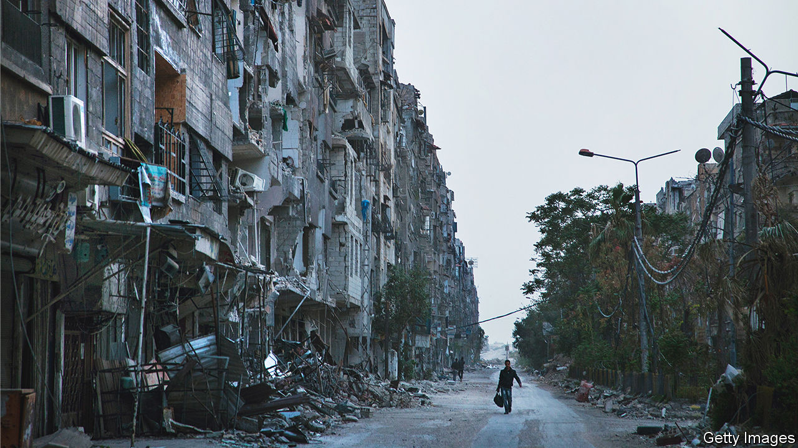
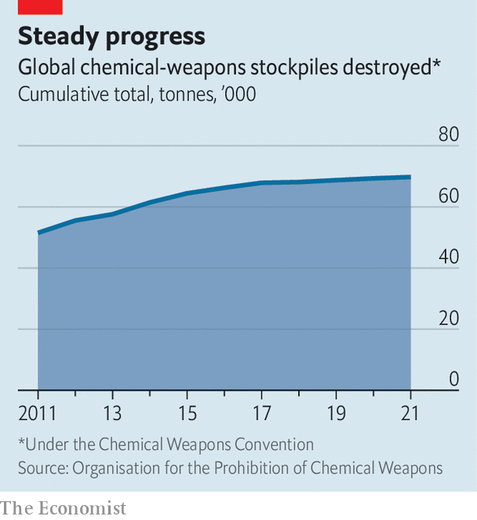

###### America and the Middle East

# Reassessing Obama’s biggest mistake 

##### How much was his red line in Syria to blame for America’s lost credibility? 

 

> Aug 22nd 2023 

THE FORCES of Syria’s president, Bashar al-Assad, struck soon after 2am. Residents of Ghouta, a Damascus suburb, told reporters that they heard a strange noise, as if someone was opening a bottle of Pepsi. A local doctor, fighting back tears, explained that many people had sought shelter underground, but the gas was heavier than air and it pooled in basements and cellars. Had they climbed the stairs instead, they would have lived. More than 1,000 people perished that night. The doctor distributed some 25,000 ampoules of atropine and 7,000 of hydrocortisone to medical teams so they could try to save those who were suffering the effects of nerve agent.

Mr Assad fired  at Ghouta on August 21st 2013. It was the deadliest day of the Syrian civil war. It , then America’s president, to act on his warning that “a red line for us is we start seeing a whole bunch of chemical weapons being moved around or utilised. That would change my calculus.”

Ten years after Ghouta, Mr Obama’s red line over Syria is remembered as a defining moment of his presidency. Rather than strike immediately, he first decided to ask for a vote in Congress and then agreed not to act at all  to oversee Syria’s chemical disarmament. Critics argue that Mr Obama’s reluctance to punish Mr Assad diminished America’s credibility and that the consequences are still being felt even now. 

Speaking to the BBC last month, François Hollande, who was French president at the time, argued that it “was particularly bad for the Middle East. And it was decisive when it comes to relations between the West and Russia.” Back in 2013,  lamented Mr Obama’s choice, too, blaming him for “”. But it is worth revisiting that judgment. Although there is no disputing the erosion of the West’s credibility over the past decade, a salvo of cruise missiles fired against Mr Assad would hardly have rescued it. It may not even have spared the Syrian people from further nerve-gas attacks. 

Mr Obama’s red line is a curious case of a policy that came about by accident and then succeeded brilliantly in its own terms only to be remembered as a historic failure. It raises questions over how much leaders can—or should—put credibility at the centre of their plans. 

Oddly for such a meticulous politician, Mr Obama stumbled into laying down his . Although the term suggests that he had settled on an ultimatum after carefully weighing up his options, the president shocked his aides at a White House news conference on August 20th 2012 when, seemingly on an impulse, he spoke about the consequences if Syria used chemical weapons. Only a handful of news outlets actually reported his remarks, perhaps because officials hastily briefed that the administration remained highly unlikely to intervene in Syria.

The officials were too late. Many people within the American government and abroad, including in London, wanted America to use military force to stop Mr Assad committing daily atrocities. They seized on Mr Obama’s words. “It was going to detonate immediately,” says Steven Simon, a former Obama official and author of “Grand Delusions”, a new history of American policy in the Middle East. “There was no time-delay fuse attached to this.”


What’s more, Mr Obama himself wavered. In December 2012 and March 2013 Mr Assad was accused of using chemical weapons against his people. On the first occasion Mr Obama called such weapons “totally unacceptable”, on the second “a game-changer”. Yet, having thus built up expectations, three weeks after Ghouta, the president suddenly denied that his credibility was at stake, saying, “I didn’t set a red line. The world set a red line.”

With hindsight, Mr Obama’s error was to seem to want to have it both ways. The red-line formulation helped strengthen America’s warning when Mr Assad appeared to be thinking about using nerve gas to terrorise his people. Yet, after the atrocity, the very firmness that made it a powerful threat also raised the cost of seeming to do too little. Theodore Roosevelt, America’s 26th president, famously advised leaders to “speak softly and carry a big stick”. Mr Obama swapped noise for stick and paid a heavy price.

The -um in ultimatum

Except that, if Mr Obama’s aim was to stop Syria using nerve gas, he also succeeded beyond expectations. A few weeks after the attack, Russia had a plan for international inspectors to oversee the dismantling of Syria’s chemical-weapons programme, if America would not strike.

“The deal to bring Syria into the Chemical Weapons Convention (CWC) was one of the greatest non-proliferation achievements of the 21st century,” believes Gregory Koblentz, a chemical-weapon expert who teaches at George Mason University in Fairfax, Virginia. 

Syria had the Middle East’s most advanced programme, which it had built to deter a conventional military attack by Israel. With Russia’s encouragement, international help and the good offices of the Organisation for the Prohibition of Chemical Weapons (OPCW), it destroyed 1,300 tonnes of weapons and precursor chemicals, 1,200 munitions and demolished 27 production facilities. Dr Koblentz points out that ten to 12 rockets had killed over 1,000 people on August 21st. Each carried around 50 litres of nerve agent weighing a little under 55kg. By comparison, he reckons, the nerve agents Syria destroyed may have weighed 1,000 tonnes—enough to attack Ghouta 1,800 times over.

The record was far from perfect. Syria continued to use chlorine, including in  in 2018, which Donald Trump, Mr Obama’s successor, and Britain and France met with a barrage of cruise missiles. Dr Koblentz also observes that Syria held on to some nerve agent—though a tiny fraction of its initial stock—because Mr Assad launched three more nerve-agent attacks, though they caused much less harm than in Ghouta. In every case, Russia covered up for its ally, blaming the attacks on rebel forces. During emergency sessions at the OPCW, Syria’s ambassador flaunted his contempt by playing “Angry Birds” on his phone. 

But the record is surely better than if America and its allies had tried to eliminate Syria’s chemical weapons from afar. Mr Simon recalls how the early months of the war were all about how to stop chemical weapons falling into the wrong hands. “I spent a lot of my time dealing with the US and Israeli intelligence communities on pinpointing where all this stuff was,” he says, “and tracking or monitoring the vulnerability of specific installations to a breach by opposition forces and exploring ways with the US military on how those stockpiles might be destroyed by the United States unilaterally without creating a monstrous public-health hazard.”

 


In addition, the Syrian civil war has not weakened the CWC (see chart). Many countries strongly condemned Russia over its attempt to poison Sergei Skripal, a former member of the KGB living in Britain, back in 2018 and Alexei Navalny, an opposition leader, in 2020 using another nerve agent called novichok. The  remains.

Yet if Syria’s programme was mostly dismantled and the CWC is intact, why has American credibility suffered? One answer, says Keren Yarhi-Milo, dean of Columbia University’s School of International and Public Affairs, is that policy choices have audiences far beyond their narrow target. In Mr Obama’s case this audience was packed with people who already doubted his resolve. His tough talk over Syria’s red line was overshadowed by his oft-stated desire for America to devote less of its resources to policing the Middle East—and indeed the world as a whole. The United States had become bogged down in Afghanistan and Iraq. The decision to “lead from behind” in Libya to remove Muammar Qaddafi, its tyrannical president, at the behest of Britain and France had ended in chaos. Mr Obama’s attempts to strike a deal with Iran over its nuclear programme was seen as too accommodating by some leaders in Israel and the Gulf.

Dr Yarhi-Milo argues that, as well as being judged on policies, leaders also acquire a “signalling reputation” reflecting their record of carrying out threats and honouring promises. Experts disagree about how much this reputation is worth. Some argue that foreign powers take hard-nosed decisions, based on their assessment of a leader’s capabilities and interests in the moment, rather than on his or her past. However Dr Yarhi-Milo’s research suggests that, in the real world, foreign powers use reputation as a guide. “Somebody like Putin doesn’t engage in those kinds of super-rationalist calculations,” she says. “They use shortcuts. And those…many times are based on their personal experience interacting with that country.”

Mr Obama’s reputation strikes Mr Simon as monumentally unfair. He points out that in 2013 the former president began a massive operation to train and support rebel fighters in Syria and argues that was far more significant than a punitive strike for Ghouta would have been. Middle Eastern leaders knew about this commitment, but it does not seem to have won much credit with them. Furthermore, Mr Simon describes in his book how, since the second term of George W. Bush, every American president has sought to limit America’s commitment to the Middle East. And yet the red line over Syria is nevertheless treated as a turning-point.

Looking back across a decade, Mr Obama’s record shows how elusive credibility can be. Mr Obama has insisted he has no regrets. In 2016 he told the  that “dropping bombs on someone to prove that you’re willing to drop bombs on someone is just about the worst reason to use force”. That is surely correct. When Richard Nixon bombed Cambodia and the Viet Cong in the 1970s, in the belief that developing countries would otherwise topple like dominoes, it cost a lot of lives without saving America’s reputation. Furthermore, leaders such as Turkey’s president, Recep Tayyip Erdogan, feel free to flip-flop but are still able to exert power.

Even so, the success in dealing with Syria’s chemical weapons has been eclipsed by the more general truth that America’s position in the Middle East has weakened—partly by choice. That has been thrown into relief by the rise of Islamic State in 2014 as a violent source of anarchy and chaos. It was made worse by the fact that the man who stepped in to handle Syria with Mr Obama’s blessing was Vladimir Putin. He has since increased his hold over the country, derided America’s pretences to act as a global policeman and sent his troops into Ukraine. The red line has stuck because it represents a powerful metaphor for America’s ongoing struggles to cope with a complicated world. ■

