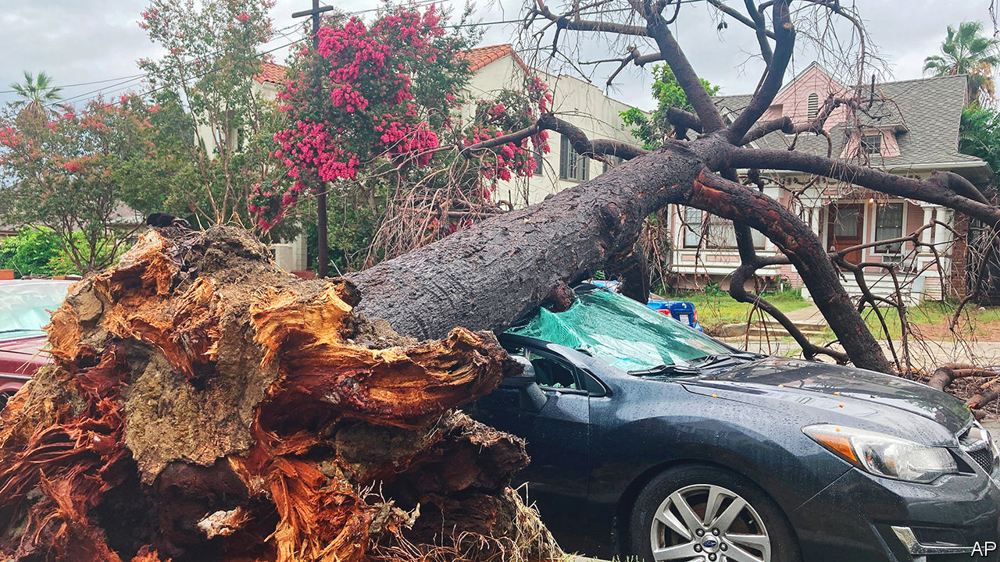

###### Fair warning

# El Niño has started. Preparations must too 

##### It will bring chaotic weather to much of the world 

 

> Aug 24th 2023 

California rarely sees the types of hurricanes and storms that routinely pummel Florida, Louisiana and Texas. But on August 20th tropical  slammed into it from the south. Unprecedented amounts of rain pelted downtown Los Angeles and flooded the state’s arid valleys. Without missing a beat, forecasts then shifted from drenching to baking, as a heat dome fastened itself over much of the southern United States all the way up to the Great Lakes. 

Barely a day has gone by this summer without news of some extreme weather somewhere in the world. Although weather is always breaking records, that raises fears of what it will be like when the climate warms further. To add to the alarm, America’s National Oceanographic and Atmospheric Administration announced the , a climate pattern that shows up every two to seven years and raises global temperatures.

As a consequence, there is a good chance that this will be the hottest year on record; and that 2024 will be hotter still, with temperatures approaching 1.4°C above pre-industrial levels. Some tropical regions will suffer damaging floods, and others will suffer droughts, with worrying consequences for food supplies and the spread of disease. As with climate change itself, the time to prepare for the coming upheaval of El Niño is now. 

On current forecasts, this El Niño is likely to be a strong one. The last such cycle was in 2014-16, and was ruinous in the countries it hit hardest. Droughts led South African food production to fall to a 20-year low and ignited one of Indonesia’s worst-ever spates of wildfires. At the same time warmer and wetter weather fuelled disease across South America, including the worst outbreak of infections from the Zika virus in 65 years. 

One reason the effects of this El Niño are likely to be severe is that they will be felt on top of more global warming. Although it is only just getting going—El Niños are named after the baby Jesus because they tend to peak around Christmas—it has already contributed to the closure of the world’s largest fishery, as anchovies have fled the coastal waters of Peru. It has also rocked the global rice market, as India has pre-emptively banned most exports of its crop. 

Humanitarian agencies have warned about the threats to food security and sanitation and from outbreaks of disease including malaria, dengue and cholera in large parts of Africa and South America. South-East Asia is likely to see excessively hot and dry weather. Widespread fires in Indonesia could affect air quality across Asia. 

Frightening as these dangers are, it is possible to prepare for some of them before they strike. Helpfully, El Niños offer some predictability. No two are exactly the same, but their cyclical nature reveals patterns of hot and dry and excessively wet weather. Seasonal forecasts are much more reliable than they were in 2014-16. These can help steer funds in order to improve water infrastructure pre-emptively, for example, or to reinforce buildings in regions likely to be hit by storms—rather than after disaster has struck. By wisely building resilience before an El Niño, you can minimise the damage and hence the spending on emergency help and repairs. 


Some aid agencies are indeed using better forecasts to start planning ahead. The International Federation of the Red Cross and Red Crescent, for instance, now runs anticipatory programmes in 17 countries, and aims for a quarter of its disaster-relief funding to be spent in advance by 2025. The World Health Organisation has begun working with the  so that it can successfully predict where best to allocate medical supplies and personnel. 

This is just a tiny fraction of the aid that is needed. Only 1% of disaster funding raised through UN appeals between 2014 and 2017 was allocated in advance, despite one in five events being highly predictable. Natural disasters were estimated to have affected 185m people worldwide last year, but fewer than 4m were helped through anticipatory measures. 

The trouble is that many of the countries which will bear the brunt of the effects of El Niño are still reeling from previous disasters. Some of those are linked to past episodes of extreme droughts and floods, others to the lingering effects of covid-19 and the spike in food prices caused by the war in Ukraine. It is a reminder of the difficulties of dealing with climate change: stresses come thick and fast without giving governments and societies enough time to recover. Yet that only strengthens the case for helping countries that cannot afford to pay for their own preparations. Whoever foots the bill, it is a false economy to skimp on spending today when there is a known chance of disaster tomorrow. ■


