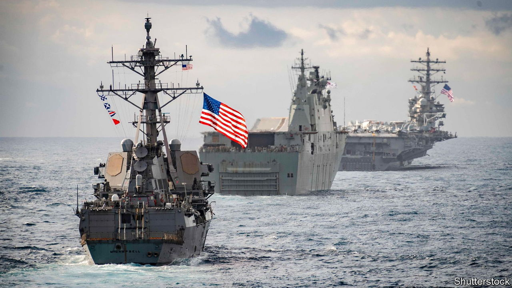

###### Geopolitics

# How Joe Biden is transforming America’s Asian alliances 

##### America is working to deter China even as it defends Europe from Russia 

 

> Aug 24th 2023 

The rivalry between great powers involves much jostling over alliances. What does this mean in practice and who is winning? The past month has provided a chance to examine two competing alliance-building efforts. One is the push, led by China, to create a bloc of emerging economies that acts as a counterweight to the West. This was the aim of the brics summit held this week in Johannesburg, attended by Narendra Modi and Xi Jinping, the leaders of India and China. The other is America’s strengthening of its  in the Pacific. Of the two efforts, America’s is more convincing.

The gathering of  brought together Brazil, Russia, India, China and South Africa. The stated goals were to expand the club’s membership and deepen its capabilities in areas such as development lending and financial payments. The event showed a widespread appetite for a less Western world order: six countries were invited to join the brics starting in January 2024, including Argentina, Iran and Saudi Arabia. But it also showed how such a disparate group will struggle to be effective.

If the aim is to project common values, it hardly helped that Vladimir Putin had to address the summit by video-link—for fear that the South African hosts would have to enforce a global arrest warrant against him for war crimes. As the group expands, tensions may rise: India fears its influence will be diluted, giving more sway to China. Defence co-operation is probably out of the question. The effort to create a common financial infrastructure (let alone share a currency) looks too ambitious for countries with very different economies and politics. Rather than a body capable of acting widely and consistently in a coordinated way, building global norms and institutions, the brics may end up with a significant but more limited role. Its members may co-operate on narrow issues where they agree, such as rich countries’ obligations in the energy transition, and sometimes act together to attack or try to block Western-led initiatives.

Contrast that with America’s alliance-building. The war in Ukraine has reinvigorated nato, which has expanded its membership to include Finland and probably Sweden. President Joe Biden has also been working in Asia to counter China. On August 18th he hosted  with the leaders of Japan and South Korea who, putting aside their old bitterness, agreed to intensify ballistic-missile co-operation and establish a military hotline. Earlier Mr Biden struck deals to let America use more military bases in the Philippines and Papua New Guinea. 

Meanwhile, the “unbreakable” defence relationship with Australia is deepening, following the aukus agreement struck in March, amid a flurry of equipment deals and military exercises. Should war break out with China, the Aussies seem the most willing to fight at America’s side. Australian land, sea and air bases are expanding to receive more American forces. Under the aukus deal, Australia is gaining its own long-range weapons, such as nuclear-powered (but not nuclear-armed) submarines to be developed jointly with America and Britain. The three partners want to work on other military technologies, from hypersonic missiles to underwater drones. 

Taken together the “latticework” of security agreements, shows how America’s long-heralded pivot to Asia is accelerating. Mr Biden is proving that America and its allies can deter China (and Russia). More could be done. Congress should agree to sell Virginia-class submarines to Australia in the 2030s as a step to acquiring the aukus subs in the 2040s, and to expand submarine-building capacity. It should waive fiddly restrictions, such as the International Traffic in Arms Regulations (itar), to make the partners’ defence co-operation seamless.

These plans still have weaknesses. Mr Biden’s protectionism prevents America from offering an economic counterweight to China, the largest trading partner for most Asian economies. He shows no sign of joining cptpp, a trade pact whose precursor was negotiated by Barack Obama and ditched by Donald Trump. While China complains about an “Asian nato”, there is no mutual commitment by America and its Asian allies to defend each other, let alone go to war over Taiwan. Australia’s government, if it is to sustain bipartisan public support, must also be more candid about the costs of the alliance. 

Last, if Mr Trump becomes president in 2024, Mr Biden’s rejuvenation of America’s security alliances could yet be undone. All the more reason for America and its allies to keep advancing at speed. The more they can lock into place, and the more Congress can demonstrate that the vision for Asian security is bipartisan, the better for all. The past month shows that America’s network of friendships and alliances is alive and kicking, and that creating competing alternatives will be hard.■

