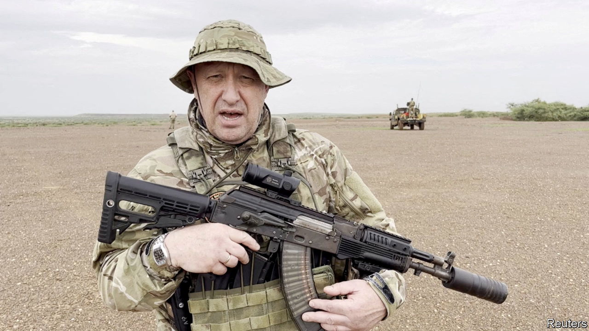

###### Götterdämmerung

# Prigozhin’s death shows that Russia is a mafia state 

##### A healthy country uses justice to restore order. Mr Putin uses violence instead 

 

> Aug 24th 2023 


As we published this editorial, it was not certain that  private jet was shot down by Russian air-defences, or that the mutineer and mercenary boss was on board. But everyone believes that it was and that his death was a punishment of spectacular ruthlessness ordered by Russia’s president, Vladimir Putin. And that is the way Mr Putin likes it. 

If Mr Prigozhin is confirmed dead,  will emerge stronger. For the moment at least, he will have seen off the biggest immediate threat to his 23-year rule. But the death also exposes the growing weakness of the system he created. Mr Putin has pretensions to being the tsar of a great power, but in reality his rotting empire runs as never before on lies, bribery and repression. And, as this killing shows, Russia’s ultimate authority is terror.

Mr Prigozhin’s Embraer jet came down in the Tver region north-west of Moscow on August 23rd. He and other commanders of the Wagner mercenary group were listed among the ten passengers on the flight manifest. Mr Prigozhin was a violent man. He grew rich from working in the kleptocracy that surrounded Mr Putin. He recruited convicts from Russia’s jails to fight in Ukraine and sent them to their deaths. His men are accused of crimes against humanity, especially , where Wagner makes much of its money.

None of that appeared to bother Mr Putin who, on the contrary, rewarded Mr Prigozhin with new business and extra responsibilities. But everything changed in June when, as a protest at the prospect of his men being absorbed into the regular army, he marched Wagner troops to within 200km of Moscow. Lacking the foresight to prevent the mutiny or the strength to crush it, Mr Putin was humiliated. So he cut a deal and Mr Prigozhin called off the mutiny.

The downing of the jet suggests that Mr Putin has reneged—and emerged on top. The wonder is that Mr Prigozhin did not see it coming. For as long as the Wagner boss was alive, he remained a source of instability. His death and Mr Putin’s apparent disregard for everyone else on the aircraft serve as a public example to any other would-be tsars of where treachery leads in the mafia world that the Kremlin has built. 

The elimination of Mr Prigozhin will also strengthen Mr Putin’s control over Russia’s army, which conspicuously failed to stop the mutineers in June. It is surely no coincidence that on the same day the plane came down, General Sergei Surovikin, who was suspected of supporting Wagner’s mutiny in June, was formally sacked. Meanwhile, Valery Gerasimov, the chief of the general staff, and Sergei Shoigu, the minister of defence, two Putin loyalists who were the butt of Mr Prigozhin’s scorn for their graft and incompetence, remain in office.

Wagner forces may grumble. Some are in Belarus, where the despot Alexander Lukashenko will be looking over his shoulder. There is talk of a second march on Moscow, but Wagnerites are more likely to choose wealth and self-preservation than loyalty to a dead commander. Meanwhile, Russia’s positions in Africa are cemented by corruption, not principle.

For all that, Mr Prigozhin’s death marks the further decay of the Russian state. Mr Putin is a supreme example of why never-ending one-man rule is so ruinous. The more power is concentrated, the more Mr Putin and his obsessions, whims and resentments become the face of Russia itself. 

The killing of Mr Prigozhin extends that dismal pattern. After mutinies challenge the state’s monopoly of the use of force, a healthy country restores order using the justice system. Mr Putin prefers ostentatious violence instead. Yet this will not restore order so much as reimpose the balance of terror. It further distances Russia from the rule of law and the institutions that every modern country depends on for competent and steady government. It leaves Russia in a miserable state. ■

