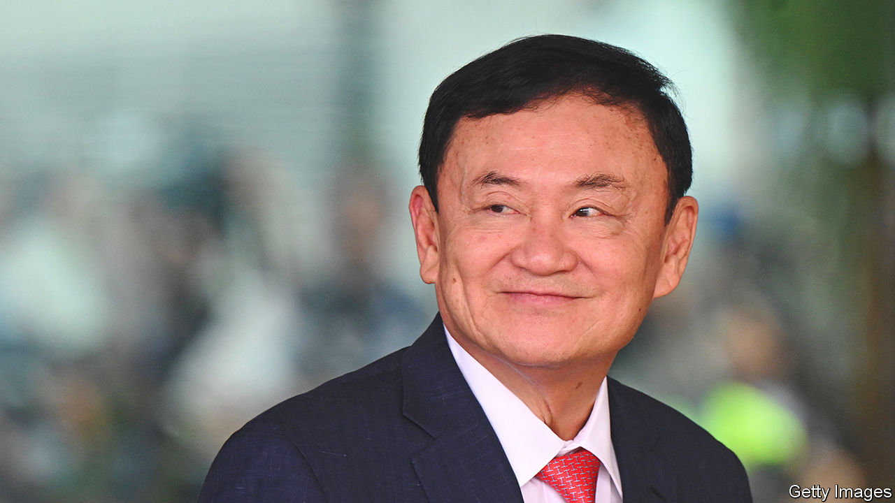

###### Thailand’s new government

# Thaksin Shinawatra shows his true colours 

##### A grubby political compromise with the army has enraged Thai voters 

 

> Aug 24th 2023 

On the face of it, the deal struck this week between Thailand’s military establishment and its second-biggest party, Pheu Thai, represents progress. The new coalition will end nine years of military-dominated government in South-East Asia’s oldest democracy. Under the influence of Pheu Thai’s de facto leader, Thaksin Shinawatra, a populist tycoon and former prime minister who returned this week from a long exile, the new government should be less incompetent than its army-run predecessor. Democratically, too, Pheu Thai seems an improvement, having come a close second in the .

But that would be to gloss what has really happened. The deal is not a win for Thai democracy so much as for the monarcho-military elite’s latest effort to stifle it. The elite is out to foil the election’s actual winner, a reformist party called Move Forward which is popular because it promises to break their grip on power. In helping to sabotage Move Forward, by doing a deal with the army establishment that his party had promised to shun, Mr Thaksin has revealed that he is no friend of  but rather an instrument of the status quo.

The details are damning. In return for betraying Move Forward—once its comrade in the fight to restore democracy—Pheu Thai could at least have minimised the establishment’s hand in its new coalition. It appears instead to have used up its leverage on securing Mr Thaksin’s return. He has been arrested and jailed on long-standing corruption charges, but is expected to receive a royal pardon shortly. His party will go into government with some of the establishment’s most unapologetic stooges—cheerleaders for the coups that ended Mr Thaksin’s government in 2006 and his sister’s in 2014. Meanwhile, even as Mr Thaksin awaits release from jail, Thailand’s rightful next leader, Move Forward’s Pita Limjaroenrat, could face imprisonment on trumped-up charges.

In the short term, Mr Thaksin’s dealmaking should bring stability to an economy that has fared miserably under military rule. As recently as 2005 to 2009, Thailand’s economy, the second-biggest in South-East Asia, enjoyed the highest foreign direct investment of any of its regional peers, reflecting Thailand’s status as a manufacturing hub, particularly of electronics and vehicle parts. But over the past five years investment inflows have lagged behind those of neighbours such as Indonesia and Vietnam. Under the premiership of Pheu Thai’s Srettha Thavisin, another mogul with a populist touch, the new government should improve on that dire record. It will also have a strong incentive to maintain its disparate 11-party coalition—though not one that Thaksinists should find reassuring. If the government founders, new elections will be held in which Move Forward could do even better than in May.

That reflects the depth of Thais’ unhappiness with the establishment politics that Mr Thaksin is helping perpetuate. Launched by liberal activists only three years ago, Move Forward did surprisingly well across the country, including in Pheu Thai’s rural strongholds. If it had Thailand’s best interests at heart, the Thaksin party would take on some of Move Forward’s liberal reforms, including trustbusting and scrapping the country’s absurd  laws. But that is not likely for a government cobbled together to stave off change.

Thailand’s best longer-term hope is that the reformist forces Move Forward has unleashed become too powerful to deny. In a way, Mr Thaksin has made this likelier. His grubby compromise has enraged pro-democracy activists, leading to rowdy protests outside Pheu Thai’s headquarters. Move Forward’s leaders must now do their part, by striving to ensure the opposition remains peaceful and united. They have already performed wonders, inspiring Thais with the promise of a better future. If they can hold together, despite the establishment’s provocations, they will probably be able to honour that promise in the end. ■

