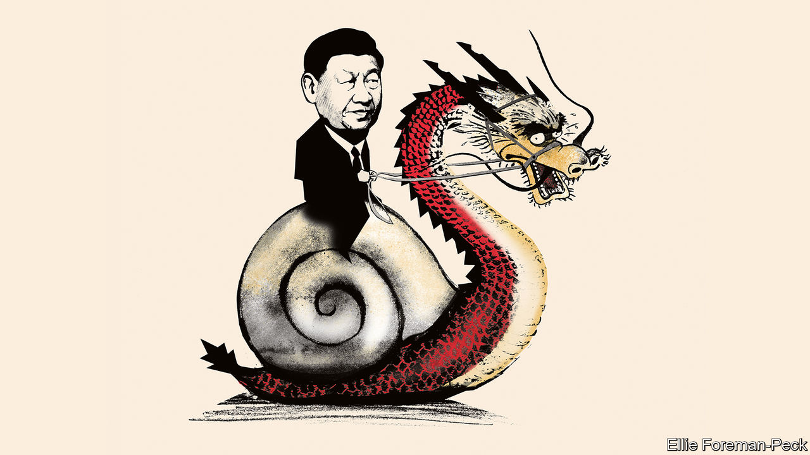

###### Xi’s broken model

# Why China’s economy won’t be fixed 

##### An increasingly autocratic government is making bad decisions 

 

> Aug 24th 2023 

WHATEVER HAS gone wrong? After China rejoined the world economy in 1978, it became the most spectacular growth story in history. Farm reform, industrialisation and rising incomes lifted nearly 800m people out of extreme poverty. Having produced just a tenth as much as America in 1980, China’s economy is now about three-quarters the size. Yet instead of roaring back after the government abandoned its “zero-covid” policy at the end of 2022, it is lurching from one ditch to the next. 

The economy grew at an annualised rate of just 3.2% in the second quarter, a disappointment that looks even worse given that, by one prominent estimate,  may be growing at almost 6%. House prices have fallen and property developers, who tend to sell houses before they are built, have hit the wall, scaring off buyers. Consumer spending, business investment and exports have all fallen short. And whereas much of the world battles inflation that is too high, China is suffering from the opposite problem: consumer prices fell in the year to July. Some analysts warn that China may enter a  like Japan’s in the 1990s .

Yet in some ways Japanification is too mild a diagnosis of China’s ills. A chronic shortfall in growth would be worse in China because its people are poorer. Japan’s living standards were about 60% of America’s by 1990; China’s today are less than 20%. And, unlike Japan, China is also suffering from something more profound than weak demand and heavy debt. Many of its challenges stem from broader failures of its economic policymaking—which are getting worse as President Xi Jinping centralises power.

A decade or so ago China’s technocrats were seen almost as savants. First they presided over an economic marvel. Then China was the only big economy to respond to the global financial crisis of 2007-09 with sufficient stimulatory force—some commentators went as far as to say that China had saved the world economy. In the 2010s, every time the economy wobbled, officials defied predictions of calamity by cheapening credit, building infrastructure or stimulating the property market.

During each episode, however, public and private debts mounted. So did doubts about the sustainability of the  and whether new infrastructure was really needed. Today policymakers are in a bind. Wisely, they do not want more white elephants or to reflate the property bubble. Nor can they do enough of the more desirable kinds of stimulus, such as pension spending and handouts to poor households to boost consumption, because Mr Xi has disavowed “welfarism” and the government seeks an official deficit of only 3% of gDP. 

As a result, the response to the slowdown has been lacklustre. Policymakers are not even willing to cut interest rates much. On August 21st they disappointed investors with an underwhelming cut of 0.1 percentage points in the one-year lending rate.

This feeble response to tumbling growth and inflation is the latest in a series of policy errors. China’s foreign-policy swagger and its mercantilist industrial policy have aggravated an economic conflict with America. At home it has failed to deal adequately with incentives to speculate on housing and a system in which developers have such huge obligations that they are systemically important. Starting in 2020 regulators tanked markets by cracking down on successful consumer-technology firms that were deemed too unruly and monopolistic. During the pandemic, officials bought time with lockdowns but failed to use it to vaccinate enough people for a controlled exit, and then were overwhelmed by the highly contagious Omicron variant.

Why does the government keep making mistakes? One reason is that short-term growth is no longer the priority of the Chinese Communist Party (CCP). The signs are that Mr Xi believes China must prepare for sustained economic and, potentially, military conflict with America. Today, therefore, he emphasises China’s pursuit of national greatness, security and resilience. He is willing to make material sacrifices to achieve those goals, and to the extent he wants growth, it must be “high quality”. 

Yet even by Mr Xi’s criteria, the CCP’s decisions are flawed. The collapse of the zero-covid policy undermined Mr Xi’s prestige. The attack on tech firms has scared off entrepreneurs. Should China fall into persistent deflation because the authorities refuse to boost consumption, debts will rise in real value and weigh more heavily on the economy. Above all, unless the CCP continues to raise living standards, it will weaken its grip on power and limit its ability to match America.

Mounting policy failures therefore look less like a new, self-sacrificing focus on national security, than plain bad decision-making. They have coincided with Mr Xi’s centralisation of power and his replacement of technocrats with loyalists in top jobs. China used to tolerate debate about its economy, but today it cajoles analysts into fake optimism. Recently it has stopped publishing unflattering data on youth unemployment and consumer confidence. The top ranks of government still contain plenty of talent, but it is naive to expect a bureaucracy to produce rational analysis or inventive ideas when the message from the top is that loyalty matters above all. Instead, decisions are increasingly governed by an ideology that fuses a left-wing suspicion of rich entrepreneurs with a right-wing reluctance to hand money to the idle poor.

The fact that China’s problems start at the top means they will persist. They may even worsen, as clumsy policymakers confront the economy’s mounting challenges. The population is ageing rapidly. America is increasingly hostile, and is trying to choke the parts of China’s economy, like chipmaking, that it sees as strategically significant. The more China catches up with America, the harder the gap will be to close further, because centralised economies are better at emulation than at innovation.

Liberals’ predictions about China have often betrayed wishful thinking. In the 2000s Western leaders mistakenly believed that trade, markets and growth would boost democracy and individual liberty. But China is now testing the reverse relationship: whether more autocracy damages the economy. The evidence is mounting that it does—and that after four decades of fast growth China is entering a period of disappointment. ■


