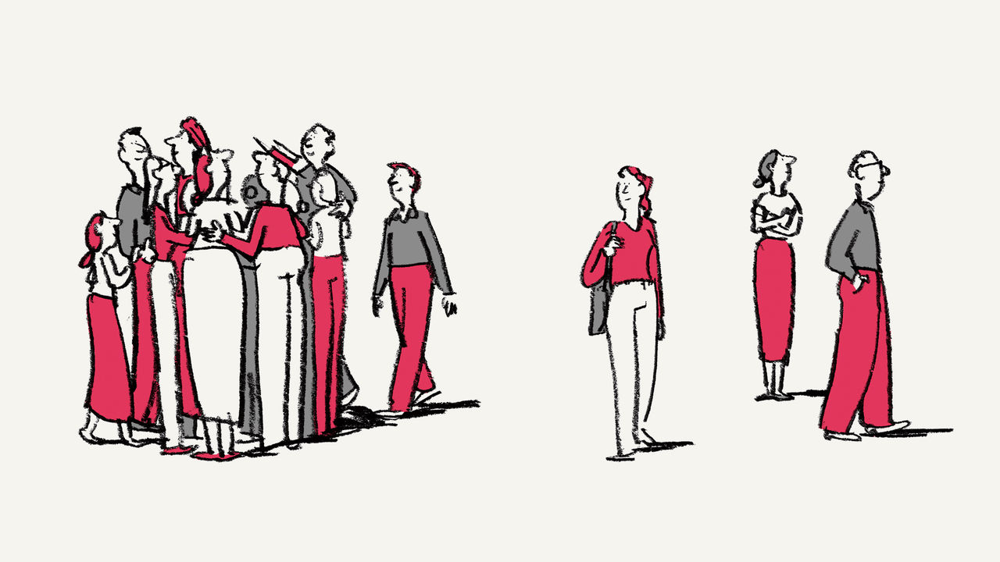
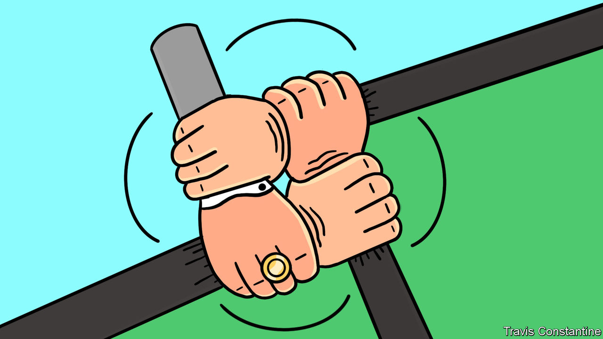
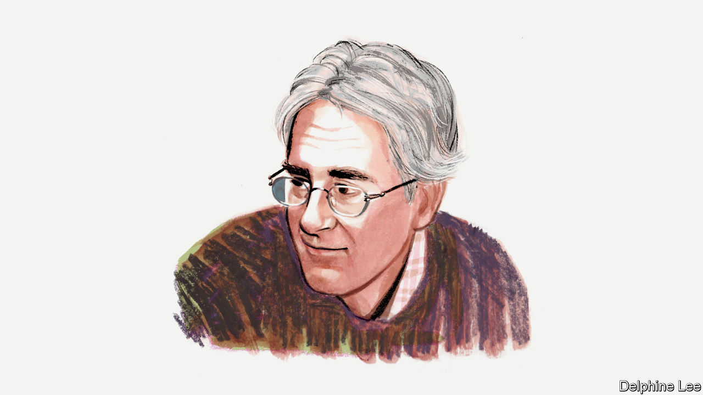
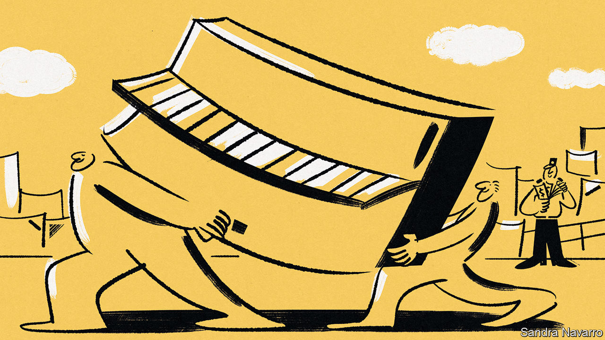

###### On trafficking children, electric cars, liberal values, narrow banking, Warren Buffett, Saudi customs

# Letters to the editor 

##### A selection of correspondence 

 

> Aug 24th 2023 


Child victims of trafficking

The notion that “Sound of Freedom”, a film about an anti-sex-trafficking activist, is not realistic because the children depicted in it are too young is wrong, skewed and disappointing (“”, August 12th). As the human-rights advocate who broke open the Jeffrey Epstein child sex-trafficking case and risked my life in Mexico, Florida and elsewhere, I can assure you that children younger than the child actress depicted in the film are abducted, exploited and sold for sex, labour and organ-harvesting on a daily basis. 

A case in point was a field assignment I reported for the  in 2014 during the fiasco surrounding the Deferred Action for Childhood Arrivals programme. In this case, hundreds of Central American children as young as nine were potential victims of the human-trafficking cartels working in Calexico and Imperial, towns in California. Had it not been for the extraordinary work of several Border Patrol and Immigration and Customs Enforcement officials, many of these children would have been trafficked for sex in the United States. 

As it stands the Mexican and Colombian cartels work closely with the US-based cartel, MS13, to traffic children from Central and South America to the United States. “Sound of Freedom” has only skimmed the surface, and it misguidedly identifies the problem as being mostly outside the jurisdiction of the United States. The real problem lies inside the United States, which is where the largest percentage of the world’s paedophiles live and operate child-porn networks, and where traffickers make huge profits from abducting and selling children for sex. 

The focus of your article should have been how law-enforcement officials need to stop this evil and lucrative crime against our children. 

Conchita Sarnoff

Senior fellow

Georgetown University

 

 


Sizing up electric cars

The argument that slimmer cars are more virtuous than obese vehicles is irrelevant to the transition to electric vehicles (, August 12th). To win over consumers, EVs must outshine their gas-guzzling counterparts in all aspects: emissions, life-cycle cost, performance, range, availability of charging points and the all-important vroom factor. Simply hoping that Hummer enthusiasts will switch to electric Minis is wishful thinking. They are more likely to be swayed by an even more badass yet cleaner electric Hummer.

Schumpeter’s concern that bigger batteries increase EV prices overlooks the historical trend of industries often seeing costs come down as they innovate and scale up. Market imbalances in battery metals may indeed lead to short-term increases in prices, but this will encourage more investments in new chemistries and capacity build-up, further supporting the long price-reduction trend.

Furthermore, the opportunity to charge EVs during low demand or excess production from renewable sources offers a significant benefit for the grid, not a strain. With smart charging solutions, EVs can help decarbonise not only transportation but also electricity generation, allowing a higher penetration of renewables in our energy mix.

Fabrizio Nastri


 


Liberal values and prosperity

In reporting that Western values are steadily diverging from the rest of the world’s, you find that “people’s principles were expected to align as countries got richer” (“”, August 12th). This belief was held only by those who suffered from the illusion that liberal values were the result of prosperity, when the fact may be that prosperity is the result of liberal values. Moreover, the rise of individual responsibility following the Protestant Reformation sparked a Counter-Reformation in Europe. So why is it a surprise that the extreme individualism of the West, especially since the 1980s, has resulted in groupism and tribalism not only in the West but around the world?

PRABHU GUPTARA


 


“Conservatives resist change”, you say (“”, August 12th). The reality is more nuanced. Conservatives don’t resist change per se, they resist many of the consequences that often accompany it, such as uncertainty and instability, and place an emphasis on maintaining personal freedom and responsibility. Conservatives recognise that change is inevitable. Indeed, resistance to change can put the very values that conservatism aims to conserve in jeopardy. 

Michael Oakeshott spoke of keeping the ship afloat; change may be necessary if one wants to be pragmatic. Edmund Burke was against the French revolution, but more sympathetic to the American cause. It’s not about resisting change, it’s about how you approach it, and what the consequences of change will mean.

Joseph Murray


While you deal extensively with the pull factors favouring Authoritarians, you neglect the push: to wit, the pathetic performance of our once exemplary democracies, the USA and the UK. Is it any wonder that watching the pantomime they have become, serious citizens might seek out alternatives. Man cannot live by values alone. 

DOMINIC WATSON


 


Do we need banks?

I’m not sure what part of David Apgar’s piece on narrow banking was the most entertaining (, August 12th). The idea that the “Chicago Plan” was conceived with “the Depression fresh in mind” must be viewed as quite original. However, almost equally amusing was Mr Apgar’s suggestion that bank lending “fuels credit to enterprising businesses”, when he realises that the problem with Silicon Valley Bank was that it had invested an awful lot of money in notes issued by the Federal Reserve, supposedly also to fuel commerce (and thus revealing the mockery underlying quantitative easing).

None of this has anything to do with supporting “enterprising businesses” that increase prosperity. Banking is doing something else. Banks should go out and make money from the people who deposit money, assuming that they will keep it safe. Instead, they are admonished to multiply paying services offered to those who trust them, and still go bankrupt. Do we need the banks or do the banks need us? And if the latter, then why do we need the banks?

David Warburton


 


The sage of Omaha

Everyone sees all the perks that chief executives get, but forget the challenges they face on a daily basis (“”, July 29th). Uneasy lies the head that wears the crown and shoulders all the responsibility. I am reminded of this advice from Warren Buffett: “It takes 20 years to build a reputation and five minutes to ruin it. If you think about that, you’ll do things differently.”

Ashish Vaid

Former president of the Indian Merchants Chamber


 


Getting past Saudi customs

Your article on smuggling banned products into Iran reminded me of the problems encountered by foreign embassies in Saudi Arabia when the importation of alcohol was prohibited (“”, July 22nd). Import papers had to be crafted so as not to raise alarms. As a result the British embassy was informed by Saudi customs that “your consignment of pianos is leaking”. The Australian embassy imported Swan lager as “black duck soup”.

Roger Hartley


