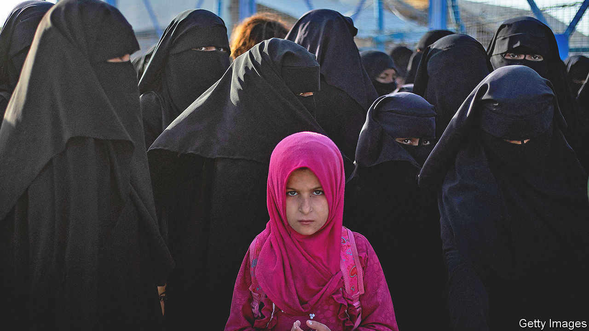

###### Rehabilitating jihadists

# Failing to reintegrate Iraq’s Sunni rebels could prove costly 

##### Mistreating people once linked to Islamic State is a mistake 

 

> Aug 24th 2023 

For two decades the war on terrorism preoccupied Western policymakers in the Middle East. America had to rally the world against Islamic State (IS), a force of Sunni Muslim jihadists who by 2016 governed an area the size of Britain and extolled their desire to conquer the world for the caliphate. But four years after a Western coalition recaptured  of IS in Iraq and Syria, it is walking away from the clear-up. 

In north-eastern Syria tens of thousands of women and children of captured jihadists are languishing in a detention camp called al-Hol. In Iraq jihadist sympathisers, their families and displaced people who had come under the sway of IS and were held in camps recently closed have fared little better. Far from being reintegrated back into society, they could still pose a threat. “Iraq is still fragile,” says a Western diplomat in Baghdad. “Without a sustainable return, there’s an increased tendency for displaced people to be pushed back into IS’s extremist narrative.”

The UN is handing over responsibility for them and their families to Iraq’s Shia-led regime and its allied militias, who have a history of wreaking revenge on their enemies. A UN document in February said that 80% of the UN’s programmes for protecting children and victims of gender-based violence were due to be closed this summer.

Up to 100,000 women and children with ties to IS fighters were quarantined after the war in al-Hol. IS commanders’ wives are bundled together with girls forced into marriage. Countries like Britain refuse to take back their own citizens. Iraq has suspended repatriations from al-Hol.

The American-backed Kurdish group that rules the area is meant to control the camp, but aid-workers speak of a free-for-all. Women loyal to IS hold sway with guns and train a new generation of believers in jihadist ideology. Killing is commonplace. “It’s more an IS base than a prison,” says a Western researcher monitoring the place.

The perimeter is punctured with tunnels through which IS infiltrates weapons. Inmates get out unvetted. While official repatriation proceeds at a snail’s pace, al-Hol’s population has fallen roughly by half, as inmates sneak away. But it still holds some 42,000 people, of whom 24,500 are reckoned to be Iraqis. 

Mothers fund their escape from al-Hol by selling their offspring as child soldiers to Kurdish, Sunni or Shia militias—or to IS. Kitaib Hizbullah, a Shia militia in Iraq, is said to charge $3,000 for getting a prisoner out of the camp and back across the border into Iraq. Western governments, loth to take back extremists, are washing their hands of the problem. “They’re hoping for a cholera epidemic,” says a consultant with America’s defence department.

On paper Iraq has the biggest return programme for those in al-Hol. In 2019 its government promised to bring back all the Iraqis who were still held there. It opened a transit camp in Iraq called Jadda 1, south of Mosul, the biggest city the caliphate had held, to serve as a pipeline for receiving people from al-Hol and putting them back into the community. But the process has ground to a halt. Jadda 1 was meant to offer three months of rehab and trauma counselling there, but aid-workers call it “Iraq’s Guantánamo”. Inmates need security clearance and sponsors to leave it. Few meet those requirements, so many are stuck there. 

UN humanitarians argue with Iraqi security men over turf, funding and agendas. Aid-workers say sexual abuse by UN staff and Iraqis overseeing security clearance at Jadda 1 is rife, while claims of rape are not investigated. After weeks of requests, the UN agencies funding the process declined interviews for this article.

Iraq’s government has closed the camps which hosted 5m internally displaced people who had been ruled over by IS. Many have no home to go back to. Thousands of buildings were destroyed in the war to defeat IS, or have new occupants. The lucky ones who have recovered their homes are often badly discriminated against. “When they go out they’re harassed by their neighbours saying, ‘You’re Daesh’ [the Arabic acronym for IS],” says a researcher for an American institute. 

Such is the stigma of affiliation to IS that those returning are often threatened with death. Some have been killed. Iraqi militias which helped recapture the territory hound them away, says a UN document, or extort bribes at checkpoints. Some 1m of them now doss down in unsupervised places such as Mosul’s car parks. An estimated 430,000 lack basic documents. Iraq’s authorities are reluctant to recognise marriage, birth and death certificates issued by IS. Local officials require women to disavow their IS husbands, even if they are widows, to get clearance. This all makes it hard for them to find jobs and health care, go through checkpoints, or register children at school.

Some UN officials, explaining why the world body has stopped overseeing the return process, say that Iraq should take over responsibility because it is flush with oil. This year it has a budget of $150bn. But they neglect to ask whether it is likely that Iraq’s Shia-led government would actually protect the Sunnis it suspects still sympathise with their genocidal foe. 

Most of those who lived under IS rule crave a fresh start. After IS was finally defeated at its last stand in early 2019 in the small Syrian town of Baghouz on the Euphrates, just north of its border with Iraq, its diehards headed to far-flung places such as the Sahel and Afghanistan.

Still, pockets of sympathy fuelled by resentment persist. This summer IS hailed , Abu Hafs al-Hashimi al-Quraishi. It has since staged roadside and other attacks in Syria. “We’re just fostering a new IS generation,” says a UN observer. Getting the return process wrong could spark another nastier sort of return. ■

