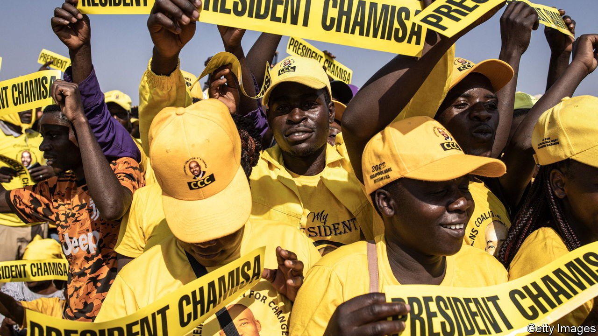

###### Déjà vu

# Familiar concerns of corruption mar Zimbabwe’s chaotic election 

##### The shenanigans of the ruling party suggest it fears the opposition’s popularity 

 

> Aug 22nd 2023 

One of the few things still manufactured in Zimbabwe is support for the ruling party. “Zanu-pf has used all the old tactics and some new ones as well,” said Happy Bangwayo, an unemployed voter outside a polling station in Harare, the capital, on August 23rd. Ballots should have arrived by 7am on election day. But in the poor urban areas that are strongholds of the Citizens Coalition for Change (ccc), the main opposition party, papers were not delivered until late in the afternoon. 

The delay caused chaos in major cities as angry voters cast ballots by phone-light; others gave up. In the middle of the night local election-monitoring groups had their offices raided, undermining their ability to run checks on official tallies. “It’s deliberate rigging,” said Mr Bangwayo. “My name is Happy but I’m not happy.”

Little wonder. Zanu-pf has misruled Zimbabwe for more than four decades. Real gdp per person is lower today than at the country’s official independence in 1980. In a fair fight Nelson Chamisa, the 45-year-old leader of the ccc, would almost certainly defeat Emmerson Mnangagwa, the 80-year-old president, who  in a coup in 2017. 

. As  went to press on August 24th there was mounting evidence that the regime was worried about the outcome of the election and was trying to sway it. The country looks set for days, if not weeks, of disputes, which will test the resilience of the regime, the opposition and outsiders’ commitment to African democracy.

Ahead of the vote, 72% of Zimbabweans polled by Afrobarometer, a research group, said the country was going in the wrong direction. That is ten points higher than in 2018, when Mr Mnangagwa , ostensibly winning 50.8% in the first round of the presidential race. (There is a statutory run-off when the leading candidate wins less than half the vote.) 


The economy is now in an even worse state. The Zimbabwean dollar, reintroduced a few years ago at nominal parity with the American greenback, trades at around 6,000 to one. Devaluation has wiped out the value of many salaries and pensions. Official annualised inflation was 101% in July. Parirenyatwa, the country’s largest public hospital, has no paracetamol and no fluid drips. “People are really suffering,” said Angela Bvekerwa, who brought a small wooden stool to ease fatigue as she waited for ballot papers in Harare. “Young people have no jobs. They’re stressed and turning to drink and drugs.” 

The blame lies with Zanu-pf. Though more subtly than when Mugabe ordered the printing presses to spew out 100trn dollar bills, the state still prints money to fund its schemes, fuelling inflation. Allegations of corruption are rife. Earlier this year an investigation by Al Jazeera, a Qatar-based media network, accused the ruling establishment, including people close to Mr Mnangagwa, of profiting massively from an illicit trade in gold. (Zanu-pf denies the allegations.) 

Some of Mr Chamisa’s colleagues mutter about his ego and disorganised ways. But the lawyer and preacher connects with ordinary Zimbabweans. His party pledges to curb corruption, stabilise the economy and uphold the rule of law. Of three polls released this year, two put Mr Chamisa ahead. The other, by Afrobarometer, had 34% of respondents refusing to answer or saying “don’t know”, suggesting that many held their tongues for fear of speaking out.

A good showing for the ccc would fit wider trends. Across Africa, opposition parties have been gaining support, as young, urban voters tire of ruling regimes. Between 2011 and 2022, of the 42 cases where a new candidate became president after an election, 25 were from an opposition party, including in Kenya, Malawi and Zambia. In the previous decade this happened in just 13 of 29 similar cases. 

But not for nothing does Zimbabwe make up a big chunk of a book called “How To Rig An Election” by Nic Cheeseman and Brian Klaas. Before the vote, state resources were diverted to party ends. Public media lavished praise on Zanu-pf and ignored the ccc. The ruling party dished out food and farming supplies to voters. Police prevented ccc rallies. Chiefs in rural areas were given cars and, in a nod to the times, solar-electricity kits. Churchmen, especially Pentecostalists and apostolic sects, were given government sinecures. 

A recent law dubbed “the patriot bill” criminalised “wilfully injuring the sovereignty and national interest of Zimbabwe”, giving the authorities vast scope to clamp down on dissent. A full list of polling stations was not released by the notionally independent electoral commission, raising fears of “phantom” sites where tallies can be altered by pro-Zanu-pf officials. Some foreign observers were deported, including—with no sense of irony—a delegation from Good Governance Africa, a pan-African advocacy group.

On election day, while urbanites struggled to vote, many Zimbabweans in rural areas were intimidated into doing so. In Mutasa, 300km east of Harare, tribal leaders told villagers to come to their homes for “orientation” before the vote. Some said they were told to opt for Zanu-pf or risk being beaten up. A new shadowy outfit known as Forever Associates Zimbabwe (faz), which analysts say is a front for spooks, set up tables draped in the logo of the ruling party. It demanded the names and identity numbers of voters before they went into the stations. 

The ccc hopes that its support will be “too big to rig”. It is running its own tabulations of returns from polling stations. If Mr Mnangagwa and Zanu-pf are declared winners it is highly likely that the ccc will contest the vote. But the judges who would rule on any court challenges are widely seen as compromised. 

Outsiders may wonder why they should care about a poor landlocked autocracy. The plight of ordinary Zimbabweans is one reason. The possibility of post-election protests and violence is another. After Mugabe lost in the first round of an election in 2008, hundreds were killed in the run-up to the second round, before the first-round winner was forced to bow out. In 2018 security forces in Harare fired on people protesting about delayed results, killing six. 

Another reason to care is that Zimbabwe is a test for the region. South Africa’s African National Congress habitually whitewashes abuses by its fellow liberation party to the north. But Zambia, which unusually has had several transfers of power since independence, is heading the regional observer delegation. Hakainde Hichilema, elected president of Zambia in 2021, invited both Mr Chamisa and Mr Mnangagwa to his inauguration. 

Zimbabwe also presents the West with a dilemma. It has been an outcast since the turn of the century, when Zanu-pf orchestrated violent farm invasions. It is locked out of international capital markets and has $18bn in external debts. Any deal to restructure them depends on economic and political reforms, which Western powers, led by America, must deem credible before institutions like the imf make new loans. Some Western officials, especially in Europe, hoped that a credible election would be the starting-point for a concerted effort to bring Harare in from the cold. That hope was always naive. In the aftermath of election day it looks even more so. ■

