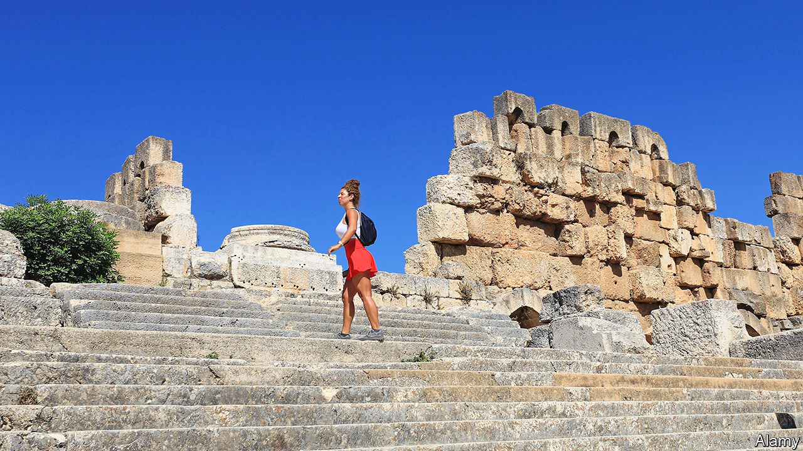

###### The Phoenician problem

# Lebanon is experiencing a tourism boom 

##### But it is disconnected from the reality of everyday life 

 

> Aug 24th 2023 

IT COULD be any luxury hotspot on the Mediterranean. The four-hour flight from Dubai, the region’s financial hub, may cost $1,000 each way. Holidaymakers fork out over $450 for hotel rooms, $100 for plates of grilled fish. Day-passes to beach clubs can cost 25% of the locals’ monthly minimum wage, yet the clubs are packed. When a punter called a popular haunt for a last-minute booking in July, the bemused receptionist asked if he meant July 2024.

This is not the French Riviera or Mykonos, though. It is Lebanon, where a has pushed the country into one of the worst depressions in modern history. Since 2019 the currency has lost 98% of its value and GDP has plunged by 40%. Annual inflation has been above 100% since July 2020. The country is trying to secure a $3bn bail-out from the IMF.

None of that stopped Skybar, a much-loved Beirut nightclub, from reopening this summer after a three-year hiatus. Partygoers sip exotic cocktails and dance all night on a rooftop ablaze with neon—even while, on the streets below, the state cannot afford to keep the street lights on. “ the IMF isn’t seeing our [Instagram] stories,” joked a comedian.

Walid Nassar, the tourism minister, expects 2m visitors this summer, an influx equal to 40% of Lebanon’s population. Most will be Lebanese expats for whom a  is a cherished tradition. Depending on whom you ask, their visits are either a much-needed boost for the ruined economy, or a reminder of the problems that ruined it in the first place.

The crisis stems from a years-long Ponzi scheme run by the central bank, which borrowed dollars from banks at high interest rates to finance large twin deficits and maintain a currency peg. By 2019 there were no longer enough new deposits to sustain it. Banks closed for weeks, then imposed arbitrary capital controls. The country defaulted in 2020.

There have been years of monetary madness. The lira had been pegged since 1997 at 1,500 to the dollar, but the official rate soon became irrelevant. Various quasi-official rates were introduced for subsidies and banks, while the black-market rate sank steadily lower. Lebanon has 18 officially recognised religious sects; for a time, people joked, it had 18 different exchange rates.

This has made it a cheap destination for foreign visitors. Two summers ago, for example, a subsidy scheme allowed food importers to buy dollars for 3,900 lira, while the street rate was around 20,000. When your correspondent took some contacts for a beachside lunch, the bill came to 765,000 lira, more than Lebanon’s monthly minimum wage: $196 at the food-subsidy rate, but just $39 with dollars changed on the black market.

Prices have caught up with reality. The government has halted most subsidies because it can no longer afford them. It raised the official exchange rate to 15,000, which meant a tenfold increase in customs duties. A separate rate known as Sayrafa, used for a wider range of transactions, has climbed above 80,000. Parts of the economy have dollarised. Restaurant prices are often listed in greenbacks.

Inflation has made it even harder for most Lebanese to make ends meet. Prices seem higher than ever. The cost of a basket of staple food has risen by more than 1,700% since 2019. Half of all Lebanese families cannot afford enough to eat, let alone take a holiday. 

With the unemployment rate at 30%, tourism is one of the few sectors creating jobs. Mr Nassar estimates tourists will spend $9bn this year, a sum equal to 41% of Lebanon’s shrivelled GDP. Still, little of the money trickles down. Waiters or bartenders may earn as little as $150-200 a month.

In 1977 this newspaper coined the term “Dutch disease” to describe how commodity wealth can harm a nation’s economy. Lebanon has no such resources (though foreign firms are sniffing natural gas off its Mediterranean coast). What it does have is a sprawling diaspora. This causes its own distortions: call it the Phoenician problem.

For decades expat money let Lebanon run one of the world’s highest current-account deficits (it hit 26% of GDP in 2014). The economy was unproductive, but the peg allowed many Lebanese to feel as if they lived in a middle-income country, buying imported brands and booking foreign holidays. A state with a double-digit unemployment rate had 400,000 migrant workers pumping petrol and cleaning homes. None of this was sustainable.

While the diaspora has stopped storing money in Lebanon’s insolvent banks, annual remittances now equal a staggering 38% of GDP. That is enough to keep the country lurching along. But these inflows support little public or private investment. Instead they flow right back out, financing consumption in an economy that still depends heavily on imports. It is like a sugar rush: a cup of ice cream on a hot summer day, briefly enjoyed but soon forgotten. ■

