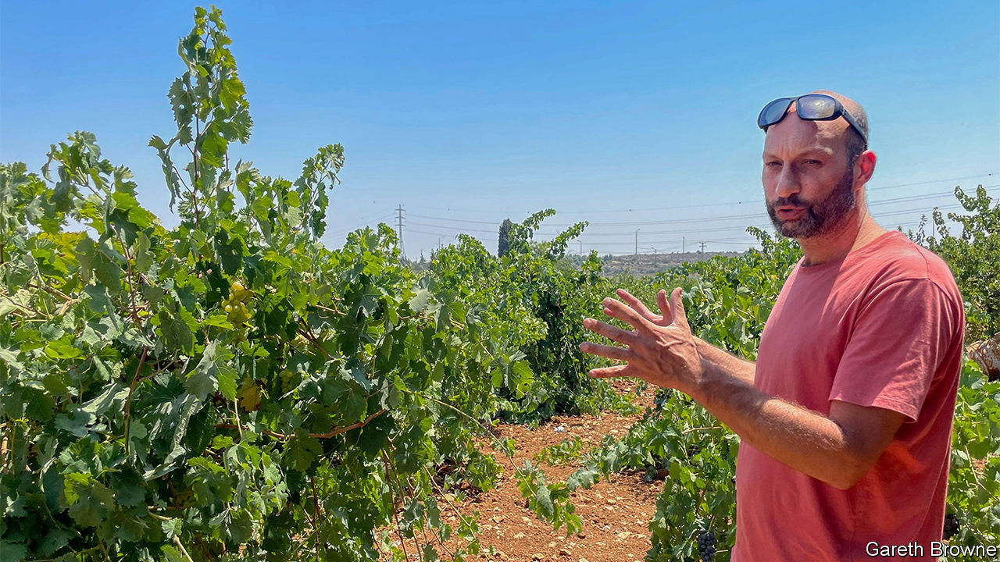

###### Grapes of wrath

# The challenge of making Palestinian wine 

##### The headaches caused by Israel’s occupation outweigh the vagaries of climate 

 

> Aug 24th 2023 

The vines are heavy with grapes, the harvest just a few days away. Yet Sari Khoury is stressed: he cannot find workers to pick grapes in his vineyards. Proud owner of the Philokalia label, he is one of a handful of Palestinians in the West Bank producing wine under the trickiest of circumstances: .

A “separation wall” between Israel proper and most of the Palestinian territory it occupies towers above Mr Khoury’s cellar in Bethlehem. Mr Khoury’s vineyards are hemmed in by Gush Etzion, a cluster of Jewish settlements nudging the south of the city. Constant niggles of the occupation abound.

In 2014 Mr Khoury gave up his job as an architect in Paris to return home to requite his passion for wine. A year later he was producing hundreds of bottles as one of the West Bank’s handful of wine producers to use only indigenous grapes. Now he fills 10,000 bottles a year. The business of wine-making is testing enough at the best of times. The headaches of production under military occupation are even more painful.

Mr Khoury is short of labourers because Palestinians can earn five times as much across the wall in Israel. And it is virtually impossible to get a from the Israeli authorities to expand his type of business physically. “I can’t even build a shed for my tools,” he explains. “I have to bring them with me in the car every time.” Other big obstacles are the Israeli checkpoints that hamper his logistics and the scarcity of water that is guzzled by the nearby Jewish settlements. 

Many Israeli wineries grow European grapes that need a lot of irrigation. But the lack of water supplies for Palestinians in the West Bank means that they struggle to grow the likes of Chardonnay or Cabernet Sauvignon. Hence Mr Khoury’s focus on local varieties such as Dabouki and Jandali that need less water and can survive the baking sun.

Mr Khoury also emphasises sustainability, but warns against growing indigenous grapes as a gimmick. “I want to create the highest quality wine possible, to be judged on its merits,” he says. “That’s my resistance,” he adds, referring to Palestinian efforts to push back against the Israeli occupation.■

