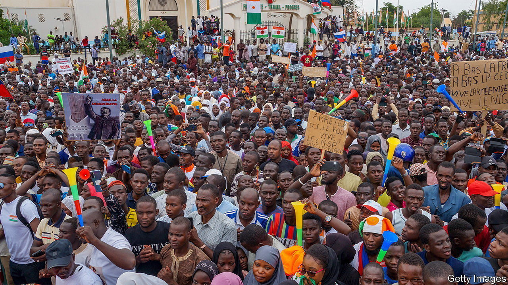
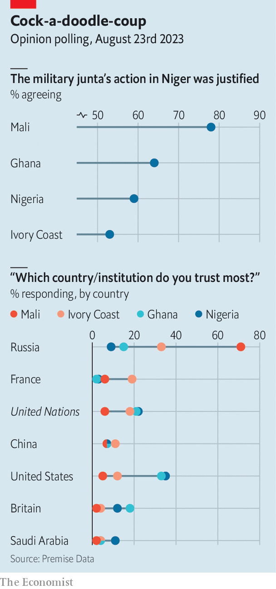

###### Vox pops on Niger

# West African views on Niger’s coup 

##### Popular coup, unpopular intervention 

 

> Aug 24th 2023 

A survey by Premise Data, a pollster, suggests that most people in west Africa approve of the recent coup in Niger (see chart). Respondents in Ivory Coast, Ghana, Mali and Nigeria also generally cast doubt on calls for the Economic Community of West African States (ECOWAS), a regional bloc, to  to put the ousted president, Mohamed Bazoum, back in power.

 


The poll, conducted by mobile phone and balanced in each country by age and sex, finds that in Ivory Coast, Ghana and Nigeria about 60% of respondents think the coup in Niger was justified. In Mali, where a ruling military junta has applauded the coup, fully 78% of respondents approve of it. 

The governments of Ivory Coast, Ghana and Nigeria all talk tough in favour of intervention, yet around 60% of respondents in each of those countries oppose the idea. Many say they fear it could spark a wider regional war. 

Even economic sanctions against Niger are divisive. Malians heavily oppose them. But so do 58% of Ivorians, while Ghanaians are almost evenly split. Nigerians narrowly approve of them. 

The survey also sketches the scale of  in west Africa. In Mali, where mercenaries of Russia’s Wagner Group operate, 71% say Russia is their country’s most trusted partner; no other country exceeds single digits. 

 is mixed. Half of Ivorians say they trust it least. Of those, 65% say it might win them over only if it were to withdraw all its forces from west Africa. Almost 30% of Ivorians reckon Russia’s values are most similar to theirs, though slightly more are happy to identify with those of France. 

Fondness for Russia may be partly thanks to France’s past role as the colonial ruler of Mali and Ivory Coast. In Ghana and Nigeria, both once run by Britain, Russia has less appeal. America is most trusted in both. At least Uncle Sam isn’t in the dock everywhere.

