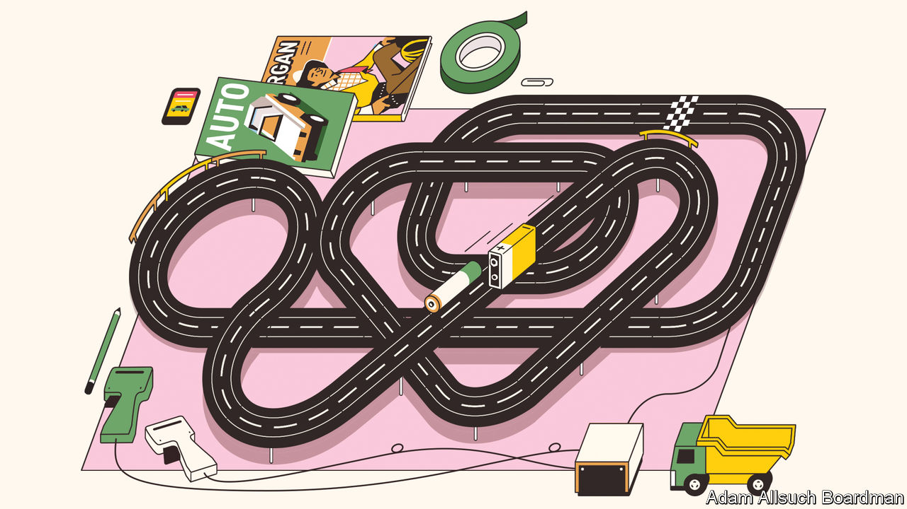
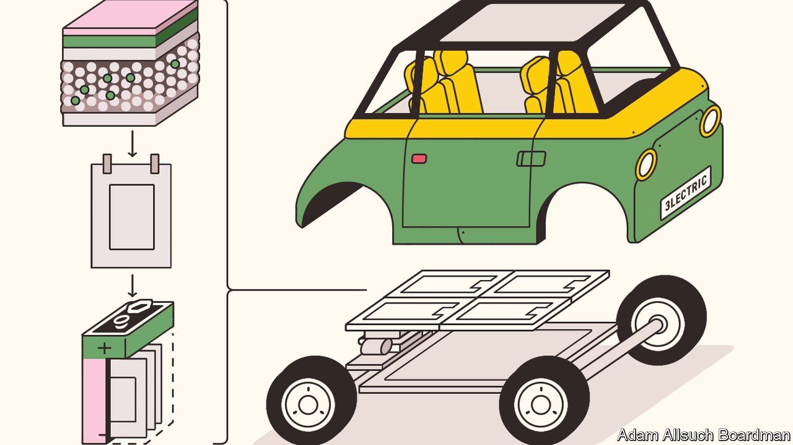

###### Electric cars

# Superbatteries will transform the performance of EVs 

##### Provided manufacturers can find enough raw materials to make them 

 

> Aug 23rd 2023 

Asked what they most want from an electric car, many motorists would list three things: a long driving range, a short charging time and a price competitive with a similarly equipped vehicle that has an internal-combustion engine. To help with those goals, carmakers have been looking for ways to replace the traditional lithium-ion (Li-ion) batteries that power most  (EVs) with more advanced “solid-state” versions. These new types of superbatteries have long promised faster charging and much greater driving range. Finally, after years of technical problems, efforts to make them are coming to fruition, with the first solid-state Li-ion batteries due to go into production within the next few years. 

, the world’s biggest carmaker, began looking at solid-state batteries in 2012. Over the years it has even intended to show off working prototypes, although little has appeared. The firm recently announced it had made a “technological breakthrough”, however, with plans to start manufacturing a solid-state battery as early as 2027. Toyota claims its new battery will provide an EV with a range of around 1,200km (746 miles), which is about twice that of many existing models, and can be recharged in around ten minutes. 

Electrifying

Toyota is not alone. Similar performance figures are being touted by other producers developing solid-state Li-ion batteries. Nissan, for instance, is building a pilot plant in Yokohama that will start making test versions next year. A similar plant is planned in Germany by BMW in partnership with Solid Power, a battery developer based in Colorado. QuantumScape, a Silicon Valley startup, has started shipping prototype solid-state batteries to Volkswagen, its main backer. 

It is, perhaps, hardly surprising that developing a solid-state battery has taken so long. Getting a new type of battery to work in a laboratory is one thing, but scaling it up so that millions can be produced in a factory is a difficult business. Although they were invented in the late 1970s, Li-ion batteries themselves were not fully commercialised until the early 1990s, at first for portable electronic devices, such as laptop computers and cell phones, and then as bigger versions that could be used to power a new generation of EVs. 

 


Electric cars have been around since the dawn of motoring. Indeed, Clara Ford much preferred her 1914 Detroit Electric to the petrol-powered vehicles made by her husband, Henry. But these early EVs, and others that appeared in subsequent years, were largely powered by dozens of heavy lead-acid batteries, which were expensive, provided limited range and often sloth-like progress. Lightweight and capable of storing a large charge, the Li-ion battery brought down costs and increased range (see chart 1), allowing the electrification of transport to begin in earnest. Solid-state Li-ion batteries could bring about another transformation. 

Carmakers were originally attracted to solid-state cells to improve safety because, as powerful as they are, traditional Li-ion cells come with a risk. This is because they contain a liquid electrolyte which is typically made from organic solvents, and these are extremely flammable. Hence, if a Li-ion battery is damaged, which can happen in an accident or if it overheats whilst recharging, it can explode into flames. Using a non-flammable, solid electrolyte prevents that. Solid electrolytes can be made from a variety of chemicals, including polymers and ceramics. But even Toyota, the master of mass production, initially found it difficult to get solid-state cells to work efficiently over a long period of time. 

By itself, a solid electrolyte does not necessarily improve the performance of a battery. But it does allow a Li-ion battery, for example, to be redesigned so that it can be made even smaller and lighter, and thus pack more energy into less space. It also allows engineers to broaden the range of materials which they can use to produce a Li-ion battery and tinker with how it works.

 


Despite their fiery nature, electrolytes are used in a liquid form for good reason. Ions are charged particles and are created at one of the battery’s electrodes, the cathode, when the cell is charged, causing electrons to be stripped from lithium atoms (see chart 2). The electrolyte provides a medium through which the ions migrate to a second electrode, the anode. As they do so, the ions pass through a porous separator that keeps the electrodes apart to prevent a short-circuit. The electrons created at the cathode, meanwhile, travel towards the anode along the wires of the external charging circuit. Ions and electrons reunite at the anode where they are stored. When the battery discharges, the process reverses, with electrons in the circuit powering a device—which in the case of an EV is its electric motor.

The medium is the message

For all this to work efficiently, the ions need to move between the electrolyte and the electrodes with ease. The electrodes are coated with various materials, in the form of layers of minute particles. As the liquid electrolyte in a traditional Li-ion battery can flow into these layers and immerse the particles, it provides a large surface area through with the ions can pass. A solid electrolyte cannot flow into all the nooks and crannies, so it needs to be compressed hard against the electrodes to make a good contact. Doing this in the construction of the battery, however, can damage the electrodes. Solving this so-called conductivity problem is one of the main technical challenges in manufacturing solid-state batteries, says Mathias Miedreich, the boss of Umicore, a Brussels-based company that supplies battery materials.

Despite their initial problems, in the past year Japanese carmakers have made great advances in working out how to manufacture solid-state Li-ion batteries at scale, says Mr Miedreich. Having been a bit of a laggard in launching EVs, he believes, they plan to use these new batteries to overtake competitors. Perhaps, but the race to build a superbattery is far from won, not least because the contenders come in many different forms.

Some solid-state batteries are already on the market. For instance, Blue Solutions, a French company that is part of the giant Bolloré Group, produces one containing a polymer as its electrolyte. As this requires a high operating temperature, the battery is best suited to vehicles that, once the battery is warmed up, remain in constant use. Hence it is being used to power electric buses.

Others are something of an interim step, as they still contain small amounts of a liquid electrolyte to help with conductivity. Many of the Chinese battery-makers that dominate the market are working on semi-solid versions. Contemporary Amperex Technology (CATL), a Chinese firm that makes more than a third of the world’s EV batteries, measured by their total capacity, says it could begin production later this year of a semi-solid version it calls a “condensed” battery. The company claims this will have both a high level of safety and a big storage capacity.

A battery’s capacity can be measured by its specific energy, which is the amount of energy that can be stored by weight. According to CATL, its condensed battery will be able to store up to 500 watt-hours per kilogram (Wh/kg). The highest performing Li-ion batteries with liquid electrolytes presently available on the market tend to top out around 300Wh/kg. Completely solid-state batteries might be able to reach 600Wh/kg or beyond. Besides boosting the performance of EVs on the road, batteries of such power and lightness will also greatly extend the range of small vertical-take-off-and-landing air taxis that are on the brink of being certified airworthy.

Capacity, however, is just one characteristic of a battery. How quickly it can deliver its power, how long it will last and how much it will cost are just as important. But resolving these issues involves trade-offs. Increasing the amount of energy that can be stored, for instance, is likely to increase costs if more lithium is required. And regular fast-charging might shorten a battery’s life. The trick in getting the balance right depends on the battery materials that are chosen.

Material issues

Start with cathodes, the most expensive component in a Li-ion battery. In theory, solid-state batteries are fairly agnostic about which type to use. The two most common varieties of cathodes are so-called NMCs, which contain coatings of lithium along with various ratios of nickel, manganese and cobalt; and LFPs, made from a blend of lithium iron phosphate. By avoiding the use of expensive nickel and cobalt, LFPs are gaining in popularity. They are a particular Chinese speciality. But with a lower storage capacity than NMCs, they tend to be used in vehicles that do not require a high level of performance.

With hundreds of laboratories around the world working on new battery materials, other types of cathodes are bound to appear. Umicore, for example, has teamed up with Idemitsu Kosan, a Japanese producer of electrolytes, to develop a type of material called a catholyte, which combines cathode chemicals with a solid electrolyte to form a single layer. If it works, this would make battery construction even simpler. Scientists are also working on using sodium instead of lithium as a source of ions in a battery. Sodium is abundant and cheap, though lithium, as the lightest metal of all, would still have the edge in some transport applications.

As for anodes, changes are also afoot. At present, most anodes are made from graphite, a pure form of carbon extracted from a handful of mines, mostly in Mozambique or China, or produced synthetically in petrochemical works using carbon-intensive processes. Because a solid electrolyte reduces the risk of adverse reactions, materials such as silicon and certain metals, particularly lithium in its metal form, can be used instead. These can store more energy in less space than graphite, which allows batteries to be made smaller and lighter. Additional space is saved because a solid electrolyte can also double up as a separator.

Some solid-state batteries will be “anode-free” (also shown in chart 2). This is the direction taken by QuantumScape. It uses a proprietary ceramic that acts as both separator and electrolyte, and which is placed between a cathode and a metal foil. When the battery is charged, lithium ions migrate through the solid electrolyte and build up on the foil, effectively plating it with lithium to form a working anode. When the battery discharges, the ions migrate back and the anode shrinks away.

Forming an anode this way does mean that the battery expands and contracts. This also happens in traditional Li-ion cells, by about 4% or so compared to some 15% in a QuantumScape cell, says Tim Holme, a co-founder of the company. This movement is accommodated for in the packaging of the cells, which are stacked into layers to form the modules that make up a complete EV battery.

Besides a long range and a fast charging time, QuantumScape says its battery will also have an extended “cycle life”. This is a measure of how many times it can be charged and discharged before the battery’s capacity degrades to below 90% and its performance level starts to fall. The QuantumScape battery should be good for at least 800 cycles, says Dr Holme. So, if each charge provided only an average range of around 500km, it would still give an EV a lifetime range of some 400,000km—which is good for any vehicle. Being ceramic, the battery’s separator also resists the formation of dendrites, adds Dr Holme. These are finger-like metallic microstructures which can grow inside a liquid electrolyte and cause a short circuit. Semi-solid batteries, including the condensed variety, could still be vulnerable to this.

On the production line

Just how good these new batteries turn out to be will not really be known until they arrive in cars and manufacturers’ claims can be tested. The advertised range of existing EVs can be unachievable in real driving conditions. The first semi-solid batteries should appear in cars in 2025-26, says Xiaoxi He of IDTechEx, a firm of analysts. She expects the first all-solid versions, like those being developed by Toyota and others, to appear in 2028. 

At first the numbers will be small as companies embark on trial production before investing billions of dollars in converting existing “gigafactories” to make the new batteries or building new ones. That means the batteries will be expensive with early applications in luxury and high-performance vehicles, adds Dr He. So it could be well into the 2030s before cheaper solid-state batteries become widely available in family cars.

To a large extent, just how successful mass production is in bringing down costs will depend on how raw material prices develop over the next decade. “Solid-state batteries will significantly consume more lithium,” says Fabian Duffner, of Porsche Consulting, which is run as an independent part of the German sports-car manufacturer. Depending on how they are made, he estimates batteries containing higher-capacity cathodes and anodes will need 40-100% more lithium. At the same time, producers will also need additional lithium as they increasingly switch more of their production away from combustion-engine vehicles to making EVs.

 


Sometimes called “white gold”, lithium prices have been on a rollercoaster. Much of the lithium market is dominated by China. Towards the end of last year prices for battery-grade lithium carbonate shot to around 600,000 yuan (some $80,000) a tonne, but have since slipped back to around 250,000 yuan—still about twice what it was two years ago. Nickel prices have also been volatile.

In such a mercurial market companies need to secure their supply lines, adds Dr Duffner. That will be difficult because even though some new mines for lithium and other battery materials are being developed, particularly outside China, they can take a decade or more before they reach their full production. 

As a result, Dr Duffner expects many of the large carmakers to become more vertically integrated by teaming up with battery producers and materials companies. In Japan, Toyota, Nissan and Honda have already joined with Panasonic and GS Yuasa, a pair of battery-makers, to form a consortium to develop solid-state batteries.

Recycling materials will help somewhat. Most operations already recycle batteries from consumer electronics and will scale up to deal with what will be a growing number of batteries as older EVs reach the end of the road. The methods are well advanced—once the battery cells are isolated, they are ground up and materials such as lithium, cobalt, nickel and manganese can be recovered and purified.

Redwood Materials, a battery recycler based in Nevada, uses some of the materials it recovers to make new cathodes and anodes. Northvolt, a Swedish battery-maker with a number of gigafactories in Europe, hopes by the end of the decade to obtain about half the materials it needs from recycled batteries.

One way or another, then, solid-state Li-ion batteries are coming down the road. They look promising enough to finally allow EVs to compete with vehicles using dirty, old-fashioned internal-combustion engines on range, performance and convenience. At present, standard Li-ion batteries account for some 40% of the cost of an EV. That proportion will have to fall if solid-state superbatteries are to allow electric cars to compete on price as well. ■


