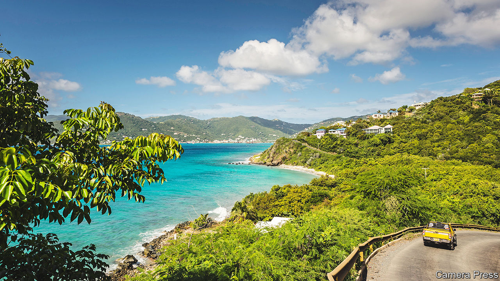
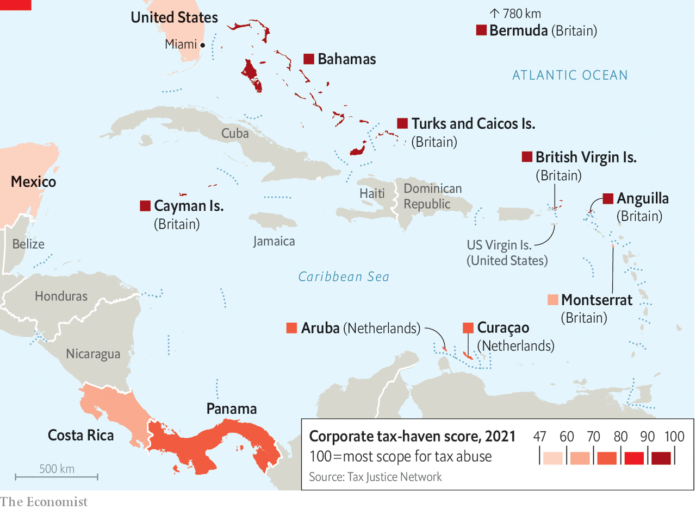

###### Treasure islands

# A wave of international rule-making threatens Caribbean tax havens 

##### Their old wheezes are running out of steam 

 

> Aug 21st 2023 

In January 2024 a court in Miami will start hearing an unusual trial: that of Andrew Fahie, the former elected leader of the British Virgin Islands (BVI). In 2022 he was arrested in the United States. The American authorities say he promised an informant working undercover for them that he would allow illegal drugs destined for the United States to pass through his territory’s ports, in exchange for a fee. Mr Fahie, who is under house arrest in Miami, has pleaded not guilty. The skeleton of a house he had been building still stands, unfinished, outside Road Town, the capital.

The smell of rotten governance is the last thing the BVI needs. For four decades this luminous speck in the Caribbean has made a chunk of its living selling foreigners brass-plate companies—shells that exist largely on paper, without real staff or offices. That business, along with services that spin off it, has in some years funded more than two-thirds of the government’s budget and has made a territory with a mere 33,000 people famous in the business world. “It has served us very well,” says Natalio Wheatley, who succeeded Mr Fahie as premier. 

But lately global efforts intended to tame money-launderers and tax evaders have been weighing on the BVI’s financial-services industry. The total number of companies registered there has fallen by more than a fifth since 2011. Like financial centres all across the Caribbean, it is sailing into choppier seas.

Almost every rock in the Caribbean has, at one point or another, sought to build an offshore sector of some flavour. The Bahamas was the first to make a good go of it. These days it earns about 10-15% of GDP from financial services, particularly private banking. But the places that most depend on offshore work are the Cayman Islands, the BVI and Bermuda (in fact in the North Atlantic). All three are self-governing territories of Britain, reliant on it for defence and much diplomacy, but in all other matters in charge of their own affairs. In the BVI offshore financial and corporate services make up one-third of GDP. They support about one-fifth of all jobs.

Offshore centres provide a seafood buffet of useful and legitimate services. Among laymen, however, it is the way that Caribbean islands have sometimes been used by crooks and kleptocrats that most often fuels debate. The Tax Justice Network (TJN), an NGO based in Britain, guesses that wheezes involving financial centres in the Caribbean and Bermuda account for about 20% of the $472bn that it thinks governments around the world lose each year to cross-border tax evasion and minimisation schemes. A larger share of global losses arises from cross-border business that is done in chilly countries such as mainland Britain, the Netherlands and Ireland. But for places so tiny, it is a whopping sum.

That offshore bounty is now threatened by a wave of international rule-making. In the Caribbean two initiatives in particular are currently top of mind. The first relates to corporate transparency. In 2016 Britain began publishing, in a public database, the identities of everyone who controls a company on its mainland; it was the first big country to do so. Now it wants its overseas territories to follow suit, by the end of this year. The idea is that allowing journalists and NGOs to trawl records that at present are made available only to police and other relevant authorities will make it easier to detect tax abuse and fraud. But the offshore centres are dragging their feet, presumably because they fear that having a public register will dent sales. 

A second pressure is a global corporate-tax deal struck by some 130 countries in 2021 which, among other things, aims to ensure that big multinationals pay at least a minimum level of tax on their profits, wherever in the world they choose to book them. For years companies have used legal loopholes to declare profits in havens that charge little or no levies, instead of where their sales are actually made. In the future, when companies use these kinds of arrangements to achieve a tax bill lower than 15%, they will be asked to cough up extra money wherever they have their main headquarters. Or at least that is the idea.

A bit rum

The extent to which Caribbean centres benefit from the corporate “profit-shifting” of a sort that will be affected by this agreement ranges widely. A global minimum tax could reduce incentives for big corporations to pitch tents in palm-fringed places, but will not eliminate them. The Bahamas and Bermuda are talking about raising taxes for the biggest foreign firms: if multinationals will be forced to pay more, goes their thinking, they might as well try to pocket the cash themselves. The Cayman Islands and the BVI are still deciding how to respond. There is a high chance that the United States will yet wimp out of the deal; that would greatly limit its effect.

 


These and various earlier initiatives have taken the BVI some way from its glory days. In the 1950s the colony made half its revenues selling stamps to philatelists, notes Oliver Bullough in his book “Butler to the World”. Everything changed in the late 1970s, when American firms began incorporating there in order to exploit the favourable treatment the BVI then enjoyed under a tax treaty between Britain and the United States. Within a few years, the territory was selling brass-plate companies to people from all over. Hong Kongers grew especially keen. Protecting their assets using offshore shells was one way to hedge against risks posed by their own island’s looming return to China. 

In the 1990s the Caribbean offshore centres were “very wild west”, in the words of Jason Sharman at the University of Cambridge. “Think private jets full of cocaine cash being flown in and taken to the bank,” he says. During that period the BVI’s financial sector grew by around 50% each year. At their busiest, bland buildings in Road Town lent their addresses to some 480,000 fee-paying companies. That was more than 15 for every resident. 

Since then the number of new companies being created every year has slowed dramatically, from almost 80,000 in 2007 to some 28,000 in 2022. The total number of businesses registered in the territory has fallen at a somewhat slower rate. Whereas customers once bought and threw away BVI companies at some speed, they now purchase fewer and hang on to them for longer. But this figure is also drifting downwards, nonetheless. Lately the government has managed to prop up the revenues this industry generates for the territory, in part by raising fees. But there is probably a limit to how long it can do that. Some of the BVI’s customers may be moving to incorporation centres that are cheaper and better able to promise anonymity, such as Delaware.

The BVI’s economy is more vulnerable to changing regulation than its Caribbean competitors because its financial sector is much less diverse. The Caymans is a big domicile for hedge funds; Bermuda a hub for insurers. The incorporation work which the BVI excels at is, by comparison, much easier to replicate. The territory has done a poorer job than its neighbours of building expertise in other kinds of financial and corporate services, which would provide more security as its ability to offer tax advantages and secrecy erodes. Efforts to diversify can be fraught with risk. The Bahamas courted cutting-edge finance, only to find it was host to Sam Bankman-Fried, a cryptocurrency tycoon, who was jailed on August 8th in the United States, ahead of his trial for fraud (in January he entered a plea of not guilty).

A government report published in 2014 noted that the BVI needed to diversify the kinds of financial services it offers, as well as strengthen other pillars of the economy, such as tourism. But progress has been slow. It has certainly not been aided by the catastrophic impact of Hurricane Irma, which struck the islands in 2017.

That calamity destroyed or damaged some 70% of buildings and set back essential efforts to improve infrastructure. Look away from Road Town’s shimmering harbours, and the territory looks scruffier than its income level suggests (its GDP per person is about the same as Britain’s). Fires smoulder at its rubbish dump. Its power station occasionally packs up. As elsewhere in the Caribbean, youngsters get tempted into gangs that ship drugs to the United States; violence sometimes results. On the edge of Road Town sits a car with three bullet holes in its windscreen.

No man is an island

Dysfunctional politics have harmed it, too. Even before Mr Fahie’s arrest, the BVI’s British governor had launched a commission seeking evidence of corruption or “serious dishonesty” in government. Last year it concluded that politicians had been spending public money “without applying any objective criteria, without giving any reasons and without fearing any comeback”. The British government declined to suspend the territory’s parliament, as the commission advised—but says it could still do so if islanders do not make reforms that its report recommended.

Locals insist that after years of tumult, the territory is finally making good progress. Lorna Smith, deputy leader in a government that took office this year, says her new ministry of financial services will protect the BVI’s incorporation business and encourage value-added services to grow around it. She talks enthusiastically about opportunities in “blue finance”, under which the islands could raise money from international investors by protecting their waters and reefs. Next year, she adds, the BVI will host a big fintech conference on a cruise ship. Mr Wheatley, the premier, says that tourism is bouncing back from its pandemic doldrums. For the first time in years visitors can reach the islands on a direct flight from Miami.

Making the most of these opportunities will require reforms, such as slashing the red tape that impedes too many local entrepreneurs. It will mean liberalising the BVI’s immigration system (until now islanders have not been very keen to offer admission and long-term residency to large numbers of foreigners). In particular, it will require big efforts to fix iffy schools, which during fat years proved easy to neglect. Without these solid foundations, the treasure islands risk slipping behind. ■

