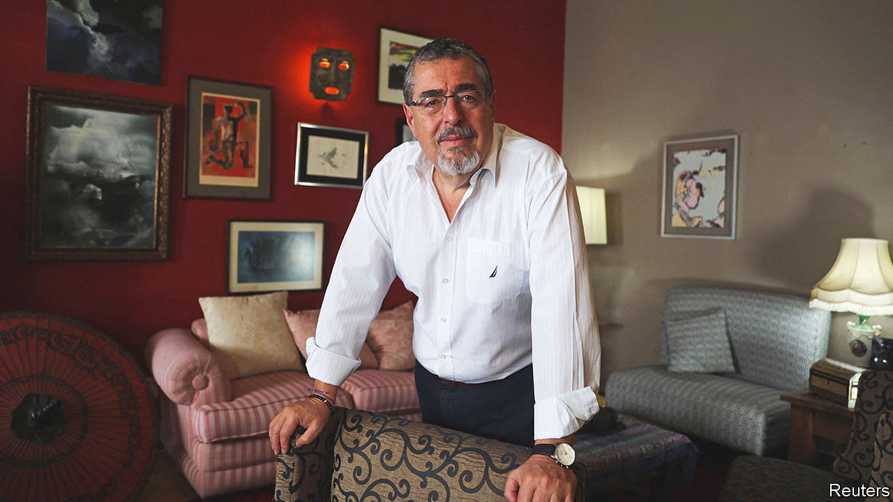

###### A win for democracy

# Elections in Ecuador and Guatemala suggest an anti-incumbent surge 

##### The rise of the outsider candidate is a broader trend across the region 

 

> Aug 21st 2023 

On August 20th voters went to the polls in Ecuador and Guatemala. Both produced results that would have been unthinkable just a few weeks ago. In Ecuador two candidates will now head to a run-off: Luisa González, a protégée of Rafael Correa, a former left-wing populist president, and Daniel Noboa, a 35-year-old who was polling in single digits a few days before the vote. In Guatemala the result was a landslide win for Bernardo Arévalo, a reformer who took 61% of votes, far ahead of the 39% gained by Sandra Torres, a former first lady on her third (unsuccessful) run for the presidency. Both elections show that Latin Americans are fed up with the status quo.

Mr Arévalo, the son of Guatemala’s first democratically elected president, pledges to tackle corruption. This appealed to voters angry at the influence over the state exercised by a sprawling network of political, military and economic elites, which Guatemalans call “the pact of the corrupt”. Although Mr Arévalo has spent part of his career as a diplomat, his party, Movimiento Semilla (Seed Movement), is relatively new and founded by academics. 

Two polls, one theme

Across the region, voters have long been restless at the rise in corruption and crime. In Guatemala this has been particularly obvious. In 2019 a UN-backed anti-corruption body was shut down by a former president. Lawmakers are widely believed to take money from drug-traffickers in exchange for their connivance. Under the outgoing president, Alejandro Giammattei, the courts have been stacked with people loyal to the political elite. Scores of independent-minded judges and journalists have fled the country. 

Many hope Mr Arévalo’s win can reverse this democratic decline. Guatemalans in the capital celebrated with fireworks. Fears that the “pact of the corrupt” would scupper the election did not come to pass. Voting took place peacefully, without any reports of major irregularities. Indeed Mr Giammattei was quick to congratulate Mr Arévalo.

Legal challenges are likely between now and the inauguration in January, however. Ms Torres has yet to accept the result. Nine political parties launched a spurious legal challenge to the vote following the first round in June. Another ongoing case seeks to revoke Semilla’s legal status on the basis of irregularities in its registration (these are denied by the party). Still, Juan Carlos Zapata of Fundesa, a think-tank in Guatemala City, reckons that any challenges will be quickly resolved. “The message of the voters was very clear,” he says.

Similarly, in Ecuador the electoral period has been turbulent. Just 11 days before the vote Fernando Villavicencio, a candidate campaigning on an anti-corruption platform, was shot and killed. This led analysts to believe that candidates who emphasised a law-and-order message would come out on top. Homicide rates have quadrupled since 2018 to 26 per 100,000 people per year. That is a higher rate than in Mexico or Colombia. 

Instead, Ecuador’s result shows a deeply divided country. Ms González won 34% of votes. Her success points to the continuing influence of Mr Correa, who ruled from 2007 to 2017 and later went into self-imposed exile in Belgium, where he worked as a host for Russia Today, a news channel linked to the Kremlin. In 2020 he was tried in absentia for corruption (which he denies) and sentenced to jail for eight years. But many voters may be nostalgic for his rule, which coincided with a commodities boom. Poverty rates fell and the country was relatively peaceful.

By contrast, Mr Noboa’s surprise second-place showing, with 23% of the votes, suggests that some Ecuadoreans—particularly younger ones—want something different. Mr Noboa, a lawmaker since 2021, is the scion of one of Latin America’s richest families. His father unsuccessfully ran for the presidency five times. Mr Noboa talks about boosting free-trade agreements and cutting taxes. He performed well in the final presidential debate, and clips of his performance went viral online. If he can win over those voters who plumped for the other centrist candidates, or those who do not fondly recall Mr Correa, he could win in the run-off on October 15th.

Once in power, however, these reforming politicians will face huge challenges. The Guatemalan elite will probably try to put obstacles in Mr Arévalo’s way, especially as he has stated clearly that he will challenge their control of state institutions. Semilla won 35 seats in the Congress in elections in June, a big increase from its previous seven. But it is only the third-largest party. Ecuador’s Congress looks set to remain fragmented, too.

Success for underdog candidates is not limited to these countries. Last week Javier Milei, a libertarian economist who was elected to Congress in 2021, won the most votes in Argentina’s primaries. He will now face more established politicians in the election on October 22nd. Surprise winners do not always work out well: El Salvador’s Nayib Bukele has slashed murder rates since being elected in 2019, but he has attacked institutions and is seeking to stay in power beyond the country’s permitted term limits. Many Guatemalans hope that Mr Arévalo, at least, will be different. ■

