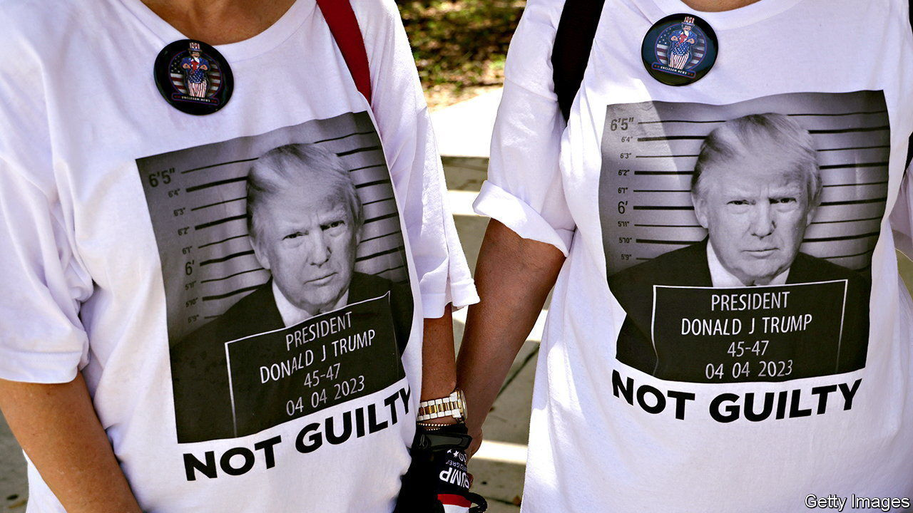
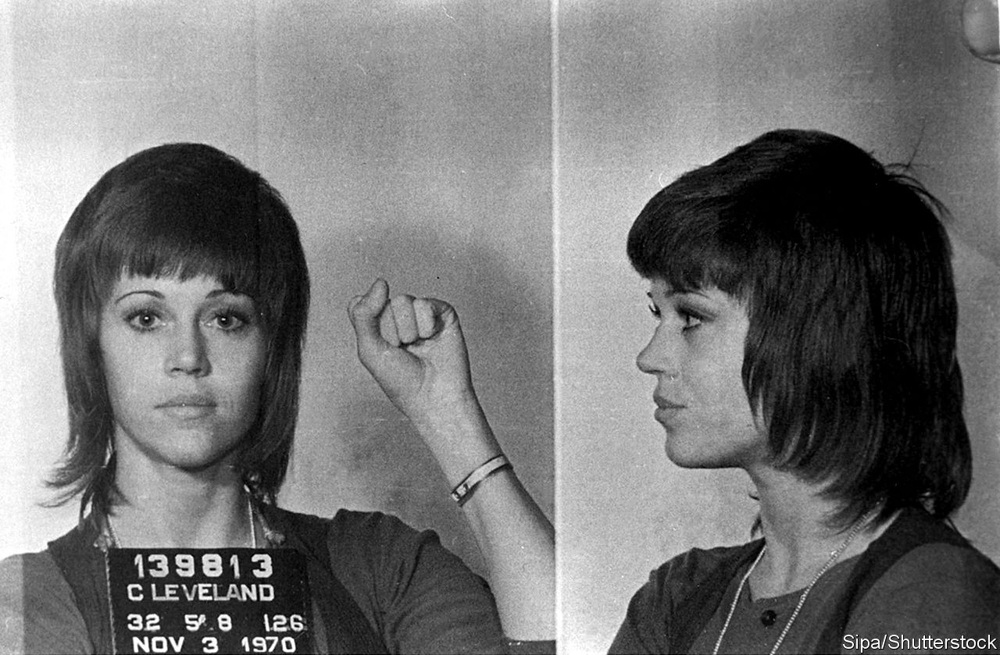

###### The Economist explains

# Donald Trump and the powerful history of the mugshot 

##### The former president is ready for his close-up 

 

> Aug 24th 2023 

IN 1872 ULYSSES GRANT was reportedly arrested for speeding. One day, as the 18th American president charged along 13th Street in Washington, DC, a policeman waved down his horse-drawn carriage. In the arresting officer’s own telling,  made a vain attempt to plead his case—“Hang it, officer, these animals of mine are thoroughbreds, and there is no holding them”—then drove to the station. There, at least, the president avoided the indignity of a mugshot, which would not be widely used until about a decade later. 

Despite four indictments in the past five months, the 45th president has so far evaded it, too. But on August 24th  will probably have his picture taken by police when he surrenders to authorities in Fulton County, Georgia, charged in connection with his effort to overturn the 2020 presidential election results there. (He denies wrongdoing.) The image will join the ranks of celebrity mugshots: famous faces in turns defiant, dejected, drunk, smirking or sulking. 

The modern mugshot—a diptych of one front-facing photo and one in profile, accompanied by identifying information—is a French invention. In the 1880s Alphonse Bertillon, a policeman and anthropologist, created the system to catch serial offenders. Upon arrest, a suspect was photographed and measured with a variety of instruments. The method was painstakingly prescriptive: the correct way to measure the length of the head was outlined in 18 steps. If police suspected they had a repeat offender on their hands, they could use his measurements to find his filed mugshot, should it exist.

 


It was called the , or speaking image, because of the many things it communicated to police. Bertillon’s measurements have been replaced by fingerprinting, but the mugshot has survived. Some, like great portraits, seem to get at the subject’s core. David Bowie, booked on marijuana charges in 1976, is sharply dressed and self-possessed. In 2022 the original Kodak (saved by the officer who photographed him in Rochester, New York) fetched nearly £5,000 ($5,950) at auction. Jane Fonda () has an unkempt fringe and holds up a fist in protest. She was arrested for possessing drugs, which turned out to be vitamins. Frank Sinatra is boyish and serene, booked for “seduction”, or luring “a single female of good repute” to bed. 

Others document an inevitable moment in a longer struggle. The late John Lewis (), a congressman and civil-rights activist, repeatedly tweeted his mugshot to mark the anniversary of his release after being arrested in 1961, for using a toilet reserved for white people. The famous mugshot of Rosa Parks is indelibly associated with her act of defiance on a bus in Montgomery, Alabama, in 1955 but was actually taken after a later arrest for protesting during the bus boycott that followed.

 


Vladimir Lenin and Joseph Stalin were both arrested and exiled (several times, in Stalin’s case) to Siberia for revolutionary activities; they look young and determined in their surviving mugshots. Fidel Castro’s hangs in the former Cuban prison where he served part of a 15-year sentence for organising an attack on a barracks. Still others are simply bleak: Hugh Grant is hunched and humbled after soliciting a sex worker in 1995; Tiger Woods is zombie-like after being arrested for driving under the influence in 2017. 

What will Mr Trump’s picture say? He would certainly like to present himself as righteous and persecuted, waging a noble political fight. His indictments have so far galvanised, rather than alienated, his supporters. His campaign team is already selling merchandise branded with a photoshopped mugshot. But the fabricated image has no power: the whole point of the mugshot is authenticity. The purpose, wrote a fan of Bertillon’s, is “to give each human being an identity, an individuality, certain, durable, invariable, always recognisable”. That, at least, Mr Trump can already claim to have achieved.■

