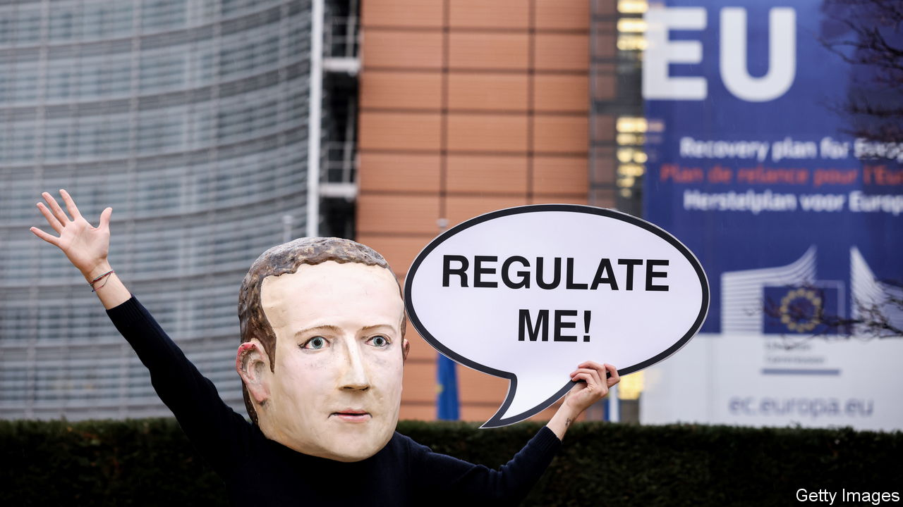

###### The Economist explains

# How Europe’s new digital law will change the internet 

##### The “Brussels effect” may fizzle when the long-awaited Digital Services Act is put into action 

 

> Aug 24th 2023 

MOST PEOPLE think of  as a social network and  as a . But tech geeks see these services as “platforms”: vast online territories that users inhabit. The companies that run them have mostly been free to make the rules in these digital places. But on August 25th they will  when the rules of the European Union’s Digital Services Act (DSA) are put into action. What will this mean for internet users—not just in Europe, but worldwide?

With the DSA and its sister legislation, the Digital Markets Act, which will also be phased in over the coming months, the EU aims to change the oversight of large online platforms. Until now regulators have tried to fix problems—such as the  and violations of —after the fact. The new laws are meant to help them get ahead of the game by setting clear rules that online platforms must follow.

The DSA will apply to all online businesses, but bigger services, defined as those with more than 45m users in the EU, will have to follow extra rules. In April the European Commission, the EU’s executive branch, designated 19 of these “very large online platforms” (VLOPs) and “very large online search engines”. This group includes the usual suspects, such as Facebook and Google, but also more surprising ones, such as , a free online encyclopaedia, and Zalando, a European e-commerce site.

Most web users will hardly notice some of the changes these firms will now have to implement. Platforms will have to share more information with regulators about how they moderate content, decide what users see and use artificial intelligence. They must allow vetted researchers and auditing firms to look at internal data to check if they are following the rules, too.

Other changes will be more obvious. Platforms must now make it easy for users to report content they think is illegal, and will have to remove it quickly if it breaks the law. They must also tell users if their content is removed or hidden, and explain why. Targeted advertisements will no longer be allowed if they are based on sensitive personal data such as religion and sexual orientation. Using personal data to show ads to children and teenagers will also be banned.

Companies have already started to tweak their services. Meta, which operates Facebook, is developing tools that will tell users when the visibility of their posts has been limited (and give them a chance to appeal). On Amazon, a big online retailer, European buyers will soon be able to flag potentially illegal products. And on , a social-media platform, users will have the option of seeing videos based on the content’s popularity in the area where they live, rather than what they have watched before, to minimise the personal data that is collected. 

Such changes should make online platforms safer and better—but much will depend on how the DSA is put into practice. Although the commission has promised to employ more than 200 people to oversee compliance, it may struggle to enforce the law. Companies are sure to take decisions they dislike to the Court of Justice of the European Union: Zalando has already challenged its classification as a VLOP. Penalties for failing to comply with the act are certainly steep. Fines can reach up to 6% of global annual revenue, which would amount to about $7bn in the case of Meta.

The EU’s most recent big piece of digital legislation, the General Data Protection Regulation, an ambitious privacy law, was an international success. Since the GDPR came into force in 2018 big tech firms have adopted its rules globally to save costs. (It has also become a model for other data-privacy laws around the world.) But tech giants may resist doing the same with the DSA: the price, losing sovereignty over their digital territories everywhere, is one they may be unwilling to pay. A repeat of the “Brussels effect”, whereby EU regulators set a global standard, is far from guaranteed. ■

