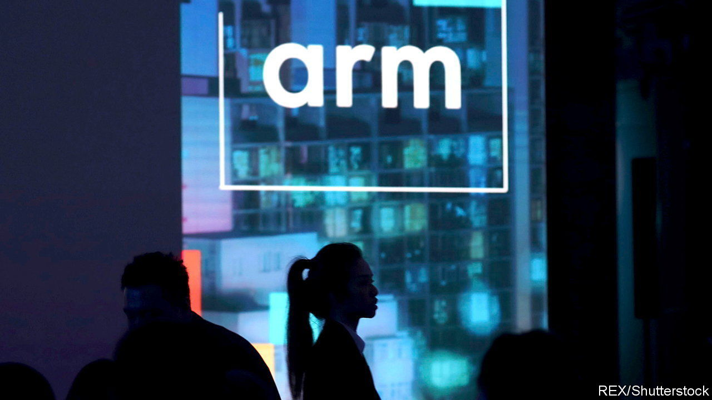
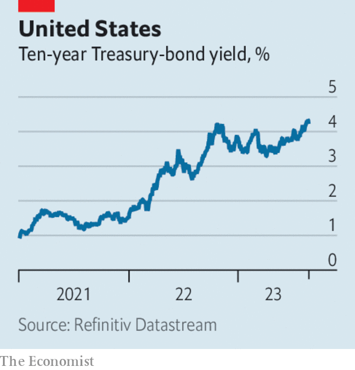

###### The world this week

# Business 

#####  

 

> Aug 24th 2023 

 published a prospectus for its blockbuster IPO on the Nasdaq exchange next month. SoftBank, a Japanese tech conglomerate, bought the British chip designer in 2016 for $31bn. It is expected to be worth between $60bn and $70bn when it makes its Nasdaq debut. Arm’s chip architecture is used in 99% of the world’s smartphones. Although that market has slowed, tech titans such as Amazon, Apple and Nvidia are reportedly interested in taking big stakes in the company. 

Chips with everything

The superlatives came thick and fast when  released quarterly earnings. Revenue more than doubled at the maker of chips for AI, year on year, to $13.5bn. Perhaps that is no surprise, given that just one of Nvidia’s H100 chips can cost upwards of $40,000. It is delighting investors by buying back $25bn-worth of stock. 

Britain’s Competition and Markets Authority cleared  proposed $69bn takeover of , a month after regulators in the EU gave their approval. America’s Federal Trade Commission is still scrutinising the deal, which was announced 15 months ago. Separately,  submitted a restructured proposal for its takeover of  to the CMA in the hope of getting the regulator’s blessing, after it said it would block the deal. 

Meta rolled out a web version of its  social-media platform. Threads was launched as an alternative to Twitter (now X) last month. Over 100m people signed up to the app in the first few days, but since that initial hullabaloo the number of active daily users has reportedly plummeted, to below 10m. It is still not available in the EU, probably because of the region’s tough regulations on data privacy. 

Markets reacted positively to latest quarterly earnings, as it raised its forecast for the full year. The video-conferencing company has been struggling to adapt to the end of the pandemic, when remote working caused its business to soar, though it is expanding its range of services through the use of artificial intelligence and has invested in Anthropic, an AI startup founded by former employees of OpenAI.

 


Investors eagerly awaited a speech by Jerome Powell, the chairman of the Federal Reserve, at the Jackson Hole symposium for clues about the future direction of interest rates. The yield on American ten-year  hit a 16-year high, as markets continued to bet that favourable economic conditions will allow the Fed to keep rates around their current level. 

 central bank disappointed markets when it cut a key interest rate by a smaller amount than had been expected. The People’s Bank of China reduced the one-year loan prime rate by just a tenth of one percentage point and left the five-year rate unchanged. That led investors to surmise that the government is more interested in protecting bank profits than in stimulating the economy. A package of reforms from the country’s securities regulator, such as extending market-trading hours, also failed to inspire. 

Underlying profit at  for the 12 months ending June 30th fell to $13.4bn, the lowest in three years. The mining company said that conditions in the iron-ore market for the rest of the year would depend in part on “how effectively China’s stimulus policy is implemented”.

China’s economic woes are in part the result of an increasingly unstable property industry. Now , a big developer which rattled markets two years ago when it defaulted on its debt, has filed for bankruptcy protection in New York to protect it from creditors in America. The company has over $300bn in liabilities, a fraction of which is held by foreign investors. The news comes as fears mount that Country Garden, another huge developer, is heading towards a default. 

Mukesh Ambani seemed to have made a rare misstep when the IPO of his  flopped on the Mumbai exchange. JFS was spun out of the Indian tycoon’s Reliance Industries, and is the first demerger of a Reliance business in 20 years. But investors are not sure that it can compete against bigger, established non-banking financial companies. 

 was rumoured to be on the verge of being sold to a private-equity firm for around $10bn. The sandwich chain has been owned by its two founding families since 1965. 

Will it work?

 announced a stock swap of 40 of its existing shares for one new one in an attempt to lift its share price above $1, the floor for listing on the New York Stock Exchange. The provider of shared working spaces has warned about its ability to continue as a going concern. Its stock dropped below $1 in March and is now worth around 12 cents. The post-split shares will start trading on September 5th.

