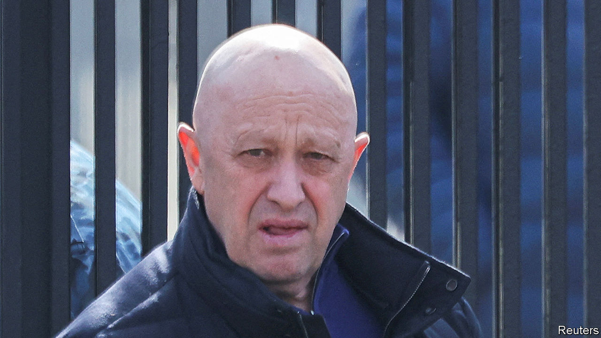
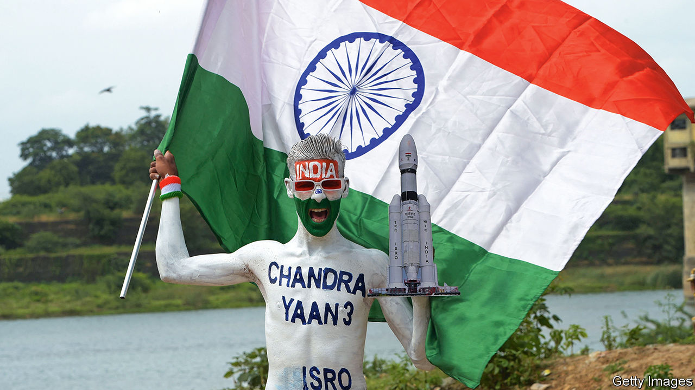

###### The world this week

# Politics 

#####  

 

> Aug 24th 2023 

, the leader of the Wagner Group of Russian-backed mercenaries, was presumed to have been killed when a private plane he was travelling in crashed north of Moscow. Two months ago Mr Prigozhin led a rebellion of his men, resulting in a short “march on Moscow” and skirmishes with Russian troops, because he was unhappy with the direction of the war in Ukraine. Vladimir Putin called him a traitor; it was said to be only a matter of time before the Russian president would exact his revenge. 

The Biden administration gave approval for Denmark and the Netherlands to send , the first time America has allowed the transfer of the American-made fighter aircraft after months of entreaties from Kyiv. The jets will not be deployed for some time, as Ukrainian pilots need training to fly them. 

President Volodymyr Zelensky said his country will use the jets “to keep Russian terrorists away from Ukrainian cities and villages”. His comments came after a Russian missile attack on a theatre in , a city in northern Ukraine, killed seven people and injured 144 others. Meanwhile Ukraine carried out more drone attacks on Russia. 

Around half a million  are now thought to have been killed or injured since the war in Ukraine began in February last year, according to American officials cited in the American press. The numbers have soared since last November, when America estimated that each side had suffered 100,000 dead or wounded. Now 120,000 Russian soldiers are believed to have died as well as 70,000 Ukrainian ones. 

America, Britain and France condemned an assault on UN peacekeepers in the buffer zone that divides the Turkish-occupied north of  from the Greek-Cypriot south. Turkish-Cypriots injured three peacekeepers who had been trying to stop the unauthorised construction of a road and used bulldozers to smash UN vehicles. 

The bodies of 18 suspected illegal migrants were found in a building scorched by  in northern Greece, close to the Turkish border. 

Thaksin times

 became  new prime minister. Mr Srettha comes from the populist Pheu Thai party, which came second in May’s election. The candidate of the winning party, Move Forward, was prevented from getting the job by the conservative establishment. Mr Srettha’s elevation was made possible by a deal with the army that allowed , who was ousted as prime minister in a coup in 2006 and is connected with Pheu Thai, to return from exile. Mr Thaksin was promptly jailed for corruption, but is expected to be released soon. The day after being imprisoned he was sent to a hospital.

The prime minister of , Kishida Fumio, and the president of , Yoon Suk-yeol, joined Joe Biden for a summit at Camp David. The three allies agreed to strengthen their security ties, such as by holding military exercises once a year. In a statement they condemned China’s “dangerous and aggressive behaviour” in the South China Sea. 

The new rapprochement between Japan and South Korea is being tested by Japan’s decision to release treated radioactive water from the damaged  nuclear plant into the sea. Japan’s closest neighbours think it will harm fish, though the UN nuclear watchdog says it is safe. China has banned all Japanese seafood.

The UN mission in said that 218 officials from the armed forces, police and former government had been killed since the Taliban regained power in 2021. 

The Republican presidential candidates held their first primary debate. Eight candidates took part, but not , who says he won’t attend any of the party’s debates because the “public knows who I am”. Mr Trump may also have been too busy preparing to surrender to the authorities in Atlanta on charges that he tried to overturn the presidential-election result in Georgia in 2020. 

Bernardo Arévalo, a reformer who ran on an anti-corruption platform, won  presidential election with a landslide, taking 61% of the vote. Mr Arévalo, the son of the country’s first democratically elected president, presented himself as an outsider to the political elite.

In  the presidential election will now head to a run-off in October. The two candidates who will compete are Luisa González, a protégée of Rafael Correa, a former left-wing populist president, and Daniel Noboa, a 35-year-old who was polling in single digits shortly before the vote.

Unholy orders

 dictator, Daniel Ortega, intensified his crackdown on the Catholic church by seizing Central American University (UCA), a Jesuit-run college, and, a few days later, evicting six Jesuits from their residence in Managua, the capital. The church has drawn the regime’s ire for criticising Mr Ortega’s increasing political repression. Last year he imprisoned a prominent bishop on charges of treason. 

The  group of countries (Brazil, Russia, India, China and South Africa) invited six new nations to join them, including Iran and Saudi Arabia. Vladimir Putin did not attend the group’s meeting in Johannesburg, South Africa’s commercial capital, as he risked being arrested there under a warrant of the International Criminal Court. But he sent a message saying Russia was ready to pick up the slack from Ukraine as a global supplier of grain. 

The African Union called on its members to refrain from any action that could legitimise the military junta which took power in  last month. The Economic Community of West African States rejected a proposal by the coup leaders to relinquish power in three years.

 held presidential and parliamentary elections amid fears that the result would once again be rigged in favour of President Emmerson Mnangagwa and the ruling Zanu-PF that has run the country since independence in 1980. The main challenger is Nelson Chamisa and his Citizens Coalition for Change.

 


India became the fourth country to carry out a landing on , and the first to land near its south pole. The Chandrayaan-3 mission landed a rover which will gather data from the lunar surface and try to establish whether craters in the area hold frozen water. India’s success came a few days after a Russian spacecraft, Russia’s first Moon mission in 47 years, crashed as it prepared to land. 

