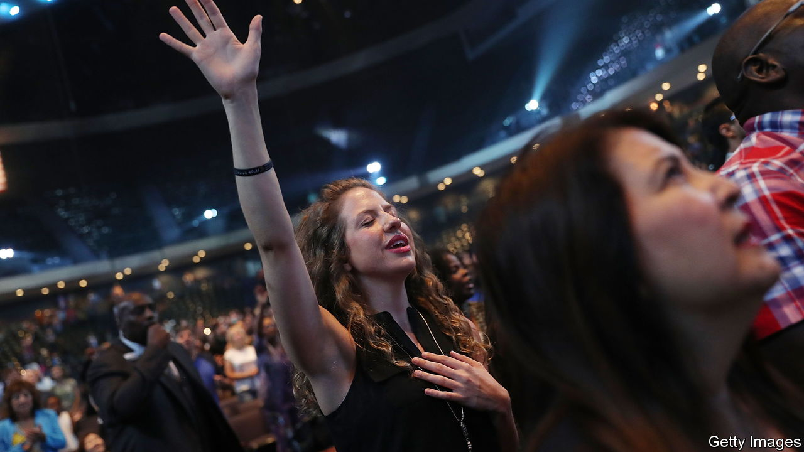

###### Throngs of praise

# American Megachurches are thriving by poaching flocks 

##### Denominations are out. Brand identity and good vibes are in 

 

> Aug 24th 2023 

Earplugs are available, should the music get too loud. Sure enough the volume—not to mention the tattooed front woman and bobbing crowd—evokes a country-rock concert. Only the lyrics suggest otherwise: “Fill it all up, fill it all up with Jesus.” Afterwards a pastor, in T-shirt and high-top sneakers, compares an Old Testament parable to a rom-com. Donations are solicited by QR code. The service is entertaining and, for many first-timers, unlike anything they expected of church.

Welcome to Life.Church, one of America’s largest megachurches, headquartered near Oklahoma City. Really it is a chain of churches, with 44 sites across 12 states. Every weekend around 80,000 people attend one of 170 services in person. Most watch a pre-recorded sermon by a senior pastor, Craig Groeschel; a junior pastor acts as an in-person MC and a worship band plays live. The whole thing blends seamlessly, and it is streamed online, too.

Churches have closed as the proportion of Americans who call themselves Christian has fallen from 76% in 2010 to 64% in 2020. But most of America’s 1,750 megachurches—all Protestant and mostly evangelical churches with at least 2,000 worshippers—are thriving. Between 2015 and 2020 their congregations grew by a third on average, turning younger and more multi-racial, according to the Hartford Institute for Religion Research, a think-tank in Connecticut. After a covid dip, “We’re in growth mode,” says Brian Tome, pastor of Crossroads, a nine-site church based in Ohio. “Things are fun right now.”

Concentration among churches accelerated as costs rose in the 1970s, notes Mark Chaves of Duke University. Smaller ones lost members. Though evangelicals aim to convert non-believers, about three-quarters of those who join megachurches were already practising. “We’d like to think that we’re reaching atheists. We’re reaching some, but the truth is that the body of Christ is consolidating,” says Mr Tome.

With more money and more hands, megachurches can innovate. Though they account for just 0.5% of all churches and 7% of churchgoers, their influence is felt in the music played elsewhere and the popularity of their TED-talk-style sermons, says Scott Thumma of the Hartford Institute. Nearly all the top contemporary worship songs between 2010 and 2020 came from just four megachurches.

Their success illustrates what it takes to compete in a dynamic spiritual marketplace. Bill Hybels, a megachurch pastor felled by sexual-misconduct allegations in 2018, was said to parrot Peter Drucker, a management guru: “What does the customer consider value?” Andre Audette, a political scientist at Monmouth College in Illinois, found that four-fifths of evangelical Christians have shopped around for a church—more than any other group. 

What would Drucker say of the faith customer? Two trends stand out. They want to choose their level of engagement, which megachurches make easy. Those craving connection can join any number of small groups. Life.Church hosts a club for Dungeons &amp; Dragons fans (“gamers connecting and growing closer to Christ”). Others like the anonymity. There is more pressure to donate and serve at smaller churches. Megachurch members show up and contribute less per capita.

The other trend is the weakening of denominations. Two-fifths of megachurches are non-denominational. The rest tend to downplay theirs and emphasise their own brand. Life.Church is affiliated with the Evangelical Covenant Church—but few congregants realise that. Todd Mullins of Christ Fellowship Church, a church with 14 sites in Florida, estimates that about half his flock were once Baptists or Catholics and the other half unchurched. 

Consolidation will level off at some point, says Mr Chaves. And today’s winners will probably not look the same in future. Back in 2006 he found that the largest churches retained their top spot for about 20 years before being overtaken. Growing has stresses of its own. Mr Tome says he stopped sharing attendance numbers with , which ranks congregations by size, because he felt like a chief executive answering to the stockmarket. “I’m not in corporate America”, he says. “I’m going to church!” ■


